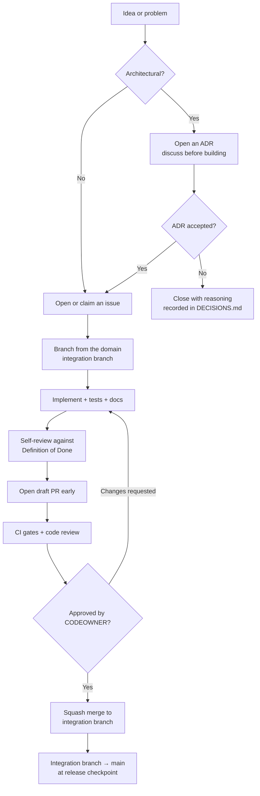

# Contributing to Witness

Thank you for considering it. Witness is being built as critical public digital infrastructure,
which means the bar is deliberately high and the process is deliberately explicit. Nothing here is
bureaucracy for its own sake — every rule exists because its absence would cost a government
somewhere years of institutional memory.

**Before anything else, read [`PROJECT_CONTEXT.md`](PROJECT_CONTEXT.md).** It is short and it is
binding.

---

## Table of contents

1. [Ways to contribute](#1-ways-to-contribute)
2. [Ground rules](#2-ground-rules)
3. [Getting set up](#3-getting-set-up)
4. [The contribution workflow](#4-the-contribution-workflow)
5. [Issue workflow](#5-issue-workflow)
6. [Branching and commits](#6-branching-and-commits)
7. [Pull requests](#7-pull-requests)
8. [Code review](#8-code-review)
9. [Definition of Done](#9-definition-of-done)
10. [Architectural changes and ADRs](#10-architectural-changes-and-adrs)
11. [Adding a dependency](#11-adding-a-dependency)
12. [AI-assisted contributions](#12-ai-assisted-contributions)
13. [Security issues](#13-security-issues)
14. [Licensing and provenance of contributions](#14-licensing-and-provenance-of-contributions)
15. [Getting help](#15-getting-help)

---

## 1. Ways to contribute

Code is not the scarcest resource on this project. These are equally valuable, often more so:

| Contribution | Why we need it |
|---|---|
| **Public-sector operational experience** | We are building for under-resourced government IT teams. If you have run one, you know things we don't. |
| **Indigenous data governance expertise** | Principle P5 is architectural. We need it reviewed by people with lived expertise, and we will pay for that where we can. |
| **Accessibility practice** | WCAG 2.2 AA is a merge gate. Auditors and users of assistive technology find what we miss. |
| **Under-served language capability** | ASR and extraction quality in low-resource languages is a core equity issue, not an edge case. |
| **Archival & records-management discipline** | Provenance, retention and disposal are solved problems in archival science. We should not reinvent them badly. |
| **Adversarial security thinking** | Threat models, abuse cases, and telling us how this could be turned into a surveillance tool. |
| **Documentation & translation** | Documentation drift is treated as a defect here. |
| **Deployment reports** | Tell us what broke in your environment. Especially air-gapped ones. |

## 2. Ground rules

1. **[`PROJECT_CONTEXT.md`](PROJECT_CONTEXT.md) principles P1–P8 are non-negotiable.** A pull
   request that violates one is closed regardless of code quality. If you think a principle is
   wrong, open an ADR to change it — that is a legitimate and welcome move.
2. **No prototypes on `main`.** Production-ready only. Experiments live on `experiments/*` and are
   time-boxed. See [`docs/engineering/BRANCH_STRATEGY.md`](docs/engineering/BRANCH_STRATEGY.md).
3. **Documentation ships in the same PR as the change.** Not the next one.
4. **Tests ship in the same PR as the change.** Untested code does not merge.
5. **No new technology without an ADR** that names what it replaces and why the existing stack
   cannot do the job.
6. **No duplicated functionality.** Search `packages/` and `services/` first.
7. **Be kind and be direct.** Both. See [`CODE_OF_CONDUCT.md`](CODE_OF_CONDUCT.md).

## 3. Getting set up

> **Note:** Witness is pre-implementation (see [`STATUS.md`](STATUS.md)). The toolchain below is
> the target state, landing in Phase 2. Until then, contributions are documentation, architecture,
> research and governance — which is exactly what the project needs right now.

```bash
git clone https://github.com/scigns/witness.git
cd witness

# Prerequisites: Node 22 LTS (see .nvmrc), pnpm 9+, Docker 24+, Docker Compose v2, Make
pnpm install
make dev          # brings up Postgres, Neo4j, OpenSearch, Redis, MinIO, Keycloak, NATS
make verify       # lint, typecheck, test, build — the same gates CI runs
```

Full instructions: [`docs/engineering/DEVELOPER_GUIDE.md`](docs/engineering/DEVELOPER_GUIDE.md).

## 4. The contribution workflow



**Discuss before you build.** For anything larger than a bug fix, open an issue or ADR first. We
would rather spend an hour disagreeing about an approach than have you spend a week on one we
cannot merge. Unsolicited large pull requests are the most common way contributor effort gets
wasted, and that is our failure to prevent, not yours.

## 5. Issue workflow

Full detail: [`docs/engineering/ISSUE_WORKFLOW.md`](docs/engineering/ISSUE_WORKFLOW.md).

**States:** `triage` → `accepted` → `ready` → `in-progress` → `in-review` → `done`
(or `needs-info`, `blocked`, `declined`).

Every issue is triaged within **two working days** by the owning lead. Issues are declined openly
and with reasoning — a clear "no" is more respectful than silence.

**Type labels:** `type:bug` `type:feature` `type:chore` `type:docs` `type:research`
`type:security` `type:adr` `type:epic` `type:accessibility` `type:sovereignty`

**Priority:** `P0` (production down / data at risk — drop everything) · `P1` (next sprint) ·
`P2` (planned) · `P3` (backlog).

`good first issue` and `help wanted` are curated, not aspirational — if one is labelled, it has
enough context to actually start.

## 6. Branching and commits

Branch from the relevant **domain integration branch**, not from `main`:

```text
<type>/<domain>/<issue-number>-<short-slug>

feat/knowledge-graph/142-entity-resolution-adjudication
fix/backend/318-outbox-duplicate-delivery
docs/governance/205-indigenous-consent-protocols
```

Long-lived integration branches, their owners and merge rules are in
[`docs/engineering/BRANCH_STRATEGY.md`](docs/engineering/BRANCH_STRATEGY.md).

**Commits follow [Conventional Commits](https://www.conventionalcommits.org/)** — this drives
versioning and the changelog, so it is enforced in CI:

```text
feat(knowledge-graph): add bitemporal validity to entity assertions

Entities need to record both when a fact was true in the world and when we
came to believe it, so that "what did we believe on date X?" is answerable
during an audit years later.

Refs: #142
ADR: ADR-0011
```

Types: `feat` `fix` `docs` `refactor` `test` `perf` `build` `ci` `chore` `revert`.
Breaking changes use `!` and a `BREAKING CHANGE:` footer.

## 7. Pull requests

Full detail: [`docs/engineering/PULL_REQUEST_WORKFLOW.md`](docs/engineering/PULL_REQUEST_WORKFLOW.md).

- **Open as a draft early.** Visible work in progress beats a surprise.
- **Keep them small.** Target under 400 changed lines. Large PRs get worse reviews, not better
  ones — this is well evidenced, not a preference.
- **One logical change per PR.** Refactors go in their own PR, separate from behaviour changes.
- **Fill in the template honestly**, including the sections about what you did *not* do.
- **Link the issue and any ADR.**
- **Never disable a CI gate to go green.** Fix the cause, or explain in the PR why the gate is
  wrong and change the gate deliberately.

## 8. Code review

Full detail: [`docs/engineering/CODE_REVIEW.md`](docs/engineering/CODE_REVIEW.md).

**Every PR requires at least one approving review from a CODEOWNER of every path it touches.**
Changes touching consent, provenance, authorisation, cryptography or data export additionally
require **Security Lead** review. Changes touching the knowledge graph ontology additionally
require **Knowledge Graph Lead** review.

Reviewers commit to first response within **one working day**. If you cannot review in time, say
so immediately and reassign — silence is the expensive failure mode.

Reviewers are asked to distinguish clearly between:

- **Blocking** — "this must change before merge" (with the reason, and ideally a suggestion)
- **Non-blocking** — "consider this" (prefix `nit:` or `suggestion:`)
- **Question** — "help me understand this"

Approving a PR means: *"I understand this change, and I am willing to be woken at 3am for it."*

## 9. Definition of Done

A change is done when **all** of these hold. This list is the merge checklist.

- [ ] Acceptance criteria in the linked issue are met
- [ ] Unit tests for logic; integration tests for boundaries; contract tests for APIs
- [ ] Coverage does not decrease; new domain logic is fully covered
- [ ] Lint, typecheck, format and build all pass
- [ ] Documentation updated in the same PR (including relevant docs in `docs/` and `architecture/`)
- [ ] ADR written or updated if an architectural decision was made
- [ ] [`STATUS.md`](STATUS.md) and [`ROADMAP.md`](ROADMAP.md) updated if workstream state changed
- [ ] Observability: meaningful traces, metrics and structured logs for new paths
- [ ] Errors handled explicitly; no silent failure; no swallowed exceptions
- [ ] Security: input validated at the boundary, authorisation enforced, no secret in code or logs
- [ ] Consent and provenance invariants upheld and tested
- [ ] Accessibility: WCAG 2.2 AA verified for UI changes (keyboard, contrast, screen reader)
- [ ] Internationalisation: no hard-coded user-facing strings
- [ ] Performance: no unbounded query, traversal or allocation on a request path
- [ ] Migration path and rollback documented for schema or projection changes
- [ ] No new technical debt, or debt logged in
  [`docs/engineering/TECH_DEBT.md`](docs/engineering/TECH_DEBT.md) with owner and date
- [ ] CODEOWNER approval obtained for every path touched

## 10. Architectural changes and ADRs

Write an ADR if the decision is **expensive to reverse**: a new dependency, a data model change, a
new service boundary, a protocol or format choice, a security or consent mechanism, a change to
any P1–P8 principle.

```bash
cp templates/adr/ADR-TEMPLATE.md architecture/decisions/ADR-00XX-short-title.md
```

Process: `Proposed` → discussion in the PR → `Accepted` or `Rejected`, and later possibly
`Superseded` or `Deprecated`. **Rejected ADRs are kept and merged**, not deleted — knowing what we
decided against, and why, is as valuable as knowing what we chose. See
[`docs/engineering/ADR_PROCESS.md`](docs/engineering/ADR_PROCESS.md).

If in doubt, write one. A rejected ADR costs an hour. An undocumented decision costs a year.

## 11. Adding a dependency

Dependencies are liabilities we accept deliberately. Every new one requires an entry in
[`docs/research/OSS_EVALUATION.md`](docs/research/OSS_EVALUATION.md) covering:

purpose · licence (and compatibility with GPL-3.0) · community health · maintenance signals ·
advantages · risks · integration approach · **replacement strategy**

The replacement strategy is the one people skip and the one that matters. If you cannot describe
how we would remove this dependency, we are not adding it.

Automatically rejected: licences incompatible with GPL-3.0; unmaintained projects (no release or
meaningful commit in 12 months) without a fork plan; single-maintainer projects on a critical path
without a mitigation; anything requiring a phone-home or external service in the default
configuration.

## 12. AI-assisted contributions

AI assistance is welcome and expected — this project is partly built with it. It comes with
obligations, set out in [`docs/engineering/AI_GUIDELINES.md`](docs/engineering/AI_GUIDELINES.md)
and [`.ai/README.md`](.ai/README.md):

- **Disclose it** in the PR template. This is not a mark against the contribution.
- **You own the output.** "The model wrote it" is not a defence at review. You are the author.
- **Verify every factual claim** — especially API signatures, licence terms and security
  properties. Confidently wrong is the failure mode.
- **Never paste secrets, personal data or unpublished user recordings into a model**, including
  in test fixtures.
- **AI cannot approve a pull request**, and cannot be the sole reviewer of security, consent,
  cryptography or Indigenous data governance changes.

## 13. Security issues

**Do not open a public issue for a vulnerability.** Follow [`SECURITY.md`](SECURITY.md) for
coordinated disclosure. We commit to acknowledging within two working days.

## 14. Licensing and provenance of contributions

- Contributions are licensed under **GPL-3.0-or-later**, matching the project.
- We use the **[Developer Certificate of Origin](https://developercertificate.org/)**, not a CLA.
  Sign off every commit: `git commit -s`. This certifies you have the right to submit the work; it
  does not assign copyright away from you.
- **Do not contribute code you do not have the right to contribute**, including code from an
  employer without authorisation, or model-generated code you have reason to believe reproduces
  incompatibly licensed source.
- Contributions containing real personal data, real meeting recordings, or real institutional
  content will be rejected and the data removal-requested. Use the synthetic fixtures in
  [`examples/`](examples/).

## 15. Getting help

| Need | Where |
|---|---|
| How something works | [`docs/`](docs/) first, then a `type:docs` issue if the docs failed you — that is a real bug |
| Design discussion | GitHub Discussions, or an ADR for a concrete proposal |
| Something is broken | `type:bug` issue with reproduction steps |
| A vulnerability | [`SECURITY.md`](SECURITY.md) — private disclosure |
| Conduct concern | [`CODE_OF_CONDUCT.md`](CODE_OF_CONDUCT.md) |

**If the documentation failed you, that is our defect, not your shortcoming.** Please report it.

---

Contributors are credited in release notes and in [`docs/governance/CONTRIBUTORS.md`](docs/governance/CONTRIBUTORS.md).
Sustained contribution leads to maintainer status through the path described in
[`GOVERNANCE.md`](GOVERNANCE.md) — including, eventually, merge authority. We mean it about
building this to be inherited.
