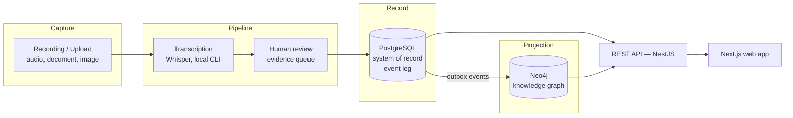

# PROJECT_CONTEXT.md

> **Read this file first.** Every contributor — human or AI — starts here before touching
> anything else in this repository. If this document contradicts something you were told
> elsewhere, this document wins, and the contradiction is a bug worth reporting.

**Status:** Controlled institutional pilot — the human-led workflow is implemented, deployed and in
front of real pilot users; AI-assisted extraction and general-availability hardening remain ahead.
**Last reviewed:** 2026-09-22
**Owner:** Chief Technology Officer
**Review cadence:** Every release, and on any accepted ADR that changes scope

---

## 1. What Witness is

Witness is open-source **Digital Public Infrastructure (DPI)** that turns conversations into
**institutional memory**.

Public institutions talk constantly — cabinet meetings, parliamentary committees, community
consultations, co-design workshops, clinical governance reviews, land negotiations, board
meetings. Almost all of that knowledge is lost. It survives, if at all, as a PDF minute nobody
reads, in a departing officer's head, or in a recording nobody has time to listen to.

Witness captures those conversations and transforms them into a **queryable, provenance-backed
knowledge graph** of the entities that institutions actually run on:

| | | |
|---|---|---|
| People | Communities | Organisations |
| Projects | Meetings | Policies |
| Evidence | Risks | Decisions |
| Actions | Commitments | Locations |
| | Relationships | |

The unit of value is **not the transcript**. A transcript is an intermediate artefact. The unit
of value is a *decision with a traceable justification*, a *commitment with an owner and a due
date*, a *risk raised three years ago by a community that turned out to be correct*.

### The one-sentence test

> *"Who committed to what, on whose behalf, on what evidence, under what consent — and can I
> prove it five years later when everyone involved has left?"*

If a proposed feature does not move us toward answering that sentence, it is out of scope.

---

## 2. What Witness is not

Explicitly out of scope. We will decline these politely and permanently:

| Not this | Why |
|---|---|
| A meeting transcription SaaS | Transcription is a commodity input. Otter, Fireflies and Teams already do it. We consume it; we do not compete with it. |
| A surveillance tool | Witness is consent-first and refuses to operate without a recorded lawful basis. See [`CONSENT_FRAMEWORK.md`](docs/governance/CONSENT_FRAMEWORK.md). |
| A general-purpose chatbot over documents | Retrieval-augmented chat is a *feature* of the graph, not the product. |
| A records-management / EDRMS replacement | We integrate with them (TRIM/Content Manager, SharePoint, Alfresco). We are not a system of record for documents. |
| A decision-making system | Witness records and surfaces human decisions. It never makes them, ranks people, or scores individuals. |
| A closed-core / open-core product | Everything is open source. See [`docs/governance/DIGITAL_SOVEREIGNTY.md`](docs/governance/DIGITAL_SOVEREIGNTY.md). |

---

## 3. Non-negotiable principles

These are architectural constraints, not aspirations. A pull request that violates one of these
is rejected regardless of how good the code is.

### P1 — Digital sovereignty

Every operator owns their knowledge, their models, their storage and their compute. The default
deployment (`deployments/sovereign-onprem`) sends **zero bytes** outside the operator's network
boundary. Any egress is opt-in, per-tenant, explicitly configured, logged, and visible to end
users. See [ADR-0009](architecture/decisions/ADR-0009-ai-abstraction-and-model-sovereignty.md).

### P2 — Consent is a domain primitive

Consent is not a checkbox and not a feature flag. It is a first-class aggregate with its own
lifecycle, its own service, and enforcement at the policy decision point. **No consent record →
no processing.** Consent is revocable, and revocation propagates through every projection.
See [ADR-0008](architecture/decisions/ADR-0008-consent-as-a-domain-primitive.md).

### P3 — Provenance or it did not happen

Every node and every edge in the knowledge graph carries an unbroken chain back to a source
utterance, at a timestamp, in a recording, under a consent grant, extracted by a named model
version, confirmed or corrected by a named human. Unattributable assertions are not permitted to
exist in the graph. See [ADR-0012](architecture/decisions/ADR-0012-provenance-and-human-in-the-loop.md).

### P4 — The machine proposes, the human disposes

AI extraction produces **candidate** assertions. Candidates require human confirmation before
they become institutional record. We will never present a model's inference as fact. Confidence
scores are shown to users, never hidden.

### P5 — Indigenous Data Sovereignty is designed in, not bolted on

Witness will be used to record the knowledge of Indigenous and traditional-owner communities.
CARE principles and OCAP® are architectural requirements: community-level (not just
individual-level) consent, community-controlled access rules, cultural sensitivity flags, and
the right to withdraw knowledge entirely. See
[ADR-0019](architecture/decisions/ADR-0019-indigenous-data-sovereignty.md).

### P6 — Decades, not quarters

Design lifetime is **ten years minimum**. Optimise for maintainability, legibility and
replaceability over delivery speed. Every component must be independently replaceable behind a
port. A staff turnover event must not be an extinction event — for our users *or* for us.

### P7 — Boring, proven technology

We prefer a widely deployed, well-understood tool over a better one nobody in a ministry of
health can operate at 2am. New technology requires an ADR that names what it replaces.

### P8 — Accessible and multilingual by default

WCAG 2.2 AA is a merge gate, not a milestone. Witness will run in low-bandwidth, intermittently
connected environments in languages with limited model support. See
[ADR-0020](architecture/decisions/ADR-0020-offline-first-and-low-connectivity.md).

---

## 4. Who we build for

| Persona | Context | Primary need |
|---|---|---|
| **Ministerial policy officer** | National government, 200+ meetings/yr | "What did we already decide about this, and why?" |
| **Committee clerk / Hansard officer** | Parliament, formal record obligations | Accurate attributable record, publishable, redactable |
| **Community engagement lead** | Local government / NGO | Prove that what communities said actually shaped the outcome |
| **Indigenous knowledge custodian** | Land council, traditional owner corporation | Control who sees what, forever; withdraw at will |
| **Programme manager** | Development partner (UN, World Bank, DFAT) | Track commitments across 5-year programmes and 3 staff cohorts |
| **Auditor / Ombudsman** | Oversight body | Reconstruct a decision chain years later, with evidence |
| **Platform operator** | Government CIO / sysadmin | Deploy, run, back up and upgrade it themselves, air-gapped if needed |

The **platform operator** is a first-class persona. Software that cannot be operated by an
under-resourced public-sector IT team is not public infrastructure.

---

## 5. Architecture in sixty seconds

**The load-bearing decision:** PostgreSQL is the **system of record**. Neo4j is a **disposable
projection**, rebuilt from the event log by `workers/graph-projector` and never written to
directly. This is what makes consent revocation, governance changes, schema evolution and disaster
recovery tractable. See [ADR-0011](architecture/decisions/ADR-0011-knowledge-graph-as-projection.md).

**Not yet built, by sequencing choice, not blocker:** AI-assisted extraction (an LLM proposing
*candidate* assertions a human confirms — the architecture and P4 already require this shape when
it lands), OpenSearch lexical search, pgvector semantic search, and speaker diarisation. See
[`STATUS.md`](STATUS.md) for the live picture of what depends on what.

Full detail: [`architecture/ARCHITECTURE.md`](architecture/ARCHITECTURE.md) ·
[`architecture/DATA_MODEL.md`](architecture/DATA_MODEL.md) describes the real, as-built write model.

---

## 6. Repository map

| Path | Contains |
|---|---|
| `.ai/` | Machine-readable context, conventions and guardrails for AI contributors |
| `agents/` | Role definitions — the engineering organisation, as executable specifications |
| `architecture/` | Architecture documents, views, domain models, and all ADRs |
| `docs/` | Engineering, product, governance, operations and research documentation |
| `apps/` | Deployable user-facing applications (web, admin console, docs site) |
| `packages/` | Shared libraries — domain model, contracts, UI kit, config |
| `services/` | Backend bounded-context services (NestJS) |
| `workers/` | Asynchronous processors (transcription, extraction, indexing, projection) |
| `infrastructure/` | Docker, Kubernetes, Helm, Terraform, observability stack |
| `deployments/` | Composed, opinionated deployment topologies |
| `sdk/` | Client SDKs (TypeScript, Python) |
| `examples/` | End-to-end worked examples with realistic synthetic data |
| `scripts/` | Repository automation |
| `templates/` | Scaffolding templates (ADR, RFC, service, package, runbook, postmortem) |
| `.github/` | CI/CD, issue and PR workflow, CODEOWNERS |

---

## 7. Working rules

Binding on every contributor, including AI agents.

1. **Read `PROJECT_CONTEXT.md` first.** You are doing this. Good.
2. **Update [`STATUS.md`](STATUS.md)** whenever the state of a workstream changes.
3. **Update [`ROADMAP.md`](ROADMAP.md)** whenever scope or sequencing changes.
4. **Write an ADR** for any decision that is expensive to reverse. Unsure? Write one — a
   rejected ADR costs an hour; an undocumented decision costs a year.
5. **Never introduce a new technology** without an ADR naming what it replaces and why the
   existing stack is insufficient.
6. **Never duplicate functionality.** Search `packages/` and `services/` first.
7. **Prefer mature open source** over building. Every dependency needs an entry in
   [`docs/research/OSS_EVALUATION.md`](docs/research/OSS_EVALUATION.md).
8. **Keep documentation current in the same pull request** as the change. Documentation drift is
   treated as a defect.
9. **Generate diagrams** as Mermaid in-repo. No binary diagram formats, no external tools.
10. **Generate tests.** Untested code does not merge. See
    [`docs/engineering/TESTING_STRATEGY.md`](docs/engineering/TESTING_STRATEGY.md).
11. **Production-ready only.** Prototypes are explicitly labelled, time-boxed, and live on
    `experiments/*`. They never merge to `main`.
12. **Reject shortcuts.** Optimise for maintainability over speed. If you are about to write
    "we'll clean this up later", log it in [`docs/engineering/TECH_DEBT.md`](docs/engineering/TECH_DEBT.md)
    with an owner and a date, or don't write it.

---

## 8. Current state — honest version

Witness is a **running product in a controlled institutional pilot**, not a foundation-only
research prototype. What genuinely works today, verified against the actual code rather than
assumed from this document (see the 2026-09-22 productisation audit referenced in
[`STATUS.md`](STATUS.md)):

- **Identity and access.** Keycloak-backed sign-in, organisation and workspace membership,
  scoped role assignment (reader/contributor/facilitator/reviewer/steward/admin), and — new this
  phase — a workspace invitation path for an external collaborator (facilitator, reviewer, or
  Knowledge Steward from another organisation) that grants authority scoped to exactly one
  workspace without making them a member of the commissioning organisation. See
  [ADR-0028](architecture/decisions/ADR-0028-organisation-workspace-session-participant-model.md).
- **Co-design programmes.** An organisation creates a workspace (the product calls this a
  "programme" or "co-design" in the UI — see ADR-0028 for why the underlying domain name stays
  `Workspace`), runs multiple sessions/workshops inside it, and manages participants — including
  anonymous and pseudonymous participation, which never requires a Witness account.
- **Evidence.** Audio, document and image capture, each consent-gated by its own policy category,
  human review, correction and provenance.
- **Decisions, commitments, reports.** Recorded, tracked, and exportable.
- **The Evidence Knowledge Graph.** Domain model, governance/perspective metadata projection,
  canonical concept merging, and manual curation (concepts, review queue, stewardship, graph
  explorer) all work end to end against a real Neo4j — entirely without AI, by design (P4).
- **Commercial operations.** Catalogue, entitlements, subscriptions, invoicing, and manual/bank-
  transfer settlement with exactly-once entitlement activation. No payment-processor dependency.

**Deliberately not yet built**, in the order the roadmap sequences them, not by accident:

1. Cross-organisation collaborator invitation UX polish and a coherent organisation/programme
   dashboard (this phase's work).
2. Production hardening: observability deployed to the pilot, expanded adversarial security
   coverage, a consolidated customer data export, a real contract/renewal lifecycle model.
3. AI-assisted knowledge extraction, embeddings, hybrid/vector search, and speaker diarisation —
   explicitly sequenced *after* the governance and collaboration model above, per the standing
   instruction that a human-governed graph must remain correct under merge, disagreement, and
   multi-organisation collaboration before a machine is allowed to propose anything into it.

See [`STATUS.md`](STATUS.md) for the live, per-workstream picture and [`ROADMAP.md`](ROADMAP.md)
for sequencing. Do not let anyone — including an enthusiastic AI agent — start work on item 3
before items 1 and 2 are further along; that ordering is deliberate, not a leftover placeholder.

---

## 9. Where to go next

| If you are… | Read |
|---|---|
| A new contributor | [`CONTRIBUTING.md`](CONTRIBUTING.md) → [`docs/engineering/DEVELOPER_GUIDE.md`](docs/engineering/DEVELOPER_GUIDE.md) |
| An architect | [`architecture/ARCHITECTURE.md`](architecture/ARCHITECTURE.md) → [`architecture/decisions/`](architecture/decisions/) |
| An AI agent | [`.ai/README.md`](.ai/README.md) → [`docs/engineering/AI_GUIDELINES.md`](docs/engineering/AI_GUIDELINES.md) |
| A government evaluator | [`VISION.md`](VISION.md) → [`docs/governance/DIGITAL_SOVEREIGNTY.md`](docs/governance/DIGITAL_SOVEREIGNTY.md) → [`SECURITY.md`](SECURITY.md) |
| An operator | [`docs/operations/DEPLOYMENT_GUIDE.md`](docs/operations/DEPLOYMENT_GUIDE.md) → [`docs/operations/ADMIN_GUIDE.md`](docs/operations/ADMIN_GUIDE.md) |
| A funder or partner | [`MISSION.md`](MISSION.md) → [`ROADMAP.md`](ROADMAP.md) → [`GOVERNANCE.md`](GOVERNANCE.md) |
