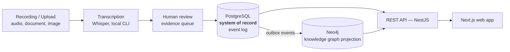

# Witness

**Open-source Digital Public Infrastructure for institutional memory.**

*Turn the conversations where decisions are actually made into structured, consented,
provenance-backed institutional knowledge that survives staff turnover, elections and decades.*

---

## What this is

Public institutions lose their memory constantly. The reasoning behind a decision lives in the
heads of the people who were in the room, and it leaves when they do. Minutes record *what* was
decided but almost never *why*, *who objected*, *what evidence was weighed*, or *what was promised
in return*.

Witness captures meetings, consultations, workshops, parliamentary sessions, co-design sessions,
interviews and community engagement — and transforms them into a **living knowledge graph** of
People, Communities, Organisations, Projects, Meetings, Policies, Evidence, Risks, Decisions,
Actions, Commitments, Locations and the Relationships between them.

**We do not store transcripts.** A transcript is an intermediate artefact. We store *a decision
with a traceable justification*, *a commitment with an owner and a due date*, *a risk raised by a
community three years ago that turned out to be correct* — each traceable back to the exact
sentence someone said, at a timestamp, under a recorded consent grant.

> **The test every feature must pass:** *"Who committed to what, on whose behalf, on what
> evidence, under what consent — and can I prove it five years later when everyone involved has
> left?"*

## Why it's built the way it is

| Principle | What it means in the code |
|---|---|
| **Digital sovereignty** | Default deployment sends **zero bytes** outside your network. Local models, local storage, local compute. Air-gap supported. |
| **Consent is a domain primitive** | No consent record → no processing. Not a checkbox — an aggregate with a lifecycle, enforced at a policy decision point that cannot be bypassed. |
| **Provenance or it didn't happen** | Every node and edge traces to a source utterance, model version and human confirmation. Unattributable assertions cannot exist. |
| **The machine proposes, the human disposes** | AI produces *candidates*. Humans confirm. Model output is never presented as institutional fact. |
| **Indigenous Data Sovereignty by design** | CARE principles and OCAP® as architectural requirements — community-level consent, community-controlled access, right to withdraw. |
| **Decades, not quarters** | Ten-year design lifetime. Every component replaceable behind a port. Built to be inherited. |

Read the full set in [`PROJECT_CONTEXT.md`](PROJECT_CONTEXT.md).

## Architecture at a glance

PostgreSQL is the system of record for every write. Neo4j is a **disposable projection**,
rebuilt from the event log by `workers/graph-projector` — never written to directly — which is
what makes consent revocation, governance changes and schema evolution tractable. See
[ADR-0011](architecture/decisions/ADR-0011-knowledge-graph-as-projection.md). AI-assisted
extraction (an LLM producing *candidate* assertions a human confirms), hybrid/vector search and
diarisation are designed for in the architecture but not yet built — see
[`STATUS.md`](STATUS.md) for exactly what is deferred and why.

## Project status

**Controlled institutional pilot.** Witness is a running product, not a research prototype: the
human-led workflow (organisation → programme → session → participants → consent → evidence →
review → decisions/commitments → reports) is implemented end to end, deployed, and in front of
real institutional pilot users. It is authenticated through Keycloak, organisation/workspace
scoped, and backed by PostgreSQL as the system of record.

**Implemented and in use today:**

- Institutional onboarding, authentication and scoped role-based access (organisation, workspace,
  and — new this phase — invited external programme collaborators; see
  [ADR-0028](architecture/decisions/ADR-0028-organisation-workspace-session-participant-model.md)).
- Co-design programme and session (workshop) management, with consent-gated audio, document and
  image evidence capture.
- Human evidence review, decisions, commitments, session summaries and exportable reports.
- The Evidence Knowledge Graph: domain model, governance/perspective metadata, manual curation
  (concepts, review queue, stewardship, merge, graph explorer) — all working end to end, by
  design, without AI (see [`architecture/KNOWLEDGE_GRAPH.md`](architecture/KNOWLEDGE_GRAPH.md)).
- Provider-independent commercial state (catalogue, subscriptions, invoices, manual/bank-transfer
  settlement with exactly-once entitlement activation) — no payment-processor dependency required.

**Deliberately not yet built** — not oversights, tracked directly in [`STATUS.md`](STATUS.md) and
[`ROADMAP.md`](ROADMAP.md):

- AI-assisted knowledge extraction, embeddings, hybrid/vector search, and speaker diarisation.
  These are sequenced *after* the governance and multi-organisation collaboration model they
  depend on, not blocked by anything technical.
- A public self-service marketing/documentation surface covering every product area.
- A general-availability hardening pass (production observability, consolidated customer data
  export, a full contract/renewal lifecycle).

Live state: [`STATUS.md`](STATUS.md) · Sequencing: [`ROADMAP.md`](ROADMAP.md) ·
Start here: [`PROJECT_CONTEXT.md`](PROJECT_CONTEXT.md)

## Repository map

| Path | Contains |
|---|---|
| [`.ai/`](.ai/) | Machine-readable context and guardrails for AI contributors |
| [`agents/`](agents/) | Role charters — the engineering organisation as executable specification |
| [`architecture/`](architecture/) | Architecture documents, C4 views, domain model, [ADRs](architecture/decisions/) |
| [`docs/`](docs/) | [Engineering](docs/engineering/), [product](docs/product/), [governance](docs/governance/), [operations](docs/operations/), [research](docs/research/) |
| [`apps/`](apps/) | Deployable applications — `web` (the product), `marketing`, `admin-console`, `docs-site` |
| [`packages/`](packages/) | Shared libraries — `domain`, `contracts`, `ui`, `policy`, `config`, `config-eslint`, `config-typescript` |
| [`services/`](services/) | Backend services — `api-gateway` (the real backend, NestJS) and `knowledge-graph` (Neo4j read layer) are live; the rest (`ai-orchestrator`, `consent`, `identity`, `ingestion`, `search`) are reserved future extractions of capability that runs inside `api-gateway` today — each README says so explicitly |
| [`workers/`](workers/) | `graph-projector` is live; `extraction`, `indexing`, `notification`, `transcription` are reserved scaffolds — transcription itself is real, but lives in `services/api-gateway/src/transcription` today, not here |
| [`infrastructure/`](infrastructure/) | Docker, Kubernetes, Helm, Terraform, observability stack (observability is wired for local dev; not yet deployed to the production pilot) |
| [`deployments/`](deployments/) | Real deployment topologies — `cloud-managed` runs the live pilot |
| [`sdk/`](sdk/) | Client SDKs — TypeScript, Python |
| [`examples/`](examples/) | Worked end-to-end examples with synthetic data |
| [`templates/`](templates/) | Scaffolding — ADR, RFC, service, package, runbook, postmortem |

## Technology

**Frontend** Next.js 15 · React · TypeScript · Tailwind
**Backend** NestJS · REST · Prisma
**Data** PostgreSQL (system of record) · Neo4j (knowledge graph projection) · S3-compatible object
storage (optional; Postgres-inline by default)
**AI** Whisper (local CLI, transcription only — extraction/embeddings not yet built)
**Infrastructure** Docker Compose (production pilot topology) · Kubernetes/Helm/Terraform
(designed for, not yet the deployed profile) · GitHub Actions
**Identity** Keycloak · OIDC · Casbin-pattern scoped RBAC

OpenSearch, pgvector, NATS JetStream, LiteLLM/Ollama-based extraction and a Kubernetes production
deployment are architected for (see [`architecture/TECH_STACK.md`](architecture/TECH_STACK.md))
but not yet wired into the running application — do not configure them expecting a live effect
today; [`.env.example`](.env.example) marks each variable as consumed or reserved.

Every choice justified in [`architecture/TECH_STACK.md`](architecture/TECH_STACK.md); every
dependency evaluated with an exit strategy in [`docs/research/OSS_EVALUATION.md`](docs/research/OSS_EVALUATION.md).

## Documentation

| | |
|---|---|
| **Start here** | [`PROJECT_CONTEXT.md`](PROJECT_CONTEXT.md) |
| Why we exist | [`VISION.md`](VISION.md) · [`MISSION.md`](MISSION.md) |
| How we work | [`CONTRIBUTING.md`](CONTRIBUTING.md) · [`docs/engineering/ENGINEERING_GUIDE.md`](docs/engineering/ENGINEERING_GUIDE.md) |
| How it's built | [`architecture/ARCHITECTURE.md`](architecture/ARCHITECTURE.md) · [`architecture/decisions/`](architecture/decisions/) |
| Data & knowledge | [`architecture/DATA_MODEL.md`](architecture/DATA_MODEL.md) · [`architecture/KNOWLEDGE_GRAPH.md`](architecture/KNOWLEDGE_GRAPH.md) |
| Trust & ethics | [`docs/governance/CONSENT_FRAMEWORK.md`](docs/governance/CONSENT_FRAMEWORK.md) · [`docs/governance/DIGITAL_SOVEREIGNTY.md`](docs/governance/DIGITAL_SOVEREIGNTY.md) · [`SECURITY.md`](SECURITY.md) |
| Running it | [`docs/operations/DEPLOYMENT_GUIDE.md`](docs/operations/DEPLOYMENT_GUIDE.md) · [`docs/operations/ADMIN_GUIDE.md`](docs/operations/ADMIN_GUIDE.md) |
| Building on it | [`docs/guides/API_GUIDE.md`](docs/guides/API_GUIDE.md) · [`sdk/`](sdk/) |
| Governance | [`GOVERNANCE.md`](GOVERNANCE.md) · [`CODE_OF_CONDUCT.md`](CODE_OF_CONDUCT.md) |

## Contributing

Witness is being built as critical public infrastructure, which means the bar is high and the
process is explicit. Start with [`CONTRIBUTING.md`](CONTRIBUTING.md).

We especially want contributors who bring what engineers usually lack: public-sector operational
experience, Indigenous data governance expertise, accessibility practice, under-served language
capability, archival and records-management discipline, and adversarial security thinking.

## Licence

Platform: **GPL-3.0-or-later** ([`LICENSE`](LICENSE)).
Contracts and SDKs are intended to carry a permissive licence so anyone can integrate without
copyleft obligations — see [ADR-0002](architecture/decisions/ADR-0002-licensing-strategy.md) for
the reasoning and current status.

---

Built to be inherited.

