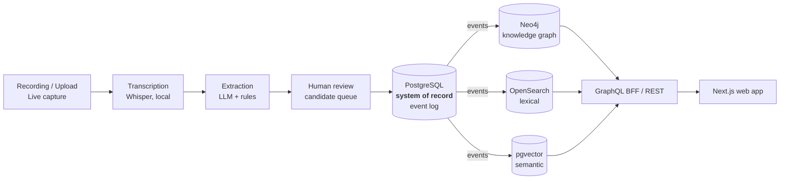

# Witness

**Open-source Digital Public Infrastructure for institutional memory.**

*Turn the conversations where decisions are actually made into structured, consented,
provenance-backed institutional knowledge that survives staff turnover, elections and decades.*

---

## What this is

Public institutions lose their memory constantly. The reasoning behind a decision lives in the
heads of the people who were in the room, and it leaves when they do. Minutes record *what* was
decided but almost never *why*, *who objected*, *what evidence was weighed*, or *what was promised
in return*.

Witness captures meetings, consultations, workshops, parliamentary sessions, co-design sessions,
interviews and community engagement — and transforms them into a **living knowledge graph** of
People, Communities, Organisations, Projects, Meetings, Policies, Evidence, Risks, Decisions,
Actions, Commitments, Locations and the Relationships between them.

**We do not store transcripts.** A transcript is an intermediate artefact. We store *a decision
with a traceable justification*, *a commitment with an owner and a due date*, *a risk raised by a
community three years ago that turned out to be correct* — each traceable back to the exact
sentence someone said, at a timestamp, under a recorded consent grant.

> **The test every feature must pass:** *"Who committed to what, on whose behalf, on what
> evidence, under what consent — and can I prove it five years later when everyone involved has
> left?"*

## Why it's built the way it is

| Principle | What it means in the code |
|---|---|
| **Digital sovereignty** | Default deployment sends **zero bytes** outside your network. Local models, local storage, local compute. Air-gap supported. |
| **Consent is a domain primitive** | No consent record → no processing. Not a checkbox — an aggregate with a lifecycle, enforced at a policy decision point that cannot be bypassed. |
| **Provenance or it didn't happen** | Every node and edge traces to a source utterance, model version and human confirmation. Unattributable assertions cannot exist. |
| **The machine proposes, the human disposes** | AI produces *candidates*. Humans confirm. Model output is never presented as institutional fact. |
| **Indigenous Data Sovereignty by design** | CARE principles and OCAP® as architectural requirements — community-level consent, community-controlled access, right to withdraw. |
| **Decades, not quarters** | Ten-year design lifetime. Every component replaceable behind a port. Built to be inherited. |

Read the full set in [`PROJECT_CONTEXT.md`](PROJECT_CONTEXT.md).

## Architecture at a glance

PostgreSQL is the system of record. Neo4j, OpenSearch and pgvector are **disposable projections**,
rebuildable from the event log at any time — which is what makes consent revocation, model re-runs
and schema evolution tractable. See [ADR-0011](architecture/decisions/ADR-0011-knowledge-graph-as-projection.md).

## Project status

**Phase 1 — Architecture & research.** The engineering organisation, architecture and decision
record exist. Application implementation has not started, deliberately: consent and provenance
are cross-cutting invariants that must exist before the first assertion is written.

There is **nothing to install yet.** Live state: [`STATUS.md`](STATUS.md) ·
Sequencing: [`ROADMAP.md`](ROADMAP.md)

## Repository map

| Path | Contains |
|---|---|
| [`.ai/`](.ai/) | Machine-readable context and guardrails for AI contributors |
| [`agents/`](agents/) | Role charters — the engineering organisation as executable specification |
| [`architecture/`](architecture/) | Architecture documents, C4 views, domain models, [ADRs](architecture/decisions/) |
| [`docs/`](docs/) | [Engineering](docs/engineering/), [product](docs/product/), [governance](docs/governance/), [operations](docs/operations/), [research](docs/research/) |
| [`apps/`](apps/) | Deployable applications — web, admin console, docs site |
| [`packages/`](packages/) | Shared libraries — domain, contracts, UI, policy, observability |
| [`services/`](services/) | Bounded-context backend services (NestJS) |
| [`workers/`](workers/) | Async processors — transcription, extraction, indexing, projection |
| [`infrastructure/`](infrastructure/) | Docker, Kubernetes, Helm, Terraform, observability |
| [`deployments/`](deployments/) | Opinionated deployment topologies (local, sovereign on-prem, cloud) |
| [`sdk/`](sdk/) | Client SDKs — TypeScript, Python |
| [`examples/`](examples/) | Worked end-to-end examples with synthetic data |
| [`templates/`](templates/) | Scaffolding — ADR, RFC, service, package, runbook, postmortem |

## Technology

**Frontend** Next.js 15 · React · TypeScript · Tailwind · shadcn/ui
**Backend** NestJS · GraphQL · REST · Prisma
**Data** PostgreSQL + pgvector · Neo4j · OpenSearch · Redis · MinIO
**AI** Whisper · LiteLLM · LangGraph · LlamaIndex · Ollama · OpenAI-compatible APIs
**Infrastructure** Docker · Kubernetes · Helm · Terraform · GitHub Actions · OpenTelemetry ·
Prometheus · Grafana
**Identity** Keycloak · OIDC · OAuth2 · JWT · Casbin

Every choice justified in [`architecture/TECH_STACK.md`](architecture/TECH_STACK.md); every
dependency evaluated with an exit strategy in [`docs/research/OSS_EVALUATION.md`](docs/research/OSS_EVALUATION.md).

## Documentation

| | |
|---|---|
| **Start here** | [`PROJECT_CONTEXT.md`](PROJECT_CONTEXT.md) |
| Why we exist | [`VISION.md`](VISION.md) · [`MISSION.md`](MISSION.md) |
| How we work | [`CONTRIBUTING.md`](CONTRIBUTING.md) · [`docs/engineering/ENGINEERING_GUIDE.md`](docs/engineering/ENGINEERING_GUIDE.md) |
| How it's built | [`architecture/ARCHITECTURE.md`](architecture/ARCHITECTURE.md) · [`architecture/decisions/`](architecture/decisions/) |
| Data & knowledge | [`architecture/DATA_MODEL.md`](architecture/DATA_MODEL.md) · [`architecture/KNOWLEDGE_GRAPH.md`](architecture/KNOWLEDGE_GRAPH.md) |
| Trust & ethics | [`docs/governance/CONSENT_FRAMEWORK.md`](docs/governance/CONSENT_FRAMEWORK.md) · [`docs/governance/DIGITAL_SOVEREIGNTY.md`](docs/governance/DIGITAL_SOVEREIGNTY.md) · [`SECURITY.md`](SECURITY.md) |
| Running it | [`docs/operations/DEPLOYMENT_GUIDE.md`](docs/operations/DEPLOYMENT_GUIDE.md) · [`docs/operations/ADMIN_GUIDE.md`](docs/operations/ADMIN_GUIDE.md) |
| Building on it | [`docs/guides/API_GUIDE.md`](docs/guides/API_GUIDE.md) · [`sdk/`](sdk/) |
| Governance | [`GOVERNANCE.md`](GOVERNANCE.md) · [`CODE_OF_CONDUCT.md`](CODE_OF_CONDUCT.md) |

## Contributing

Witness is being built as critical public infrastructure, which means the bar is high and the
process is explicit. Start with [`CONTRIBUTING.md`](CONTRIBUTING.md).

We especially want contributors who bring what engineers usually lack: public-sector operational
experience, Indigenous data governance expertise, accessibility practice, under-served language
capability, archival and records-management discipline, and adversarial security thinking.

## Licence

Platform: **GPL-3.0-or-later** ([`LICENSE`](LICENSE)).
Contracts and SDKs are intended to carry a permissive licence so anyone can integrate without
copyleft obligations — see [ADR-0002](architecture/decisions/ADR-0002-licensing-strategy.md) for
the reasoning and current status.

---

Built to be inherited.

