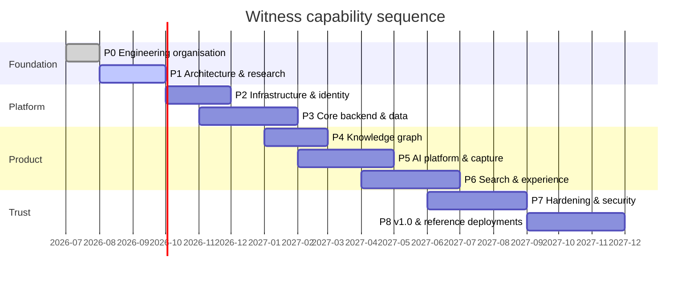

# Roadmap

**Owner:** CTO & Product Director
**Status:** Active
**Last updated:** 2026-08-25
**Review cadence:** Fortnightly (Engineering Review), quarterly (Steering Committee)

> This roadmap sequences _capability_, not calendar dates. Dates are targets, not commitments;
> the sequencing is the commitment. Where a phase gate is not met, we do not proceed — we fix.
> Live progress is in [`STATUS.md`](STATUS.md).

---

## Current delivery position — August 2026

The Phase 1–8 sequence below remains the **long-term architectural roadmap**,
not a literal statement that implementation has waited for every formal phase
exit.

During controlled-pilot development, Witness delivered the human-led MVP
vertically across several of these future phases: authentication,
authorisation, organisation/program isolation, consent, evidence capture and
review, decisions/commitments/actions, summaries, reports/exports, browser
recording, local transcription/AI drafting and the client-facing web
experience.

Version 0.3.0 adds repeatable institutional pilot configuration, facilitator
guidance, structured pilot feedback and measurable operational value signals.

The following remain deliberately incomplete and therefore prevent the later
roadmap phases or v1.0 from being called complete:

- knowledge-graph projection;
- hybrid/vector search;
- speaker diarisation and published language evaluation;
- database-level row-level-security defence-in-depth;
- full hardening, supply-chain release artefacts and general-availability
  operations;
- formal completion/sign-off of outstanding governance and research gates.

This distinction is intentional: **a capability may exist in the controlled
pilot while its broader roadmap phase remains incomplete.**

## Commercial foundation workstream

Commercialisation is an additive workstream over the controlled human-led pilot; it does not reorder
or weaken the Phase 1-8 architectural sequence. Detailed, atomic tasks and acceptance criteria are in
[`COMMERCIAL_IMPLEMENTATION_ROADMAP.md`](docs/engineering/COMMERCIAL_IMPLEMENTATION_ROADMAP.md).

| Milestone | Outcome | State |
| --- | --- | --- |
| C1 — Commercial Domain Foundation | Every organisation has a FREE subscription; entitlement is domain-evaluated | ✅ Implemented |
| C2 — Pricing and Self-Service Upgrade UX | Public pricing and authenticated upgrade choice | ⚪ Planned |
| C3 — Invoice + Direct Bank Transfer | Institution can be invoiced and manually reconciled | ⚪ Planned |
| C4 — Payment Provider Port | Settlement providers are replaceable adapters | ⚪ Planned |
| C5 — Usage, Cost Allocation and Unit Economics | Allowances and per-customer margin are reportable | ⚪ Planned |
| C6 — Commercial Pilot Readiness | External customer journey verified end to end | ⚪ Planned |

Commercial state remains in Witness/PostgreSQL. Payment providers only transport or confirm
settlement, as proposed in [ADR-0022](architecture/decisions/ADR-0022-billing-and-payments-as-replaceable-ports.md).

---

## Sequencing principle

Witness is built in dependency order, not demo order. The temptation in a project like this is to
build the impressive part (AI extraction, graph visualisation) first and retrofit the foundations
(consent, provenance, identity) later. That retrofit is impossible in practice: consent and
provenance are cross-cutting invariants that must exist before the first assertion is written, or
every assertion written before them is permanently untrustworthy.

Therefore: **foundations → boundaries → pipeline → intelligence → experience → hardening.**

---

## Phase 0 — Engineering organisation _(complete)_

**Goal:** an organisation capable of building this for ten years exists before any code does.

| Deliverable                                               | State |
| --------------------------------------------------------- | ----- |
| Engineering & product operating models                    | ✅    |
| Repository, branch and release strategy                   | ✅    |
| ADR process and initial decision set                      | ✅    |
| Contribution, review, CI/CD and security review processes | ✅    |
| AI development workflow and guardrails                    | ✅    |
| Role definitions (`agents/`)                              | ✅    |
| Governance, code of conduct, security policy              | ✅    |
| Full documentation baseline                               | ✅    |

**Exit gate:** a competent engineer joining with no context can find the answer to "how do we work
here, and why is it built this way?" without asking a human. **Met.**

---

## Phase 1 — Architecture & research _(active)_

**Goal:** every significant technical choice is made, justified and recorded before implementation.

| #    | Deliverable                                       | Owner                | Definition of done                                                                                              |
| ---- | ------------------------------------------------- | -------------------- | --------------------------------------------------------------------------------------------------------------- |
| 1.1  | C4 architecture (context, container, component)   | Principal Architect  | Diagrams in-repo as Mermaid, reviewed                                                                           |
| 1.2  | Domain model & bounded contexts                   | Principal Architect  | Aggregates, invariants, context map published                                                                   |
| 1.3  | Knowledge graph ontology v0.1                     | Knowledge Graph Lead | 13 entity types + relationship taxonomy, CIDOC-CRM/PROV-O alignment documented                                  |
| 1.4  | Event catalogue v0.1                              | Backend Lead         | AsyncAPI spec for all domain events                                                                             |
| 1.5  | API contract v0.1                                 | Backend Lead         | OpenAPI + GraphQL SDL, spec-first, no implementation                                                            |
| 1.6  | OSS evaluation for every dependency               | Research Lead        | [`docs/research/OSS_EVALUATION.md`](docs/research/OSS_EVALUATION.md) complete with exit strategy per dependency |
| 1.7  | Threat model (STRIDE) & privacy impact assessment | Security Lead        | Signed off; mitigations tracked in risk register                                                                |
| 1.8  | Consent framework specification                   | Governance Lead      | Legal bases, lifecycle, revocation semantics, Indigenous data protocols                                         |
| 1.9  | Accessibility & multilingual strategy             | UX Lead              | WCAG 2.2 AA plan, RTL, low-bandwidth budget                                                                     |
| 1.10 | Non-functional requirements & SLOs                | CTO                  | Latency, throughput, availability, recovery objectives quantified                                               |

**Exit gate:** no unanswered "we'll figure that out later" on any load-bearing decision. All
ADRs 0001–0020 accepted or explicitly deferred with an owner.

---

## Phase 2 — Infrastructure & identity

**Goal:** a developer clones the repo and has a working, observable, authenticated platform
locally in under fifteen minutes.

| #   | Deliverable                                                                                 | Definition of done                                  |
| --- | ------------------------------------------------------------------------------------------- | --------------------------------------------------- |
| 2.1 | Monorepo toolchain (pnpm, Turborepo, TS project refs)                                       | `pnpm install && pnpm build` green from clean clone |
| 2.2 | Local dev stack (Docker Compose: Postgres, Neo4j, OpenSearch, Redis, MinIO, Keycloak, NATS) | `make dev` → all healthy                            |
| 2.3 | CI pipeline (lint, typecheck, test, build, SBOM, scan)                                      | All PRs gated; < 10 min p95                         |
| 2.4 | Observability baseline (OpenTelemetry, Prometheus, Grafana, structured logs)                | Traces span HTTP → service → DB from day one        |
| 2.5 | Keycloak realm-as-code, OIDC flows, JWT validation                                          | Login works; realm reproducible from source         |
| 2.6 | Casbin authorisation model (RBAC + ABAC + relationship-based)                               | Policy unit tests pass; deny-by-default proven      |
| 2.7 | Helm chart & Terraform modules (skeleton, deployable)                                       | Chart installs on kind; `terraform validate` clean  |
| 2.8 | Secrets management & key rotation runbook                                                   | No secret in git; rotation tested                   |

**Exit gate:** a new contributor is productive in one morning; a hostile reviewer cannot find an
unauthenticated path to data.

---

## Phase 3 — Core backend & data

**Goal:** the system of record exists and is correct, with consent enforced before any data lands.

| #   | Deliverable                                                 | Definition of done                                                                     |
| --- | ----------------------------------------------------------- | -------------------------------------------------------------------------------------- |
| 3.1 | Domain layer (`packages/domain`) — pure, framework-free     | 100% unit tested; zero infrastructure imports (enforced by lint rule)                  |
| 3.2 | Hexagonal service template (`templates/service`)            | Generates a service passing all gates                                                  |
| 3.3 | PostgreSQL schema + Prisma; event log; transactional outbox | Migrations reversible; outbox delivery at-least-once proven                            |
| 3.4 | **Consent service** — grants, scopes, revocation, audit     | Revocation propagates to all projections within SLO; bypass impossible by construction |
| 3.5 | Identity service — org/tenant/user/role model               | Multi-tenant isolation verified by adversarial test                                    |
| 3.6 | API gateway — GraphQL BFF + REST, spec-conformant           | Contract tests against Phase 1 specs; breaking-change detection in CI                  |
| 3.7 | Audit log — append-only, tamper-evident                     | Hash-chained; verification tool ships                                                  |
| 3.8 | Backup & restore runbook                                    | Full restore from cold backup, timed and documented                                    |

**Exit gate:** consent and provenance invariants are enforced by the type system and the database,
not by developer discipline.

---

## Phase 4 — Knowledge graph

| #   | Deliverable                                                | Definition of done                                             |
| --- | ---------------------------------------------------------- | -------------------------------------------------------------- |
| 4.1 | Ontology implementation & versioning                       | Schema migrations for the graph; versioned, forward-compatible |
| 4.2 | Graph projector worker (event log → Neo4j)                 | Idempotent; full rebuild from zero verified                    |
| 4.3 | Entity resolution & merge/split with human adjudication    | Precision/recall measured on a labelled fixture set            |
| 4.4 | Temporal model (bitemporal: valid time + transaction time) | "What did we believe on date X?" answerable                    |
| 4.5 | Graph query API + traversal safety limits                  | No unbounded traversal reachable from the API                  |
| 4.6 | Provenance chain API                                       | Every node resolves to source utterance in ≤ 3 calls           |

**Exit gate:** delete the graph entirely; rebuild it from the event log; byte-comparable result.

---

## Phase 5 — AI platform & meeting capture

| #   | Deliverable                                                   | Definition of done                                                          |
| --- | ------------------------------------------------------------- | --------------------------------------------------------------------------- |
| 5.1 | LiteLLM gateway, model registry, per-tenant egress policy     | Default config provably makes zero external calls                           |
| 5.2 | Transcription worker (Whisper) + diarisation + alignment      | WER and DER published per language on a held-out set                        |
| 5.3 | Media ingestion, chunking, storage lifecycle (MinIO)          | Large-file upload resumable; retention policy enforced                      |
| 5.4 | Extraction pipeline (LangGraph) → candidate assertions        | Every candidate carries model version, prompt hash, confidence, source span |
| 5.5 | Human review queue & correction UX                            | Reviewer throughput measured; corrections feed evaluation set               |
| 5.6 | Evaluation harness & regression suite for extraction          | Model/prompt change cannot merge without eval delta report                  |
| 5.7 | Document processing (LlamaIndex) — PDFs, minutes, submissions | OCR path for scanned documents; provenance preserved                        |
| 5.8 | Offline / low-connectivity capture                            | Field capture with deferred sync, conflict resolution defined               |

**Exit gate:** no model output reaches the graph without provenance and human confirmation —
demonstrated by attempting to bypass it and failing.

---

## Phase 6 — Search & experience

| #   | Deliverable                                                                | Definition of done                                                     |
| --- | -------------------------------------------------------------------------- | ---------------------------------------------------------------------- |
| 6.1 | Hybrid search (OpenSearch BM25 + pgvector) with permission-aware filtering | No result leaks across consent or tenant boundary — adversarial tested |
| 6.2 | Next.js 15 web application                                                 | Meeting, entity, decision, commitment and provenance views             |
| 6.3 | Design system (`packages/ui`, shadcn/ui + Tailwind)                        | Component library documented; WCAG 2.2 AA verified per component       |
| 6.4 | Graph exploration UI                                                       | Usable by non-technical policy officers — validated by user testing    |
| 6.5 | Admin console                                                              | Tenant, consent, retention, model and user administration              |
| 6.6 | Internationalisation & RTL                                                 | Full UI translatable; two non-English locales shipped                  |
| 6.7 | SDKs (TypeScript, Python) + examples                                       | Generated from contracts; published; example apps run                  |

**Exit gate:** an unassisted policy officer completes the core task in usability testing.

---

## Phase 7 — Hardening

| #   | Deliverable                                         | Definition of done                                     |
| --- | --------------------------------------------------- | ------------------------------------------------------ |
| 7.1 | Independent penetration test                        | Findings remediated or formally accepted               |
| 7.2 | Performance & scale testing                         | SLOs met at target volume; documented capacity model   |
| 7.3 | Disaster recovery exercise                          | RTO/RPO met in a live drill, not on paper              |
| 7.4 | Accessibility audit (external)                      | WCAG 2.2 AA certified                                  |
| 7.5 | Supply chain: SBOM, signing, provenance attestation | SLSA build level 3; artifacts signed and verifiable    |
| 7.6 | Air-gapped installation                             | Verified install with no internet, from offline bundle |
| 7.7 | Threat model refresh & privacy re-assessment        | Signed off against as-built system                     |

---

## Phase 8 — v1.0 & reference deployments

| #   | Deliverable                                                                                    |
| --- | ---------------------------------------------------------------------------------------------- |
| 8.1 | Three reference deployments: national government, Indigenous organisation, development partner |
| 8.2 | Operator training materials & certification path                                               |
| 8.3 | Published case studies including failure modes and limitations                                 |
| 8.4 | Foundation governance transition (see [`GOVERNANCE.md`](GOVERNANCE.md))                        |
| 8.5 | Digital Public Goods Alliance submission                                                       |
| 8.6 | v1.0.0 release with long-term support commitment                                               |

---

## Beyond v1.0 — candidate directions

Not commitments. Recorded so they are not forgotten, and so we resist doing them early.

- Federated search across institutions with consent-preserving boundaries
- Cross-institution commitment reconciliation (did the promise made in one department land in another?)
- Standardised civic decision-record interchange format (proposed as an open standard)
- Regional language model fine-tuning cooperatives for under-served languages
- Formal Hansard/parliamentary record integration
- Longitudinal analysis tooling for oversight bodies

## Explicitly deferred

| Item                                    | Why deferred                                                                  | Revisit when                                         |
| --------------------------------------- | ----------------------------------------------------------------------------- | ---------------------------------------------------- |
| Real-time live transcription in-meeting | Large complexity and accuracy cost; batch is sufficient for the core use case | After Phase 5 evaluation data exists                 |
| Mobile native applications              | PWA covers field capture at far lower maintenance cost                        | Field evidence shows PWA insufficient                |
| Multi-tenant SaaS hosting               | Contradicts sovereignty default; distracts from self-host quality             | Only if a neutral public-sector operator requests it |
| Video analysis                          | Marginal value over audio + slides for the core use case                      | Post-v1.0                                            |
| Automated decision recommendation       | Violates principle P4                                                         | Never                                                |
