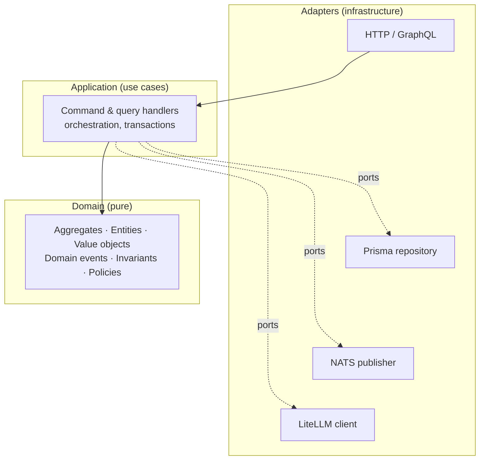
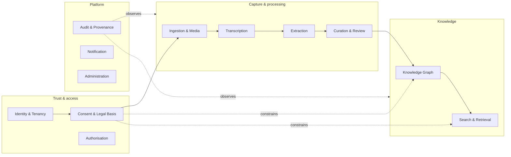
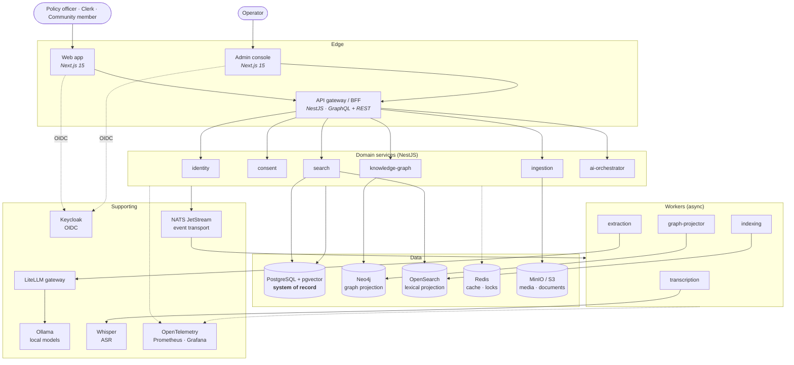
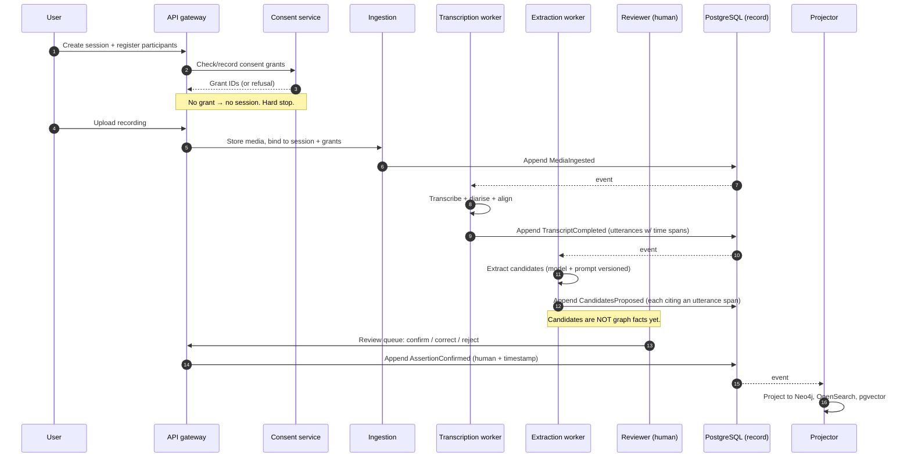

# Witness Architecture

**Owner:** Principal Architect
**Status:** Baseline — Phase 1
**Last reviewed:** 2026-07-31
**Companion documents:** [`SYSTEM_CONTEXT.md`](SYSTEM_CONTEXT.md) · [`DATA_MODEL.md`](DATA_MODEL.md) · [`KNOWLEDGE_GRAPH.md`](KNOWLEDGE_GRAPH.md) · [`EVENT_CATALOGUE.md`](EVENT_CATALOGUE.md) · [`SECURITY_ARCHITECTURE.md`](SECURITY_ARCHITECTURE.md) · [`DEPLOYMENT_ARCHITECTURE.md`](DEPLOYMENT_ARCHITECTURE.md) · [`decisions/`](decisions/)

---

## 1. Architectural goals

Ranked. When they conflict, the higher one wins — this ordering is the actual architecture, and
most disagreements dissolve once people agree on it.

| # | Goal | Consequence |
|---|---|---|
| 1 | **Correctness of the record** | Provenance and consent invariants enforced structurally. We would rather record nothing than record something unattributable. |
| 2 | **Sovereignty** | No runtime dependency on any service outside the operator's boundary. |
| 3 | **Longevity & replaceability** | Every external technology behind a port. Nothing irreplaceable. |
| 4 | **Operability** | Deployable and recoverable by a small, under-resourced public-sector IT team. |
| 5 | **Security & privacy** | Deny by default; least privilege; data minimisation; auditability. |
| 6 | **Evolvability** | Ontology, models and schema will all change. Design for migration, not for being right first time. |
| 7 | **Performance** | Fast enough that people use it. Explicitly below correctness and operability. |
| 8 | **Cost** | Runs meaningfully on modest hardware; scales up when needed. |

**Notable non-goal:** elastic web-scale. Witness serves institutions, not the public internet. A
large national deployment is thousands of users and tens of thousands of meetings per year, not
millions of concurrent sessions. Architecting for scale we will never see would cost us
operability, which we need every day.

## 2. Architectural style

Four patterns, each with a specific job.

| Pattern | Applied to | Why |
|---|---|---|
| **Domain-Driven Design** | The whole system | The domain — consent, provenance, institutional decisions — is the hard part. Model it explicitly, with a language shared with policy officers and archivists. |
| **Hexagonal (ports & adapters)** | Every service | Goal 3. Neo4j, OpenSearch, Whisper and every LLM are adapters behind ports. Replaceable without touching domain logic. |
| **Clean Architecture layering** | Within each service | Dependencies point inward. Domain has zero infrastructure imports — enforced by a lint rule, not by discipline. |
| **Event-driven + CQRS** | Between contexts | Write model (Postgres, normalised, transactional) is separate from read models (graph, lexical, vector). Projections are disposable and rebuildable. |

**API-first:** contracts (OpenAPI, GraphQL SDL, AsyncAPI) are authored before implementation and
live in [`packages/contracts`](../packages/contracts). Implementations are verified against them
by contract tests, and breaking changes are detected in CI.

### Layering within a service

**The rule:** `packages/domain` imports nothing but the standard library and other domain code. No
Prisma, no NestJS, no HTTP, no clock, no randomness. Time and identity are injected. This is what
makes the domain testable in milliseconds and portable across a decade of framework churn.

## 3. Bounded contexts

Contexts map to teams, services, integration branches and CODEOWNERS. That alignment is
deliberate — Conway's Law is not resisted, it is exploited.

| Context | Owns | Key invariant |
|---|---|---|
| **Identity & Tenancy** | Organisations, workspaces, users, roles, groups | A user acts within exactly one tenant per request; cross-tenant reference is impossible |
| **Consent & Legal Basis** | Grants, scopes, subjects, revocations, legal bases | No processing of a subject's data without an active grant covering the purpose |
| **Authorisation** | Policy model, decision point, effective permissions | Absence of an explicit allow is a deny |
| **Ingestion & Media** | Sessions, recordings, uploads, documents, lifecycle | Every media object is bound to a session with a consent grant before processing |
| **Transcription** | Transcripts, utterances, speakers, alignment, diarisation | Every utterance has a time range in an identified media object |
| **Extraction** | Candidate assertions, model runs, prompts, confidence | Every candidate cites the utterance span that produced it |
| **Curation & Review** | Review queues, adjudication, corrections, merges | No candidate becomes an assertion without a human decision |
| **Knowledge Graph** | Entities, relationships, temporal validity, resolution | Every node and edge resolves to at least one confirmed assertion |
| **Search & Retrieval** | Indexes, embeddings, ranking, permission filtering | No result is returned that the caller is not permitted to see |
| **Audit & Provenance** | Append-only audit log, provenance chains | The log is tamper-evident and never mutated |
| **Notification** | Subscriptions, digests, delivery | Notifications never leak content the recipient cannot see |
| **Administration** | Configuration, retention, model policy, tenant setup | Every administrative action is audited and attributable |

### Context map

| Upstream → Downstream | Relationship | Notes |
|---|---|---|
| Identity → all | **Conformist** | Everyone accepts the identity model as given |
| Consent → Ingestion, KG, Search | **Customer/Supplier** with an enforced gate | Downstream cannot proceed without a decision; this is a *hard* dependency by design |
| Transcription → Extraction | **Published language** (transcript schema) | Versioned contract in `packages/contracts` |
| Extraction → Curation | **Published language** (candidate assertion schema) | |
| Curation → Knowledge Graph | **Customer/Supplier** | Graph only accepts confirmed assertions |
| Knowledge Graph → Search | **Open host service** (projection events) | Search is one of several projection consumers |
| External systems (EDRMS, calendar, SSO) | **Anti-corruption layer** | External models never leak into the domain — this is where most long-lived systems rot |

## 4. Runtime architecture

### C4 Level 2 — containers

### The central flow

The gap between steps 10 and 12 is the entire ethical position of the product. Everything before
it is a proposal; everything after it is institutional record.

## 5. The load-bearing decisions

Six decisions carry the architecture. Each has an ADR; here is why they exist together.

### 5.1 PostgreSQL is the system of record; everything else is a projection

Neo4j is excellent at traversal and bad at being a durable transactional system of record for
regulated data. OpenSearch is a search index, not a database, whatever anyone tells you. So:
Postgres holds the append-only event log and the normalised write model; Neo4j, OpenSearch and
pgvector are **rebuildable projections**.

This one decision is what makes tractable:
- **Consent revocation** — delete from the log's tombstone set, rebuild projections, done
- **Model re-runs** — re-extract, re-review, re-project without corrupting history
- **Ontology evolution** — change the projection logic, replay
- **Disaster recovery** — back up one database, not four consistent snapshots of four
- **Operability** — an operator needs to reliably back up *one* thing

[ADR-0011](decisions/ADR-0011-knowledge-graph-as-projection.md), [ADR-0004](decisions/ADR-0004-polyglot-persistence.md)

### 5.2 Consent is enforced at a policy decision point, not in application code

A consent check scattered across forty call sites will be missing from at least one. Instead: a
single policy decision point, a domain type (`ConsentedContext`) that cannot be constructed
without a valid decision, and repository methods that structurally require it. Forgetting the
check becomes a compile error rather than a privacy incident.

[ADR-0008](decisions/ADR-0008-consent-as-a-domain-primitive.md)

### 5.3 Provenance is a required field, not metadata

An `Assertion` cannot be constructed without a `ProvenanceChain` (source utterance span, media
object, model + prompt version, human confirmer, timestamps). There is no "unknown" variant.
Data without provenance cannot be represented in the type system, so it cannot enter the graph.

[ADR-0012](decisions/ADR-0012-provenance-and-human-in-the-loop.md)

### 5.4 The AI layer is an adapter behind a port with an egress policy

Every model call goes through LiteLLM behind a `LanguageModelPort`. The default binding is Ollama
on local hardware. External providers require: sovereign profile off, per-tenant opt-in, explicit
allowlist, and every call logged and attributable. Model identifiers and prompt hashes are
recorded on every extraction so we can answer "which model said that?" in 2032.

[ADR-0009](decisions/ADR-0009-ai-abstraction-and-model-sovereignty.md)

### 5.5 Bitemporal knowledge

Two independent time axes: **valid time** (when the fact was true in the world) and **transaction
time** (when we came to believe it). Without both, "what did we believe on the date that decision
was made?" is unanswerable — and that is precisely the question an auditor, an ombudsman or a
royal commission asks.

[ADR-0011](decisions/ADR-0011-knowledge-graph-as-projection.md)

### 5.6 Deployment profiles are a first-class architectural concept

`sovereign` | `hybrid` | `development`. The profile is validated at startup and constrains
runtime behaviour — a sovereign instance with an external model provider configured **refuses to
start**. Security posture is a build-and-boot-time property, not a checklist item.

[ADR-0013](decisions/ADR-0013-tenancy-and-deployment-topology.md)

## 6. Cross-cutting concerns

| Concern | Approach |
|---|---|
| **Authentication** | Keycloak, OIDC authorisation-code + PKCE. Services validate JWTs locally against cached JWKS; no per-request IdP round trip. |
| **Authorisation** | Casbin. RBAC for coarse roles, ABAC for tenant/sensitivity attributes, ReBAC for graph-scoped access. Single decision point; deny by default. |
| **Auditing** | Every state change and every read of sensitive material appends to a hash-chained log. Verification tool ships with the product. |
| **Observability** | OpenTelemetry traces, metrics and logs from the first line of code. Trace context propagates through NATS so async pipelines are one trace. |
| **Error handling** | Domain errors are typed values, not exceptions. Infrastructure failures are exceptions with retry/backoff at the adapter. No silent failure. |
| **Idempotency** | Every event consumer is idempotent, keyed on event ID. At-least-once delivery is assumed; exactly-once is a fiction we do not build on. |
| **Transactions** | Transactional outbox pattern — state change and event publication commit atomically in Postgres. |
| **Schema evolution** | Additive-first; expand/contract migrations; contracts versioned; consumers tolerate unknown fields. |
| **Internationalisation** | No user-facing string in code. ICU message format. RTL supported in the design system. |
| **Accessibility** | WCAG 2.2 AA as a CI gate on every UI component. |
| **Configuration** | Twelve-factor via environment; schema-validated at boot; invalid configuration fails fast and loudly. |

## 7. Quality attribute scenarios

Testable statements, not adjectives. These become the NFR suite in Phase 1.10.

| Attribute | Scenario | Target |
|---|---|---|
| **Consent revocation** | A subject revokes consent; the assertion is removed from graph, indexes, embeddings and caches | ≤ 5 minutes, verified by automated test |
| **Provenance retrieval** | A user asks "why does the system believe this?" | Full chain to source audio in ≤ 3 API calls, < 500 ms p95 |
| **Search latency** | Hybrid search over 100k meetings | < 800 ms p95 |
| **Graph traversal** | 3-hop query from an entity | < 1 s p95, hard depth limit enforced |
| **Ingestion throughput** | 1-hour recording, transcription to candidates | < 15 min on 8 vCPU + GPU; < 60 min CPU-only |
| **Projection rebuild** | Full rebuild from event log, 100k meetings | < 6 hours, resumable |
| **Availability** | Core read paths during a projection rebuild | Reads stay available; degraded, not down |
| **Recovery** | Total loss of the database host | RPO ≤ 15 min, RTO ≤ 4 h, drilled quarterly |
| **Sovereignty** | Sovereign profile under network monitoring | Zero outbound packets to non-allowlisted destinations, verified in CI |
| **Cold start** | Operator with no prior knowledge installs from the guide | Working instance in ≤ 1 day |

## 8. Known architectural risks

Recorded because pretending they do not exist is how architectures fail. Tracked in the
[risk register](../docs/governance/RISK_REGISTER.md).

| # | Risk | Mitigation |
|---|---|---|
| **A-1** | Ontology becomes an unbounded research project | Time-boxed v0.1; explicitly versioned and evolvable; ship and iterate |
| **A-2** | Projection rebuild time grows beyond the maintenance window | Incremental and partitioned rebuild designed in from the start; measured continuously |
| **A-3** | Extraction quality is unacceptable in low-resource languages | Measured and published per language; human review is mandatory anyway, so poor extraction degrades throughput rather than correctness |
| **A-4** | Neo4j licensing or footprint blocks constrained deployments | Graph access behind a port; Apache AGE evaluated as an alternative binding (D-4) |
| **A-5** | Four data stores exceed the operational capacity of a small team | Single-node profile collapses the stack; Postgres-only minimal profile under evaluation |
| **A-6** | Human review becomes the throughput bottleneck | Review UX is a first-class product surface, not an afterthought; batch adjudication; confidence-based triage |
| **A-7** | Prompt injection from recorded speech forges assertions | Extraction output is data, never instruction; strict output schemas; human confirmation gate; adversarial test corpus |
| **A-8** | Event log grows unboundedly | Partitioning, archival tiering and compaction designed in Phase 3, not retrofitted |

## 9. What we explicitly rejected

| Rejected | Why |
|---|---|
| Microservices per entity type | Operational cost with no benefit at our scale; bounded contexts are the right granularity |
| Neo4j as system of record | Transactional and backup story insufficient for regulated data; licensing risk on a critical path |
| Kafka as the event backbone | Operationally heavy for a ministry IT team; NATS JetStream gives us what we need at a fraction of the burden ([ADR-0005](decisions/ADR-0005-event-driven-backbone.md)) |
| Vector database as a separate product (Pinecone, Weaviate, Qdrant) | pgvector avoids a fourth store and a fifth backup; revisit only with measured evidence |
| LLM agents writing directly to the graph | Violates principle P4 and destroys provenance |
| Multi-tenant SaaS as the primary deployment | Contradicts sovereignty; distracts from self-host quality |
| GraphQL as the only API | Machine-to-machine integrators and government systems need stable REST; both, spec-first |
| Building our own ASR or LLM | We are not a model lab. Consume the ecosystem, keep it swappable |
| Blockchain for provenance | A hash-chained append-only log in Postgres provides tamper evidence without the operational and political cost |

---

**Next:** [`SYSTEM_CONTEXT.md`](SYSTEM_CONTEXT.md) for the external landscape, or
[`decisions/`](decisions/) for the reasoning behind each choice above.
