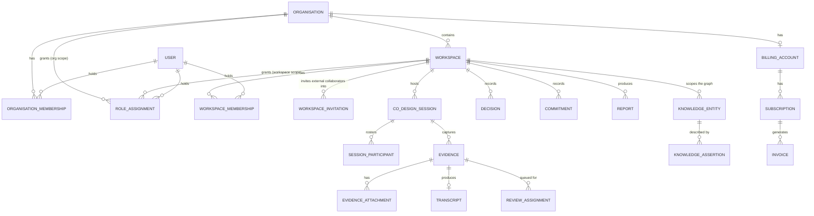

# Data Model

**Owner:** Principal Architect & Backend Lead
**Status:** As-built — describes the real PostgreSQL schema, not a future one
**Companion:** [`KNOWLEDGE_GRAPH.md`](KNOWLEDGE_GRAPH.md) (the Neo4j projection) ·
[`decisions/ADR-0028`](decisions/ADR-0028-organisation-workspace-session-participant-model.md)
(the ratified Organisation/Workspace/Session/Participant model this document describes)

> This describes the **write model** — the system of record in PostgreSQL
> (`services/api-gateway/prisma/schema.prisma`). The knowledge graph in Neo4j is a disposable
> projection derived from it (ADR-0011); if the two ever disagree, the write model is right and
> the projection is rebuilt.
>
> **This file replaces an earlier draft** that described a different, never-implemented schema
> (`tenant`, `subject`, `group`, `media_object`, bitemporal `valid_from`/`valid_to` on every table,
> PostgreSQL row-level security). That draft was Phase 1 planning, written before implementation
> began, and was never updated to match what was actually built. Where this document and that
> planning differed, treat every difference below as the real, current, *only* system of record —
> not a second model to reconcile against.

## 1. Modelling principles, as actually implemented

1. **PostgreSQL is the system of record.** Everything else — the Neo4j knowledge graph — is a
   disposable projection, rebuilt from a transactional-outbox event log at any time (ADR-0011).
2. **Assertions, not facts, in the knowledge graph specifically.** A `KnowledgeAssertion` traces to
   a `KnowledgeProvenanceChain`, which names the source `Evidence`, the confirming actor, and
   (where AI extraction exists — it does not yet) the extraction run. This discipline applies to
   the knowledge graph's write path (`packages/domain/src/knowledge-assertion.ts`); it is not (yet)
   generalised to every table in the schema the way the original draft envisioned.
3. **Append-only, hash-chained audit.** Every privilege-bearing or state-changing write appends an
   `AuditEvent` (`audit_event` table), each carrying the hash of the one before it
   (`packages/domain/src/audit.ts`). This is real and enforced today — the original draft's
   `audit_entry` was the same idea under a different name.
4. **Tenant isolation is application- and repository-layer enforced, not PostgreSQL row-level
   security.** Every organisation-and-workspace-scoped table carries `organisation_id`/
   `workspace_id`, checked in the application layer and covered by adversarial cross-tenant tests
   (`test/adversarial/adversarial.test.ts` and the knowledge-graph-specific suites). Database-level
   RLS remains a tracked, deferred defence-in-depth item — see `STATUS.md`. This is the single
   biggest divergence from the original draft's principle 5 ("tenant isolation is structural"):
   today it is disciplined, tested, and application-enforced, not structurally guaranteed by
   Postgres itself.
5. **Provenance is required for knowledge, not for every row.** A `KnowledgeEntityAttribute` or
   `KnowledgeRelationship` cannot exist without an `assertion_id` (`NOT NULL` foreign key) — this
   part of the original draft's principle 6 is real and enforced exactly as described. It applies
   to the knowledge graph's write model specifically, not to every table in the schema (an
   `Organisation` row, for instance, has no "provenance" concept — it is administrative data, not
   an assertion about the world).
6. **Soft, explicit lifecycle states — not bitemporal valid-time tracking.** Most aggregates use an
   explicit status/state field with a defined transition table (`MembershipState`, `SessionStatus`,
   `AssertionLifecycleState`, and so on), checked by a pure domain function
   (`assertMembershipTransition`, `canTransitionSession`, …). This is simpler than the original
   draft's two-axis bitemporal model (`valid_from`/`valid_to` independent of `recorded_at`/
   `retracted_at` on every table) and is what is actually implemented everywhere except the
   knowledge graph's `KnowledgeAssertion`, which does carry both a validity window and a
   `recordedAt`/`retractedAt` pair — see `KNOWLEDGE_GRAPH.md`.

## 2. Aggregate map



| Aggregate | Root | Boundary rationale |
|---|---|---|
| **Organisation** | `Organisation` | The tenant boundary (ADR-0028). Everything else hangs off it, directly or via `Workspace`. |
| **Workspace** | `Workspace` | A scoped working area inside one organisation — what the product UI calls a "programme" or "co-design" (ADR-0028). Sessions, evidence, knowledge and reports are all scoped to a workspace, not directly to an organisation, so one organisation running several unrelated programmes keeps them separated. |
| **Membership & Authority** | `OrganisationMembership` / `WorkspaceMembership` / `RoleAssignment` | Three deliberately separate concepts — belonging (Membership) and permission (RoleAssignment) are never conflated (ADR-0028). A `RoleAssignment` requires a `Membership` in good standing at the *same* scope. |
| **WorkspaceInvitation** | `WorkspaceInvitation` | New in ADR-0028 — the lifecycle by which an *external* collaborator (no organisation membership required) is granted workspace-scoped `WorkspaceMembership` + `RoleAssignment`. |
| **CoDesignSession** | `CoDesignSession` | One workshop, meeting, or structured conversation. `draft → scheduled → open → closed → archived`. |
| **SessionParticipant** | `SessionParticipant` | Who is on one session's roster, and how identifying their record is (`named`/`pseudonymous`/`anonymous`) — orthogonal to `RoleAssignment` authority; a participant need not hold a Witness account at all. |
| **Evidence** | `Evidence` | A captured contribution (audio, document, or image), each with its own consent-gated attachment kind. Reviewed, corrected, and provenance-linked into the knowledge graph once confirmed. |
| **Knowledge** | `KnowledgeEntity` / `KnowledgeAssertion` / `KnowledgeRelationship` | The Evidence Knowledge Graph's write model — see `KNOWLEDGE_GRAPH.md` for the full shape; summarised in §3 below only far enough to place it in the wider schema. |
| **Decisions, Commitments, Reports** | `Decision` / `Commitment` / `Report` | The outcomes a workspace produces — each independently reviewable/approvable, each workspace-scoped. |
| **Commercial** | `BillingAccount` / `Subscription` / `Invoice` | Organisation-scoped commercial state — catalogue-driven entitlements, provider-independent settlement (ADR-0022, ADR-0023). |
| **AuditEvent** | `AuditEvent` | Append-only, hash-chained, never part of another aggregate's transaction. |

## 3. Core entities

### Tenancy, identity and authority

```text
organisation           (id, name, storage_quota_bytes, profile, created_at)
workspace              (id, organisation_id, name, description, created_at)
witness_user            (id, email, display_name, bio, account_state, created_at, updated_at)
                       -- account_state: invited | active | suspended | deactivated
identity_link          (id, user_id, provider, provider_subject, linked_at, last_sign_in_at)
                       -- the Keycloak OIDC `sub` a user last signed in with

organisation_membership (id, organisation_id, user_id, state, created_at, updated_at)
workspace_membership    (id, workspace_id, user_id, state, created_at, updated_at,
                        affiliation_type?, affiliation_label?, via_invitation_id?)
                       -- affiliation_type/label and via_invitation_id are set only for an
                       -- external collaborator (ADR-0028); null for an internal member added
                       -- through an organisation-membership-gated path
role_assignment        (id, scope_type, organisation_id?, workspace_id?, user_id, role,
                        via_invitation_id?, created_at, updated_at)
                       -- scope_type: organisation | workspace | platform (platform is narrow,
                       -- bootstrap-only — see role-resolution.service.ts). organisation_id and
                       -- workspace_id are mutually exclusive per scope_type.
workspace_invitation   (id, organisation_id, workspace_id, invited_email, invited_name?,
                        inviter_id, role, affiliation_type, affiliation_label?, message?,
                        status, token_hash, expires_at, accepted_at?, accepted_by_user_id?,
                        declined_at?, revoked_at?, resend_count, delivery_status,
                        delivery_attempts, last_delivery_error?, created_at, updated_at)
                       -- status: pending | accepted | declined | expired | revoked (ADR-0028)
```

`witness_user` deliberately holds no password or credential — Keycloak owns authentication.
`state` on both membership tables uses the shared `invited | active | suspended | revoked` machine
(`packages/domain/src/membership.ts`); `revoked` is terminal (re-admitting is a new membership, not
a reopened one, so the audit trail never has to explain "revoked, then un-revoked" as one row).

`MembershipState` and `WorkspaceInvitation`'s own status are two different machines on purpose —
membership answers "does this person currently belong," invitation answers "what happened to one
specific invite," and an invitation can be re-sent (`expired → pending`) independently of whatever
the resulting membership's state is once accepted.

### Sessions, participants and evidence

```text
co_design_session      (id, organisation_id, workspace_id, title, session_type, occurred_at,
                        primary_facilitator_id, status, version, ...)
                       -- status: draft | scheduled | open | closed | archived
session_participant    (id, organisation_id, workspace_id, session_id, linked_user_id?,
                        display_name, affiliation?, participant_type, participation_mode,
                        identity_mode, identity_visibility, invitation_status,
                        attendance_status, consent_status_summary, facilitator_notes?,
                        withdrawn_at?, version, ...)
                       -- identity_mode: named | pseudonymous | anonymous — an anonymous
                       -- participant can never carry linked_user_id or identifying fields
                       -- (enforced in packages/domain/src/session-participant.ts, not just the UI)
evidence               (id, organisation_id, workspace_id, session_id, evidence_type,
                        content, attribution_mode, consent_basis, status, ...)
evidence_attachment    (id, evidence_id, kind, storage_key, mime_type, checksum, ...)
                       -- kind: audio | document | image — each gated by its own consent check
                       -- (mayRecordAudio vs maySubmitEvidence), with MIME allow-lists and
                       -- magic-byte verification for document/image
transcript             (id, evidence_id, engine, status, produced_at, ...)
review_assignment      (id, evidence_id, reviewer_user_id, status, ...)
```

`session_participant.affiliation` is free text — "which organisation is this participant from," as
a label, never a foreign key to a real `Organisation` tenant (ADR-0028's affiliation-is-not-
authority principle, already true here since before this ADR existed).

### Decisions, commitments, reports

```text
decision               (id, organisation_id, workspace_id, ...)
commitment             (id, organisation_id, workspace_id, owner_user_id, status, ...)
action_item            (id, organisation_id, workspace_id, owner_user_id, status, ...)
report                 (id, organisation_id, workspace_id, status, ...)
report_source          (id, report_id, source_type, source_id, included, ...)
```

### Knowledge (see `KNOWLEDGE_GRAPH.md` for the full model)

```text
knowledge_domain              (id, organisation_id, workspace_id, ...)
knowledge_entity               (id, organisation_id, workspace_id, entity_type, canonical_label,
                                status, merged_into_id?, ...)
knowledge_provenance_chain     (id, source_evidence_ids[], confirmed_by_actor_id, confirmed_at, ...)
knowledge_assertion             (id, organisation_id, workspace_id, provenance_chain_id,
                                 lifecycle_state, perspective_tags[], valid_from, valid_to?,
                                 retracted_at?, ...)
knowledge_entity_attribute      (id, entity_id, attribute_key, attribute_value, assertion_id, ...)
knowledge_relationship          (id, from_entity_id, to_entity_id, relationship_type,
                                 assertion_id, ...)
knowledge_candidate_assertion   (id, status, source_evidence_ids[], extraction_method, ...)
                                -- 'human_manual' only today; AI extraction methods are modelled
                                -- but not yet populated by any running extraction pipeline
```

Every `knowledge_entity_attribute` and `knowledge_relationship` row carries a `NOT NULL
assertion_id` foreign key — an attribute or relationship with no assertion is impossible to insert,
a database constraint, not a convention.

### Commercial

```text
billing_account        (id, organisation_id, ...)
subscription            (id, billing_account_id, plan, status, interval, current_period_start,
                         current_period_end, ...)
invoice                 (id, organisation_id, subscription_id?, invoice_number, status,
                         currency, purchase_order_reference?, due_date, ...)
payment                 (id, invoice_id, source_reference, idempotency_key, verified_at, ...)
entitlement_grant        (id, organisation_id, capability_key, source, effective_from, ...)
```

Manual/bank-transfer settlement (`payment.idempotency_key` + a Postgres advisory transaction lock)
guarantees exactly-once entitlement activation — a repeated settlement event never double-activates
a subscription. See ADR-0022. There is currently no `CommercialAgreement`/contract-lifecycle
aggregate — see ADR-0023's documented divergence note.

### Audit

```text
audit_event             (id, subject_type, subject_id, action, actor_id, occurred_at,
                         previous_hash, hash, metadata_json)
```

Hash-chained: `hash = SHA256(previous_hash || canonicalise(event))`. Append-only at the application
layer (`packages/domain/src/audit.ts`'s `createAuditEvent`/`verifyChain`) — this gives tamper
*evidence*, not tamper *proofing*: a sufficiently privileged attacker with direct database access
could rewrite the chain from a point forward without detection by `verifyChain` alone. External,
periodically-anchored checkpoints (making even that undetectable-rewrite impossible) remain future
work, matching the original draft's own honesty about this same limitation.

### Event log (the projection mechanism)

```text
event_log_entry        (id, organisation_id, workspace_id?, aggregate_type, aggregate_id,
                        event_type, event_version, payload_json, occurred_at)
outbox                  (id, event_id, destination, status, attempts, dispatched_at)
knowledge_graph_projection_checkpoint (projection_name, last_event_id, status, updated_at)
```

`event_log_entry` plus `outbox` in one transaction is the transactional outbox pattern this
project actually runs on: state and event publication commit atomically, so an event is never
published for a change that rolled back, and a committed change's event is never lost. This is the
mechanism `workers/graph-projector` polls to keep Neo4j current — see ADR-0011 and ADR-0027.

## 4. Tenant isolation, as actually enforced

Every organisation/workspace-scoped table carries `organisation_id` and, where applicable,
`workspace_id`, checked in the application layer (every service method takes and validates a scope)
and the repository layer (every query is scoped, never relying on the caller to remember a `WHERE`
clause — see the knowledge-graph package's own `TenantScope`-typed query methods as the clearest
example). PostgreSQL row-level security is **not** implemented — this is a deliberate, tracked,
deferred defence-in-depth item, not an oversight (`STATUS.md`, "Database-level RLS remains future
defence-in-depth"). Adversarial cross-tenant tests exist and run in CI
(`test/adversarial/adversarial.test.ts` plus the knowledge-graph package's own tenant-isolation
suites) to catch a missing application-layer check before RLS would have.

## 5. Sensitivity and access

`sensitivity_class` (`internal | confidential | restricted`, per aggregate) exists on `Organisation`,
`KnowledgeEntity`, and `KnowledgeAssertion` today. It is currently **informational** — displayed,
not enforced as an access-control filter anywhere outside the one specific case ADR-0027 documents
(the `community_restricted` perspective tag, redacted from callers lacking
`knowledge_provenance:inspect`). A general sensitivity-based access-control model for
`confidential`/`restricted` content remains a real, tracked, unimplemented gap — see `STATUS.md`'s
security workstream. Do not assume `sensitivity_class` gates visibility anywhere it is not
explicitly documented to.

## 6. Migration strategy

- **Expand / migrate / contract**, the same convention the original draft specified and every
  Prisma migration in this repository actually follows: additive columns/tables first, backfilled,
  read paths switched over, only then is anything dropped — never a single destructive migration.
- **Migrations run through Prisma's standard migration process**
  (`services/api-gateway/prisma/migrations/`), one file per change, applied in order.
- **Projection schema changes need no write-model migration**: change `workers/graph-projector`,
  rebuild Neo4j from the event log. This remains the major payoff of the projection architecture,
  exactly as the original draft anticipated.

## 7. Open questions

| # | Question | Owner | Needed by |
|---|---|---|---|
| DM-1 | Should organisation/workspace tenant isolation move from application-enforced to PostgreSQL row-level security? | Principal Architect | Gate H (production resilience) |
| DM-2 | What is the minimum viable `CommercialAgreement`/contract-lifecycle model (ADR-0023's documented divergence)? | Product Director | Gate F (commercial completion) |
| DM-3 | Does a real sensitivity-class access-control model (beyond the one `community_restricted` case) belong in the application layer or the projection layer? | Security Lead | Before AI-assisted extraction increases graph volume |
| DM-4 | Embedding storage, once semantic search is built: alongside evidence content, or a separate lifecycle for re-embedding on model change? | AI Lead | Deferred — not scheduled |
| DM-5 | Cross-organisation entity references for genuinely shared knowledge-graph entities (e.g. a national ministry referenced by several organisations' programmes) — allowed at all? | Principal Architect | Deferred — not scheduled |
