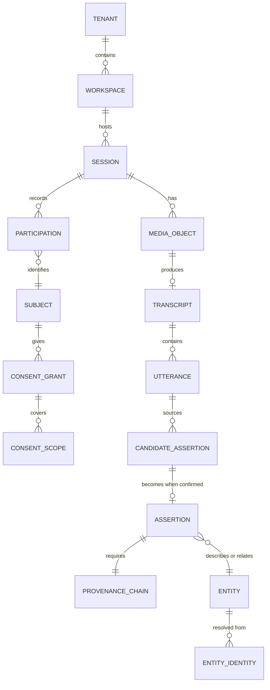

# Data Model

**Owner:** Principal Architect & Backend Lead
**Status:** Draft v0.1 — Phase 1 deliverable 1.2
**Companion:** [`KNOWLEDGE_GRAPH.md`](KNOWLEDGE_GRAPH.md) (the projection) · [`EVENT_CATALOGUE.md`](EVENT_CATALOGUE.md) (the events)

> This describes the **write model** — the system of record in PostgreSQL. The knowledge graph is
> a projection derived from it, described separately. If the two ever disagree, the write model is
> right and the projection is rebuilt.

---

## 1. Modelling principles

1. **The event log is the truth.** Current-state tables are a materialised convenience. Any
   current-state table can be dropped and rebuilt.
2. **Assertions, not facts.** We never store "Alice is the Director of Housing." We store "on
   2027-03-04, in meeting M, at 00:14:22, speaker S said something from which model X extracted a
   candidate that human H confirmed, asserting Alice held the role Director of Housing, valid from
   2026-01-01." The difference is the entire product.
3. **Bitemporality everywhere.** Valid time (when true in the world) and transaction time (when we
   recorded it) are independent. Never conflate them.
4. **Nothing is deleted, except when it must be.** Default is soft-delete with tombstones for
   auditability. Consent revocation and erasure requests are the deliberate exception: they perform
   **hard erasure** of content while retaining a non-reversible tombstone proving something was
   removed and when. Both properties are legally required and they are in tension; §7 explains how
   we resolve it.
5. **Tenant isolation is structural.** Every table carries `tenant_id`, enforced by PostgreSQL
   row-level security. Not a `WHERE` clause developers must remember.
6. **Provenance is non-nullable.** There is no code path that constructs an assertion without one.

## 2. Aggregate map

Aggregates are consistency boundaries. One transaction touches one aggregate; cross-aggregate
consistency is eventual, via events.



| Aggregate | Root | Boundary rationale |
|---|---|---|
| **Tenant** | `Tenant` | Isolation root; changes rarely; everything hangs off it |
| **Subject & Consent** | `Subject` | A person's consent state must be transactionally consistent — a partial revocation is a privacy incident |
| **Session** | `Session` | The meeting: participants, media, metadata. Consistency needed for the consent gate |
| **Transcript** | `Transcript` | Large and immutable once complete; separate so a session update does not lock a transcript |
| **CandidateSet** | `CandidateSet` | One extraction run's output; reviewed as a unit |
| **Assertion** | `Assertion` | The atomic unit of institutional knowledge; individually consistent so review can be concurrent |
| **Entity** | `Entity` | Resolved identity; merges and splits are entity-level transactions |
| **AuditEntry** | `AuditEntry` | Append-only, never part of another aggregate's transaction |

**Deliberate choice:** `Assertion` is its own aggregate rather than being nested under `Entity`.
This means two reviewers can confirm different assertions about the same person concurrently
without contention — and review throughput is a known bottleneck risk (A-6).

## 3. Core entities

### Tenancy and identity

```
tenant                (id, slug, name, data_residency, deployment_profile, created_at)
workspace             (id, tenant_id, name, description, retention_policy_id, archived_at)
user_account          (id, tenant_id, external_subject_id, display_name, email, status, ...)
role_assignment       (id, tenant_id, user_id, role, scope_type, scope_id, granted_by, granted_at)
group                 (id, tenant_id, name, kind)   -- kind: team | community | committee
group_membership      (group_id, user_id, role_in_group, valid_from, valid_to)
```

`user_account` deliberately holds no password or credential — Keycloak owns authentication.
`external_subject_id` is the OIDC `sub`. If we ever change IdP, no credential migration is needed.

### Subjects and consent

A **Subject** is a person whose data may be processed. Critically, a subject **need not be a
user** — most people recorded in a community consultation will never hold an account, and their
rights must work anyway.

```
subject               (id, tenant_id, display_name, subject_type, linked_user_id?, created_at)
                      -- subject_type: individual | community | organisation
consent_grant         (id, tenant_id, subject_id, granted_by_subject_id, legal_basis,
                       granted_at, expires_at, revoked_at?, revocation_reason?,
                       capture_method, capture_evidence_ref, language, version)
consent_scope         (id, grant_id, purpose, data_class, permitted_operations[],
                       permitted_audiences[], restrictions)
consent_delegation    (id, grant_id, delegate_subject_id, authority_basis, valid_from, valid_to)
                      -- community-level consent given by an authorised custodian (ADR-0019)
erasure_request       (id, tenant_id, subject_id, requested_at, scope, status,
                       completed_at?, verification_hash)
```

| Field | Why it exists |
|---|---|
| `legal_basis` | `consent`, `public_task`, `legal_obligation`, `vital_interests`, `legitimate_interests`, `customary_authority`. Jurisdictions differ; the model must not assume GDPR |
| `capture_method` | `written`, `verbal_recorded`, `digital_signature`, `witnessed`, `community_protocol`. Field consent is often verbal and that must be first-class, not a workaround |
| `capture_evidence_ref` | Pointer to the artefact proving consent was given — including an audio clip of the verbal grant |
| `permitted_audiences` | Who may see the resulting knowledge. Drives the authorisation filter |
| `consent_delegation` | Community consent is given by custodians on behalf of a group. Individual-only consent models fail Indigenous data governance outright |

### Sessions and media

```
session               (id, tenant_id, workspace_id, title, session_type, occurred_at,
                       location_id?, convening_org_id?, status, sensitivity_class,
                       consent_state, created_by, ...)
                      -- session_type: meeting | consultation | workshop | parliamentary_sitting
                      --             | co_design | interview | community_engagement
participation         (id, session_id, subject_id, role_in_session, attended,
                       consent_grant_id?, speaking_time_seconds?)
media_object          (id, tenant_id, session_id, storage_key, media_type, duration_ms,
                       checksum_sha256, size_bytes, captured_at, ingested_at,
                       encryption_key_id, retention_until, status)
document              (id, tenant_id, session_id?, workspace_id, storage_key, mime_type,
                       title, checksum_sha256, source, ocr_status, retention_until)
```

`session.consent_state` is a derived, denormalised guard: `blocked | partial | cleared`. It is
recomputed on every consent change and **checked before any processing step**. Denormalising it is
a deliberate exception to normalisation, justified because it is on the hot path of the most
important safety check in the system.

### Transcription

```
transcript            (id, tenant_id, media_object_id, engine, engine_version, model,
                       language_detected, wer_estimate?, status, produced_at)
utterance             (id, transcript_id, sequence, speaker_label, subject_id?,
                       start_ms, end_ms, text, confidence, is_redacted, redaction_reason?)
speaker_mapping       (id, transcript_id, speaker_label, subject_id, mapped_by, mapped_at,
                       confidence, method)   -- method: manual | voice_match | position_inference
```

**`utterance` is the atomic provenance target.** Every assertion in the system points at one or
more utterance IDs with character offsets. Word-level timestamps from WhisperX make the pointer
precise enough to play back the exact audio — which is what "prove it" actually means to an
auditor.

`speaker_mapping` is separate from `utterance` because diarisation gives you "Speaker 1", not
"the Minister". Mapping labels to real subjects is a distinct, human-confirmed, auditable act, and
it can be corrected without touching the transcript.

### Extraction and assertion

```
extraction_run        (id, tenant_id, transcript_id, pipeline_version, model_id, model_version,
                       prompt_id, prompt_hash, parameters_json, started_at, completed_at, status)
candidate_assertion   (id, run_id, tenant_id, assertion_type, payload_json, confidence,
                       source_utterance_ids[], source_char_ranges, status, superseded_by?)
                      -- status: pending | confirmed | corrected | rejected | expired
review_decision       (id, candidate_id, reviewer_user_id, decision, corrected_payload_json?,
                       rationale, decided_at, review_duration_ms)
assertion             (id, tenant_id, assertion_type, subject_ref, predicate, object_ref,
                       payload_json, valid_from, valid_to?, recorded_at, retracted_at?,
                       provenance_chain_id, confidence, sensitivity_class)
provenance_chain      (id, assertion_id, candidate_id, extraction_run_id, utterance_ids[],
                       media_object_id, consent_grant_ids[], confirmed_by_user_id,
                       confirmed_at, chain_hash)
```

`prompt_hash` matters more than it looks. In 2032, someone will ask why the system believed
something, and "an LLM extracted it" is not an answer. The exact prompt text, model version and
parameters are recoverable, forever.

### Knowledge entities

```
entity                (id, tenant_id, entity_type, canonical_label, sensitivity_class,
                       community_restriction_id?, created_at, merged_into_id?)
entity_identity       (id, entity_id, identifier_scheme, identifier_value, confidence, source)
entity_attribute      (id, entity_id, attribute_key, attribute_value, valid_from, valid_to?,
                       assertion_id)
relationship          (id, tenant_id, from_entity_id, to_entity_id, relationship_type,
                       valid_from, valid_to?, assertion_id, strength?)
entity_merge_log      (id, tenant_id, surviving_entity_id, merged_entity_id, decided_by,
                       decided_at, rationale, reversible_until)
```

Entity types are the thirteen in the mission, defined in
[`KNOWLEDGE_GRAPH.md`](KNOWLEDGE_GRAPH.md).

**Every `entity_attribute` and `relationship` row carries an `assertion_id`.** This is the
enforcement of principle P3: an attribute with no assertion is impossible to insert, guaranteed by
a `NOT NULL` foreign key. Provenance is not a convention here; it is a constraint.

### Audit

```
audit_entry           (id, tenant_id, sequence, actor_type, actor_id, action, resource_type,
                       resource_id, outcome, context_json, occurred_at,
                       previous_hash, entry_hash)
```

Hash-chained: `entry_hash = SHA256(previous_hash || canonical_json(entry))`. Append-only, enforced
by table permissions — the application role holds `INSERT` and `SELECT` and nothing else. A shipped
verification tool walks the chain. This gives tamper *evidence*, not tamper *proofing*: a
sufficiently privileged attacker could rewrite the chain, but not without detection at the periodic
externally-anchored checkpoint.

### Event log

```
event_log             (id, tenant_id, aggregate_type, aggregate_id, sequence, event_type,
                       event_version, payload_json, metadata_json, occurred_at, recorded_at)
outbox                (id, event_id, destination, status, attempts, last_attempt_at, published_at)
projection_checkpoint (projection_name, last_event_id, updated_at, status)
```

`event_log` plus `outbox` in one transaction is the transactional outbox pattern: state and event
publication are atomic, so we never publish an event for a state change that rolled back, and never
commit a change whose event was lost.

## 4. Bitemporality

Two axes, always distinguished:

| Axis | Column | Question it answers |
|---|---|---|
| **Valid time** | `valid_from` / `valid_to` | When was this true in the world? |
| **Transaction time** | `recorded_at` / `retracted_at` | When did we believe it? |

```
Alice became Director of Housing on 2026-01-01.        ← valid time
We learned this in a meeting on 2027-03-04.            ← transaction time
We discovered on 2027-09-12 that the date was wrong.   ← retraction + new assertion
```

That last line is why this matters. A single-timestamp model cannot represent "we were wrong, and
here is when we were wrong, and here is what we believed while we were wrong." An auditor
reviewing a 2027 decision needs to know what the decision-maker knew *then*, not what we know now.

Queries:
- *Current belief about now:* `valid_to IS NULL AND retracted_at IS NULL`
- *What we believed on date D:* `recorded_at <= D AND (retracted_at IS NULL OR retracted_at > D)`
- *What was true on date D:* `valid_from <= D AND (valid_to IS NULL OR valid_to > D)`

## 5. Tenant isolation

Every tenant-scoped table has `tenant_id NOT NULL` and PostgreSQL row-level security:

```sql
ALTER TABLE assertion ENABLE ROW LEVEL SECURITY;
CREATE POLICY tenant_isolation ON assertion
  USING (tenant_id = current_setting('witness.tenant_id')::uuid);
```

The application sets `witness.tenant_id` per connection from the validated JWT. A developer who
forgets a `WHERE tenant_id = ...` gets zero rows, not another tenant's data. Defence in depth: the
repository layer also filters, and adversarial cross-tenant tests run in CI.

## 6. Sensitivity and access

`sensitivity_class`: `public | internal | confidential | restricted`.

**Propagation rule:** an assertion inherits the highest sensitivity of its sources; an entity
inherits the highest of its assertions. Downgrade requires an explicit, audited human decision by
a user holding the authority. **There is no automatic declassification.**

`community_restriction_id` supports Indigenous data governance: knowledge marked with a community
restriction is visible only to members of that community group, and the restriction is enforced at
the policy decision point regardless of any other role the requester holds — including
administrators. See [ADR-0019](decisions/ADR-0019-indigenous-data-sovereignty.md).

## 7. Deletion, retention and the tension we have to resolve

Two obligations pull in opposite directions:

- **Auditability** requires that the record cannot be silently altered.
- **Privacy law and Indigenous data sovereignty** require that a person or community can compel
  genuine erasure.

Reconciliation:

| Layer | On erasure |
|---|---|
| Content (text, audio, embeddings, extracted payloads) | **Hard deleted**, everywhere, including all projections, caches and backups on the next backup cycle |
| Structural record | Retained: an assertion existed, was erased, when, by whose request, under what authority |
| Audit chain | Never broken — the tombstone is a chain entry, so the hash chain remains verifiable |
| Backups | Erasure list replayed on restore; documented as a mandatory restore step in the runbook |

The result: you can prove *that* something was removed and *when*, but not recover *what*. An
auditor's legitimate question ("was the record tampered with?") is answerable; an illegitimate one
("what did she say before she withdrew?") is not.

**Erasure completion is verified, not assumed.** `erasure_request.verification_hash` is produced by
a job that re-scans every store for the erased identifiers and fails loudly if anything remains.
Retention limits (`retention_until`) are enforced by a scheduled job, and expiry is an event like
any other, so projections stay consistent.

## 8. Migration strategy

- **Expand / migrate / contract.** Never a destructive change in one release. Add the new column,
  backfill, dual-write, switch reads, then drop — across at least two releases.
- **Every migration is reversible**, or ships with a documented and *tested* forward-fix.
- **Migrations run separately from deployment**, so an operator can inspect and time them.
- **Long migrations are resumable and report progress.** A migration that takes four hours with no
  output is an operational failure regardless of correctness.
- **Projection schema changes** do not require a write-model migration: change the projector,
  replay. This is a major payoff of the projection architecture.

## 9. Open questions

| # | Question | Owner | Needed by |
|---|---|---|---|
| DM-1 | Event log partitioning strategy — by tenant, by time, or both? | Backend Lead | Phase 3 |
| DM-2 | Does `assertion` need its own event stream, or is the aggregate log sufficient? | Principal Architect | Phase 3 |
| DM-3 | Embedding storage: alongside utterances, or a separate lifecycle for re-embedding on model change? | AI Lead | Phase 5 |
| DM-4 | Entity resolution confidence: store the full candidate set or only the decision? | Knowledge Graph Lead | Phase 4 |
| DM-5 | Cross-tenant entity references for genuinely shared entities (e.g. a national ministry) — allowed at all? | Principal Architect | Phase 4 |
