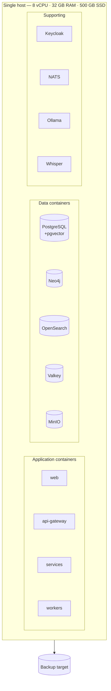
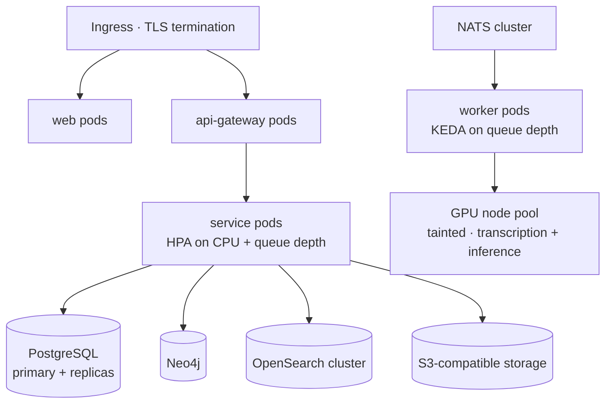

# Deployment Architecture

**Owner:** Infrastructure Lead
**Status:** Baseline — Phase 1
**Companion:** [`docs/operations/DEPLOYMENT_GUIDE.md`](../docs/operations/DEPLOYMENT_GUIDE.md) (how) · [ADR-0013](decisions/ADR-0013-tenancy-and-deployment-topology.md) (why)

---

## 1. Deployment profiles

The profile is a first-class architectural concept, validated at startup. A misconfigured profile
**refuses to boot** rather than running in a state the operator believes is safe and is not.

| Profile | Egress | External models | Target | Scale |
|---|---|---|---|---|
| **`sovereign`** *(default)* | **Denied** | Prohibited — config error at boot | Government, Indigenous org, air-gapped | 1–5,000 users |
| **`hybrid`** | Allowlist only | Per-tenant opt-in, logged, user-visible | Institutions with an approved cloud model provider | 1–20,000 users |
| **`development`** | Permitted | Permitted | Local development only | 1 |

`development` is refused in any environment where `NODE_ENV=production`. There is no fourth profile
and no "just this once" flag.

## 2. Topologies

### Single node — the default, and a first-class production target

Docker Compose. One `make` target to install, one to back up, one to restore. This is how most
institutions will run Witness and we treat it accordingly — **not** as a development convenience
that happens to work in production.

*Without a GPU*, transcription is roughly 6–10× slower than realtime on CPU. A one-hour meeting
takes 6–10 hours. That is acceptable for overnight batch processing and it is documented plainly
rather than hidden, because an operator discovering it in production would rightly be angry.

### Clustered — Kubernetes

Helm chart in `infrastructure/helm`. Workers scale on queue depth, not CPU — transcription is a
long, bursty, GPU-bound workload and CPU-based autoscaling gets it consistently wrong.

**Data stores are the operator's choice**: run them in-cluster with an operator (CloudNativePG,
Neo4j Helm), or point at managed equivalents. We take no position beyond requiring that they stay
inside the sovereignty boundary.

### Air-gapped

The proof that sovereignty is real rather than marketing.

| Requirement | Approach |
|---|---|
| No registry access | Offline bundle: images as OCI archives, verified by checksum |
| No model downloads | Model weights included in the bundle, checksum-pinned |
| No package installs at runtime | Every dependency vendored into the images |
| No licence server, no telemetry, no update check | None exist. There is nothing to disable |
| Security advisories | Out-of-band distribution process documented in the admin guide |
| Updates | Signed offline bundles, verified before application |

`make egress-test` runs the stack in a network namespace with no route and asserts full function.
This runs in CI, so a regression that introduces a phone-home breaks the build.

## 3. Sizing

| Deployment | Users | Meetings/yr | vCPU | RAM | Storage | GPU |
|---|---|---|---|---|---|---|
| **Small** — single agency | < 100 | < 500 | 8 | 32 GB | 500 GB | Optional |
| **Medium** — department | < 1,000 | < 5,000 | 24 | 96 GB | 4 TB | 1× 24 GB |
| **Large** — national | < 10,000 | < 50,000 | 64+ | 256 GB+ | 20 TB+ | 2–4× 24 GB |

Storage is dominated by media. Roughly 1 GB per hour of recording at archival quality, before
retention policy. Retention tiering to cold storage is a Phase 5 deliverable, and for a national
deployment it is the difference between 20 TB and 200 TB.

## 4. Availability and recovery

| Objective | Single node | Clustered |
|---|---|---|
| Availability target | 99% (business hours) | 99.9% |
| **RPO** | ≤ 24 h (nightly) or ≤ 15 min (WAL shipping) | ≤ 15 min |
| **RTO** | ≤ 8 h | ≤ 4 h |
| Backup scope | Postgres, MinIO, Keycloak realm, config, keys | Same |
| **Not backed up** | Neo4j, OpenSearch, embeddings — *rebuilt from the log* | Same |

Not backing up the projections is a direct dividend of [ADR-0011](decisions/ADR-0011-knowledge-graph-as-projection.md).
The operator backs up **one** database and one object store. Consistent multi-store snapshots — the
thing that quietly ruins disaster recovery in polyglot systems — are simply not part of our problem.

**Recovery is drilled quarterly.** An untested backup is a hypothesis.

Degradation ladder, in order:
1. Neo4j down → graph views unavailable; search, transcripts and review continue
2. OpenSearch down → lexical search degrades to Postgres full-text; everything else continues
3. Workers down → ingestion queues; nothing is lost; users see honest queue status
4. Keycloak down → existing sessions continue to token expiry; new logins fail
5. **Postgres down → the system is down.** This is the single point of failure, chosen deliberately,
   and it is the one thing that gets replication in every non-trivial deployment

## 5. Upgrades

- **Rolling** for stateless services; **expand/migrate/contract** for schema, never destructive in
  one release
- **Migrations run as a separate, inspectable step** so an operator can time and observe them
- **Backward compatibility for one minor version** — mixed-version operation during a rolling
  upgrade must be safe
- **Projection rebuilds run against a shadow store** and swap atomically, so reads stay available
- **Rollback is tested** as part of the release checklist, not assumed
- **LTS releases** every 12 months, supported 24 months. Public institutions cannot upgrade
  quarterly, and a release policy that ignores that will be ignored in turn

## 6. Observability

OpenTelemetry throughout, self-hosted, telemetry never leaving the operator's boundary.

**Golden signals** per service plus these domain-specific ones, which are the ones that actually
matter here:

| Metric | Alert |
|---|---|
| `consent_revocation_propagation_seconds` | **Page** if p99 > 300 s — this is our hardest guarantee |
| `projection_lag_events` | Warn > 1,000; page > 10,000 |
| `audit_chain_verification_status` | **Page** on failure — potential tampering |
| `egress_denied_total` | Warn on any non-zero in `sovereign` — something tried to phone home |
| `review_queue_depth` / `review_queue_age_hours` | Warn — human review is the known throughput bottleneck |
| `transcription_queue_depth` | Warn — capacity signal |
| `extraction_confidence_p50` | Track — a sudden drop signals model or data drift |

## 7. Configuration and secrets

- Twelve-factor: environment variables, schema-validated at boot, **fail fast and loudly** on
  anything invalid
- Kubernetes: External Secrets Operator or Sealed Secrets. Compose: file-based with strict
  permissions and a documented rotation runbook
- **No secret in git, ever.** Enforced by push-time scanning and history scanning
- Realm-as-code for Keycloak; policy-as-code for Casbin; both versioned and reviewed like source

## 8. Cost posture

An institution running the small profile on its own hardware pays for: one server, storage growth,
and the staff time to operate it. There is no licence cost, no per-seat cost, no per-minute
transcription cost, and no cost that grows with the value of the data.

This is stated explicitly because it is a deliberate architectural outcome. Every design choice that
increased operational complexity was weighed against the fact that the operator is often a
two-person team in an under-funded agency — and where we could not reduce complexity, we wrote a
runbook and accepted the obligation.
