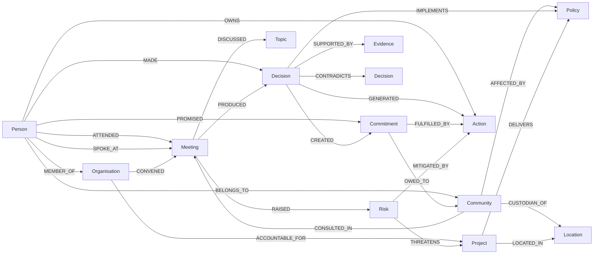
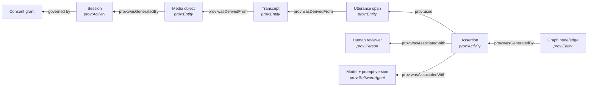
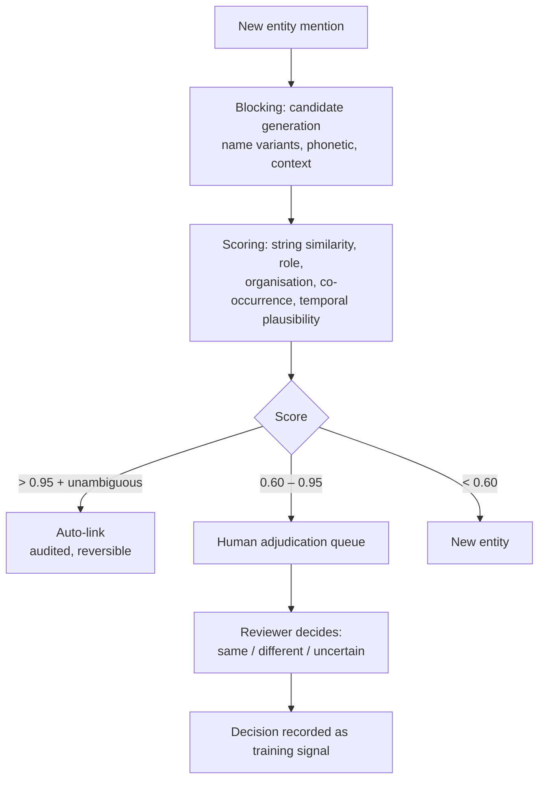
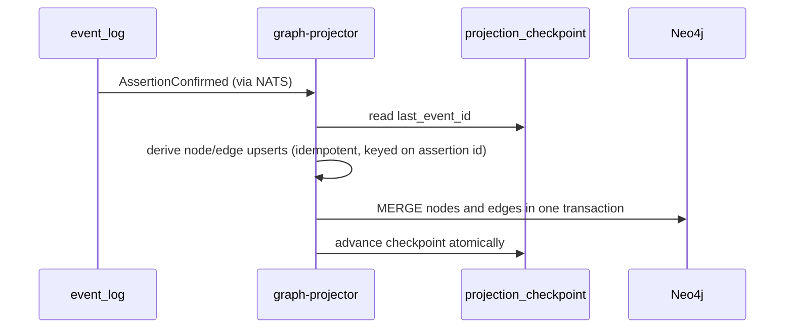

# Knowledge Graph

**Owner:** Knowledge Graph Lead
**Status:** Ontology v0.1 draft — Phase 1 deliverable 1.3
**Companion:** [`DATA_MODEL.md`](DATA_MODEL.md) (the source of truth) · [ADR-0011](decisions/ADR-0011-knowledge-graph-as-projection.md)

> The graph is a **projection**. It holds no authoritative data. Delete it entirely and it rebuilds
> from the event log. This is what lets us evolve the ontology without migrating a production graph
> — and we will evolve it, repeatedly.

---

## 1. What the graph is for

Three questions the relational write model answers badly and the graph answers well:

1. **Traversal** — "show me everything connecting this community to this policy, at any depth"
2. **Path** — "how did this commitment come to exist? What chain of evidence and decisions?"
3. **Neighbourhood** — "who and what is involved in this project, and how?"

If a question is answerable with a straightforward SQL query, it should be. The graph is not a
general-purpose database; it earns its operational cost only on relationship-shaped questions.

## 2. Ontology design principles

1. **Reuse standards.** Align to W3C PROV-O, schema.org and CIDOC-CRM wherever they fit. We are not
   inventing vocabulary for its own sake — interoperability is a decade-scale asset.
2. **Small and stable core; extensible edges.** Thirteen node types is the committed core.
   Relationship types are extensible per deployment; node types are not.
3. **Everything is asserted, nothing is asserted-by-nobody.** Every node and edge carries
   `assertion_ids`. An edge with no assertion is a bug, and an invariant test fails the build.
4. **Time is on the edge, not implied.** Relationships have validity intervals. "Alice works for
   Department X" without a time range is a fact with a hidden expiry.
5. **Confidence is visible.** Never hide uncertainty from users. A relationship confirmed by a
   human at 100% and one inferred at 62% must be visually and queryably distinct.
6. **Sensitivity travels.** A node's sensitivity is the maximum of its assertions'. Access filtering
   happens before results leave the service, never in the client.

## 3. Node types

The thirteen core types. Each maps to `entity.entity_type` in the write model.

| Type | Definition | Key attributes | Standard alignment |
|---|---|---|---|
| **Person** | An individual human | names, roles held, affiliations, contact scope | `schema:Person`, `prov:Agent` |
| **Community** | A self-identifying group with collective interests and, often, collective consent authority | identifiers, custodians, protocols, territory | `schema:Organization` (extended) |
| **Organisation** | A formal body — ministry, NGO, company, council | legal identifiers, type, jurisdiction, parent | `schema:Organization`, `prov:Organization` |
| **Project** | A bounded programme of work | status, dates, budget scope, objectives | `schema:Project` |
| **Meeting** | A convened conversation | type, datetime, location, convener, status | `schema:Event`, `crm:E7_Activity` |
| **Policy** | A formal position, instrument or programme of intent | status, instrument type, jurisdiction, version | `schema:Legislation` (extended) |
| **Evidence** | A referenceable basis for a claim | evidence type, source, strength, date | `prov:Entity` |
| **Risk** | An identified potential adverse outcome | likelihood, impact, status, owner, treatment | — (domain-specific) |
| **Decision** | A determination made by an authorised party | decision type, made_at, authority, rationale, status | `prov:Activity` |
| **Action** | A discrete task arising from a decision | owner, due date, status, completion evidence | `schema:Action` |
| **Commitment** | A promise made by a party to a party | promisor, promisee, obligation, deadline, status | — (domain-specific) |
| **Location** | A place | geometry, admin hierarchy, traditional name(s), identifiers | `schema:Place`, `geo:Feature` |
| **Topic** | A subject of discussion — the connective tissue | label, scheme, broader/narrower | `skos:Concept` |

**Note on `Commitment` vs `Action`:** these are deliberately distinct. An *Action* is internal task
tracking. A *Commitment* is a promise made **to someone**, usually outside the institution, and it
is the single highest-value object in the system for the community-trust use case. Collapsing them
would lose the accountability relationship — who was promised, not just who must do it.

**Note on `Topic`:** the thirteenth type is not in the original mission list, which named
Relationships as the thirteenth. Relationships are edges, not nodes; `Topic` earns the slot because
without a controlled subject vocabulary the graph fragments into disconnected islands and cross-meeting
retrieval fails. This is an ontology decision open to challenge in review.

## 4. Relationship types



| Category | Types |
|---|---|
| **Participation** | `ATTENDED` `SPOKE_AT` `CONVENED` `CONSULTED_IN` `REPRESENTED` `CHAIRED` `APOLOGISED_FOR` |
| **Affiliation** | `MEMBER_OF` `BELONGS_TO` `EMPLOYED_BY` `PART_OF` `CUSTODIAN_OF` |
| **Causation** | `PRODUCED` `GENERATED` `CREATED` `RAISED` `TRIGGERED` `SUPERSEDES` |
| **Evidential** | `SUPPORTED_BY` `CONTRADICTED_BY` `CITES` `DERIVED_FROM` |
| **Accountability** | `OWNS` `ACCOUNTABLE_FOR` `PROMISED` `OWED_TO` `DELEGATED_TO` |
| **Impact** | `AFFECTED_BY` `THREATENS` `MITIGATED_BY` `BENEFITS` |
| **Thematic** | `DISCUSSED` `ABOUT` `RELATED_TO` `BROADER_THAN` |
| **Spatial** | `LOCATED_IN` `ADJACENT_TO` `WITHIN` |
| **Lifecycle** | `FULFILLED_BY` `IMPLEMENTS` `DELIVERS` `BLOCKS` |

**`CONTRADICTS` is deliberately included.** Institutions contradict themselves constantly, and a
knowledge graph that cannot represent contradiction will silently pick a winner. Surfacing
contradiction to a human is one of the most valuable things Witness can do — "this commitment
conflicts with a decision made by another department in 2029" is exactly the institutional memory
failure we exist to fix.

### Edge properties

Every edge carries:

```
assertion_ids: [uuid]      # required, non-empty — the provenance hook
valid_from: datetime       # when the relationship became true
valid_to: datetime?        # null = still valid
confidence: float          # 0..1
confirmed_by: uuid?        # user who confirmed; null = candidate (not projected by default)
sensitivity: enum          # public | internal | confidential | restricted
recorded_at: datetime      # transaction time
```

## 5. Provenance model

Aligned to W3C PROV-O so exports interoperate with archival and research tooling.



**The provenance query** — the single most important query in the product:

```cypher
MATCH (n) WHERE n.id = $nodeId
MATCH (n)-[:ASSERTED_BY]->(a:Assertion)
RETURN n, a, a.utterance_ids, a.media_object_id, a.confirmed_by, a.confirmed_at,
       a.model_id, a.model_version, a.prompt_hash, a.consent_grant_ids
```

From that result a user gets: the exact words spoken, playable audio at the exact timestamp, who
said it, who confirmed the interpretation, which model proposed it, and under which consent grant
it was lawful to process. That is what "provenance-backed institutional memory" means in practice.
Target: ≤ 3 API calls, < 500 ms p95.

## 6. Entity resolution

The hardest unsolved problem in the system, and the one most likely to cause user distrust if we
get it wrong.

"Minister Chen", "the Minister", "Chen", "Hon. L. Chen MP" and "Lin" may be one person or five.
Getting this wrong in either direction is damaging: over-merging fabricates a false record;
under-merging fragments memory into uselessness.

**Approach — propose, never auto-merge above the ambiguity threshold:**



**Rules:**
- Auto-merge only above 0.95 **and** with no competing candidate above 0.60. Ambiguity always goes
  to a human.
- **Every merge is reversible** for a defined window (`entity_merge_log.reversible_until`), and
  splits are supported permanently — because we will get some wrong.
- Merges of `Person` entities across sensitivity classes require elevated authority: linking a
  pseudonymous community submission to a named individual is a re-identification event, and it is
  treated as one.
- Community and Indigenous entities are **never** auto-merged. Group identity is a matter of
  self-determination, not string similarity.
- Precision is preferred over recall. A fragmented graph is recoverable; a graph that has fused two
  people is a trust catastrophe.

## 7. Temporal semantics in the graph

The graph projects **current belief about all validity periods** by default: every edge, with its
`valid_from`/`valid_to`. Historical belief (transaction time) stays in the write model — projecting
the full bitemporal cube into Neo4j would multiply the graph size for a query pattern that is rare
and can be answered by replaying the log to a point in time.

| Query | Where it runs |
|---|---|
| "Who is on the committee now?" | Graph, `valid_to IS NULL` |
| "Who was on the committee in 2028?" | Graph, valid-time filter |
| "What did we believe the committee was in 2028?" | Write model, transaction-time query |
| "Show me every change of belief about this committee" | Write model, event log |

## 8. Projection mechanics



**Properties:**
- **Idempotent** — replaying any event produces an identical graph. `MERGE`, never `CREATE`.
- **Ordered per aggregate** — global ordering is not required and not assumed.
- **Resumable** — checkpointed; a crash costs re-processing since the last checkpoint, nothing more.
- **Rebuildable** — `make rebuild-graph` drops and replays. Target: < 6 hours for 100k meetings,
  running against a shadow database so reads stay available (quality attribute A-2).
- **Lagging is visible** — projection lag is a first-class metric with an alert. Users are shown
  "indexing in progress" rather than being silently served stale data.

**Revocation:** a consent revocation emits `ConsentRevoked`, the projector deletes every node and
edge whose assertions depend solely on the revoked grant, and a verification pass confirms
absence. SLO: 5 minutes.

## 9. Query safety

An unbounded graph traversal will take a production database down. Non-negotiable limits:

| Limit | Value | Rationale |
|---|---|---|
| Max traversal depth | 6 | Beyond this, results are noise anyway |
| Max result nodes | 1,000 per query | Paginate; visualisation is useless past this |
| Query timeout | 5 s | Fail fast and clearly |
| Cypher injection | Parameterised queries only, enforced by lint | User input never concatenated |
| Permission filtering | Applied in the query, not post-hoc | Filtering after retrieval leaks via timing and result counts |
| Rate limiting | Per user and per tenant | One user cannot starve a tenant |

Users never write raw Cypher. The API exposes typed, bounded traversal operations. This is
restrictive on purpose: an expressive query language exposed to the internet is an exfiltration
primitive.

## 10. Export and interoperability

Exit must be real, which means the graph exports completely:

| Format | Use |
|---|---|
| **JSON-LD** (schema.org + PROV-O contexts) | Interoperable semantic export |
| **RDF / Turtle** | Archival, triple stores, research |
| **GraphML** | Gephi, Cytoscape, network analysis |
| **CSV** (nodes + edges) | Spreadsheets — genuinely the most-used format in government |
| **Neo4j dump** | Direct restore into another instance |

Every export includes provenance, and every export is itself an audited event. Restricted and
community-controlled content is excluded from export unless the exporter holds explicit authority,
and community-restricted material may be marked permanently non-exportable.

## 11. Ontology governance

The ontology will be wrong at first and must change without breaking deployments.

- **Versioned** — `ontology_version` on every node; semantic versioning
- **Additive by default** — new types and relationships are minor versions
- **Removals are major** and require a migration projector plus a deprecation period of at least
  one LTS cycle
- **Deployment extensions** — operators may add relationship types in a namespaced range
  (`x_<tenant>_<TYPE>`); core types cannot be extended, so upgrades never conflict
- **Changes require** Knowledge Graph Lead **and** Principal Architect approval, plus an ADR for
  anything touching core node types

## 12. Open questions

| # | Question | Owner | Needed by |
|---|---|---|---|
| KG-1 | Is `Topic` the right thirteenth type, or should Evidence subsume it? | Knowledge Graph Lead | Phase 4 |
| KG-2 | Do we project unconfirmed candidates into a separate "proposed" subgraph for reviewer UX? | KG Lead + UX Lead | Phase 5 |
| KG-3 | Neo4j vs Apache AGE for constrained deployments (open decision D-4) | KG Lead | Phase 4 |
| KG-4 | Cross-tenant shared entities — a national ministry appearing in many tenants' graphs | Principal Architect | Phase 4 |
| KG-5 | Contradiction detection: automatic surfacing, or human-flagged only? | KG Lead + AI Lead | Phase 5 |
| KG-6 | How much CIDOC-CRM alignment is worth the modelling cost? | Research Lead | Phase 4 |
