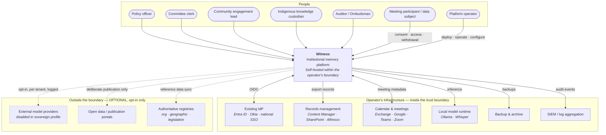
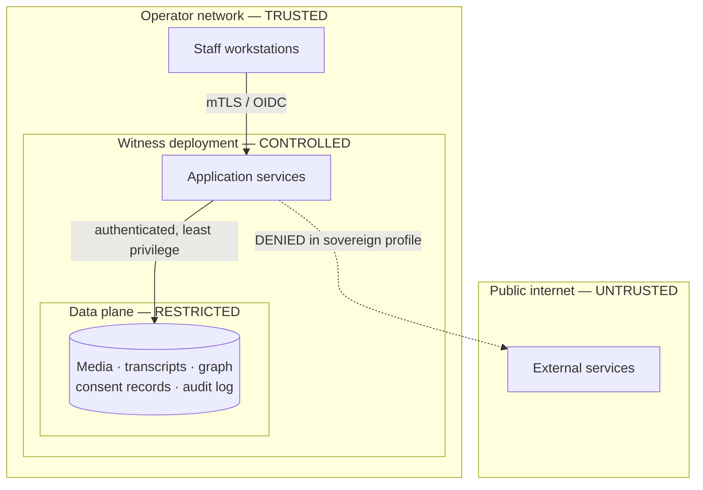

# System Context

**Owner:** Principal Architect
**Status:** Baseline — Phase 1
**C4 level:** 1 (Context)

This document describes Witness's boundary: who uses it, what it depends on, what it integrates
with, and — importantly for a sovereign system — what it deliberately does *not* connect to.

---

## 1. Context diagram

**Solid lines are required. Dashed lines are optional and default to off.** A Witness deployment
with every dashed line severed is fully functional — that is the definition of the sovereign
profile, and it is the configuration we test first.

## 2. Actors

### Human actors

| Actor | Uses Witness to | Critical need | Notes |
|---|---|---|---|
| **Policy officer** | Find prior decisions and their rationale; trace evidence | "What did we already decide, and why?" | Highest-frequency user; success or failure of the product rests here |
| **Committee clerk / Hansard officer** | Produce accurate attributable records | Accuracy, redaction, publication workflow | Has formal legal obligations; low tolerance for error |
| **Community engagement lead** | Show that community input shaped outcomes | Traceability from statement to decision | Often works offline and in the field |
| **Indigenous knowledge custodian** | Control what is recorded, who sees it, and withdraw it | Community-level control, not just individual | Highest trust bar in the system; see [ADR-0019](decisions/ADR-0019-indigenous-data-sovereignty.md) |
| **Programme manager** | Track commitments across years and staff cohorts | Commitment lifecycle and closure | The "institutional memory" use case in its purest form |
| **Meeting participant / data subject** | Give, review and withdraw consent; see their own data | Genuine control, in plain language | **Not necessarily a system user** — consent must work for people who never log in |
| **Auditor / Ombudsman** | Reconstruct decision chains years later | Tamper-evident provenance | Read-only, high-privilege, heavily audited |
| **Platform operator** | Install, run, back up, upgrade, restore | Predictable operations, good runbooks | First-class persona; often a two-person team |

The **data subject** deserves emphasis. Most systems treat consent as a checkbox the *operator*
ticks. In Witness, the subject is an actor with rights that are exercisable through the system —
including by people who will never hold an account. This drives real architecture: token-based
consent portals, offline consent capture, and delegated community consent.

### System actors

| System | Direction | Purpose | Failure mode if unavailable |
|---|---|---|---|
| **Identity provider** | Inbound auth | Staff SSO via OIDC | Degraded: local Keycloak accounts still work |
| **Local model runtime** | Outbound | Transcription and extraction | Pipeline pauses; queued work resumes; no data loss |
| **Records management (EDRMS)** | Outbound | Export records into the statutory record | Export queued and retried; core function unaffected |
| **Calendar** | Inbound | Meeting metadata, participant lists | Manual entry still available |
| **SIEM** | Outbound | Security event forwarding | Local audit log remains authoritative |
| **Backup target** | Outbound | Durability | **Critical** — operator alerted immediately |

## 3. Trust boundaries

| Boundary | Controls |
|---|---|
| **Operator network → Witness** | TLS 1.3, OIDC authentication, rate limiting, WAF where deployed |
| **Application → data plane** | Per-service credentials, least privilege, network policy, encryption at rest |
| **Witness → internet** | Default deny. Egress allowlist enforced at network policy *and* application layer — two independent controls, because one will eventually be misconfigured |
| **Tenant → tenant** | Row-level isolation in Postgres, separate graph subgraphs, index-level filtering; verified by adversarial test |
| **Consent boundary** | Policy decision point on every data access path; deny by default |

## 4. Data classification

| Class | Examples | Handling |
|---|---|---|
| **Restricted — sensitive personal / cultural** | In-camera testimony, health disclosures, culturally restricted knowledge | Encrypted at rest with separate key scope; access individually audited; export requires elevated authority; may be flagged non-exportable entirely |
| **Confidential** | Deliberative records, draft policy, unpublished evidence | Standard encryption, tenant-scoped, audited access |
| **Internal** | Meeting metadata, participant lists, project structure | Tenant-scoped |
| **Public** | Published decisions, open consultation records | Publishable via deliberate action only |

Classification is **inherited and monotonic**: an entity derived from restricted material is
restricted until a human with authority downgrades it, and that downgrade is itself an audited
decision. Nothing declassifies by accident.

## 5. Integration principles

1. **Anti-corruption layer, always.** External models never reach the domain. Every integration
   has an explicit translation layer. Government systems change on their own schedule and we do
   not let their schemas rot ours.
2. **Pull over push where possible.** Witness reaching out on a schedule is easier to secure,
   observe and firewall than accepting inbound callbacks.
3. **Export is a first-class feature, not an afterthought.** Open formats (JSON-LD, CSV, RDF,
   PROV-O, plain audio) with no proprietary dependency. Exit must work.
4. **Every integration is optional.** No integration is on a critical path to core function.
5. **Failure is expected and non-catastrophic.** Every integration degrades gracefully; none can
   take the platform down.

## 6. Standards and interoperability

We do not intend to invent vocabulary where a standard exists. Alignment is documented in
[`KNOWLEDGE_GRAPH.md`](KNOWLEDGE_GRAPH.md).

| Standard | Use |
|---|---|
| **W3C PROV-O** | Provenance model — our chain maps to PROV entities, activities and agents |
| **schema.org** | Person, Organization, Event, Place — general interoperability |
| **CIDOC-CRM** | Cultural heritage event modelling — informs temporal and participation modelling |
| **Dublin Core** | Document and record metadata |
| **W3C DCAT** | Dataset publication for open-data export |
| **Akoma Ntoso** | Parliamentary and legislative document markup |
| **ISO 15489 / ISO 16175** | Records management principles for retention and disposal |
| **W3C ODRL** | Machine-readable expression of consent and usage policy |
| **OpenAPI 3.1 · GraphQL · AsyncAPI 3** | API contracts |
| **CloudEvents 1.0** | Event envelope format |
| **OpenTelemetry** | Traces, metrics, logs |
| **CycloneDX** | Software bill of materials |
| **WCAG 2.2 AA** | Accessibility |
| **CARE Principles · OCAP®** | Indigenous data governance |

## 7. Constraints

| Constraint | Source | Implication |
|---|---|---|
| Must run air-gapped | Sovereignty (P1) | No runtime dependency on any external service; offline install bundle required |
| Must run on modest hardware | Operator reality | Single-node profile: 8 vCPU, 32 GB RAM, no GPU (degraded ASR speed, full function) |
| Must be operable by 1–2 people | Operator reality | Minimise moving parts; excellent runbooks; automated recovery |
| Must support intermittent connectivity | Field use (P8) | Offline capture with deferred sync and defined conflict resolution |
| Must comply with varied jurisdictions | Global deployment | Configurable retention, residency and legal bases; no jurisdiction hard-coded |
| Must be auditable by adversaries | Public trust | Open source, reproducible builds, published threat model |
| Ten-year lifetime | Vision | Boring technology; every dependency replaceable; no unmaintained critical path |

## 8. Out of context

Explicitly outside the system boundary — we neither build nor own these:

- Speech-to-text model training (we consume models; we do not train foundation models)
- The recording hardware in the room
- The institution's decision-making process itself
- Legal advice about the lawfulness of any particular recording
- The operator's network, hardware and physical security
- Publication decisions — Witness enables publication; humans decide what is published

---

**See also:** [`ARCHITECTURE.md`](ARCHITECTURE.md) · [`SECURITY_ARCHITECTURE.md`](SECURITY_ARCHITECTURE.md) · [`DEPLOYMENT_ARCHITECTURE.md`](DEPLOYMENT_ARCHITECTURE.md)
