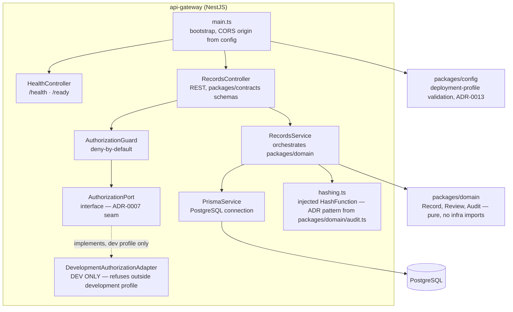
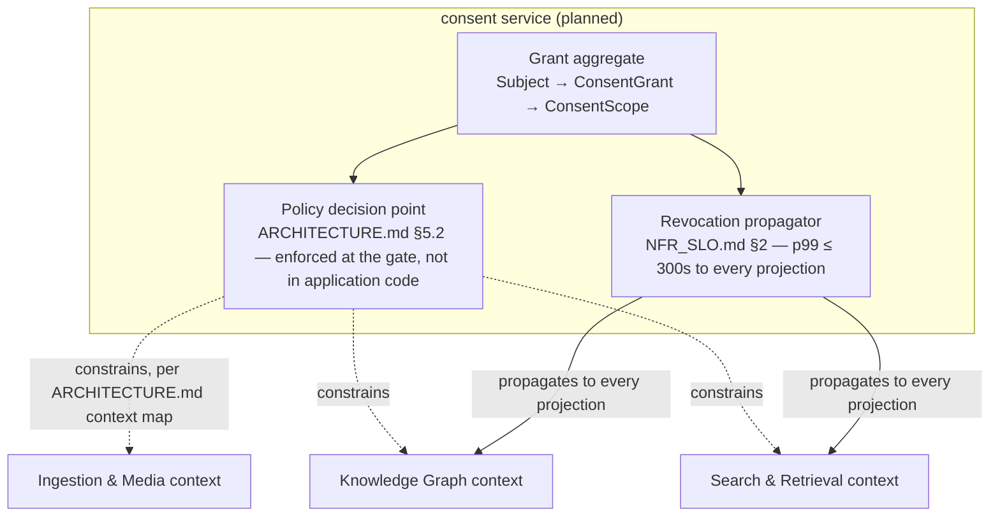
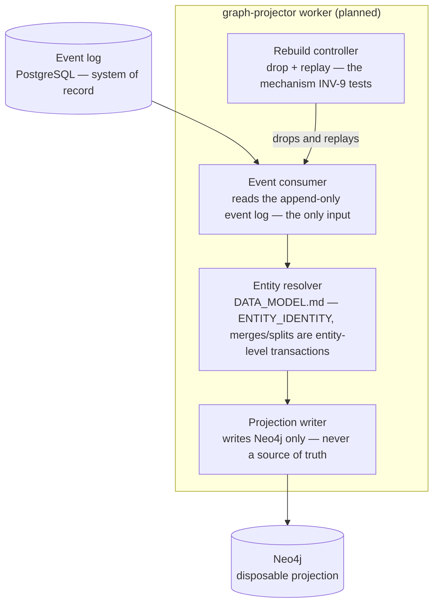

# C4 Component Views

**Owner:** Principal Architect
**Status:** Draft — Phase 1 deliverable 1.1. Pending review by Principal Architect and CTO per
[`DEPARTMENT_ASSIGNMENTS.md`](../../docs/engineering/DEPARTMENT_ASSIGNMENTS.md)'s acceptance gate
for row 1.1. Not self-certified — see
[`PHASE_EXECUTION_PLAN.md`](../../docs/engineering/PHASE_EXECUTION_PLAN.md)'s rule that an exit gate
is verified by the named department, not the implementer.
**Related:** [`../ARCHITECTURE.md`](../ARCHITECTURE.md) (C4 Level 1–2, bounded contexts) ·
[`../DATA_MODEL.md`](../DATA_MODEL.md) (aggregate map) ·
[ADR-0011](../decisions/ADR-0011-knowledge-graph-as-projection.md) ·
[ADR-0021](../decisions/ADR-0021-canonical-scope-and-architecture-reconciliation.md)

---

## What this is

[`ARCHITECTURE.md`](../ARCHITECTURE.md) §4 has the C4 Level 1 (context) and Level 2 (container)
views. Level 3 (component) breaks selected containers into their internal building blocks. This
document does not decide new architecture — every component below is derived from a decision already
recorded: the bounded-context table (`ARCHITECTURE.md` §3), the aggregate map
(`DATA_MODEL.md` §2), or, for the one container that already has code, the actual source structure of
`services/api-gateway`.

**Scope, deliberately limited.** Three containers, not all ten from the Level 2 view: `api-gateway`
(because it is the one container with real code to ground the view in evidence, not intent),
`consent` (because Consent & Legal Basis is the hardest guarantee in the system — P2, and the 300s
propagation SLO in [`NFR_SLO.md`](../NFR_SLO.md) §2), and `graph-projector` (because ADR-0011's
rebuildable-projection guarantee is a central load-bearing decision and its component boundary is
where that guarantee is actually enforced). The remaining seven containers get component views when
their implementation is scheduled — drawing one now would document intent as if it were decided
structure, which is what a component view is supposed to prevent, not produce.

## 1. `api-gateway` — as built, Developer Preview 0.1.0

**Not yet built, per the container view:** `identity`, `ingestion`, `knowledge-graph`, `search`,
`ai-orchestrator` services. `AuthorizationPort`'s Keycloak/Casbin implementation
(`DEPARTMENT_ASSIGNMENTS.md` row `feat/remove-dev-authz`, Phase 2) replaces
`DevelopmentAuthorizationAdapter` — the port already exists precisely so that replacement does not
touch `RecordsController` or `RecordsService`.

## 2. `consent` service — planned, Phase 3 (3.4)

Derived from the **Consent & Legal Basis** bounded context (`ARCHITECTURE.md` §3: "Owns Grants,
scopes, subjects, revocations, legal bases") and the **Subject & Consent** aggregate
(`DATA_MODEL.md` §2: "A person's consent state must be transactionally consistent — a partial
revocation is a privacy incident").

**Explicitly not decided by this document:** the transport mechanism for revocation propagation
(D-2, NATS JetStream vs Postgres-only — `docs/governance/DECISIONS.md`) and the exact API shape.
Both are Phase 3 implementation decisions, not Phase 1 architecture.

## 3. `graph-projector` worker — planned, Phase 4

Derived from the **Knowledge Graph** bounded context and
[ADR-0011](../decisions/ADR-0011-knowledge-graph-as-projection.md)'s central guarantee: delete the
graph, rebuild from the event log, byte-comparable result (INV-9).

**Explicitly not decided by this document:** entity-resolution algorithm choice, and whether rebuild
runs against a shadow store with atomic swap (`DEPLOYMENT_ARCHITECTURE.md` §5 states this as the
upgrade pattern generally; whether `graph-projector` specifically uses it is a Phase 4 implementation
decision).

## Why 1.2 is not pre-empted here

Deliverable 1.2 (domain model & bounded contexts) is a separate, dependent deliverable. Where a
component boundary above would require deciding something 1.2 has not yet decided — for example, the
exact aggregate boundary inside a not-yet-built service — this document stops at the level already
fixed by `DATA_MODEL.md`'s aggregate map and goes no further, per this deliverable's own stop
condition (see the `principal-architect-wp-1.1` context pack).
