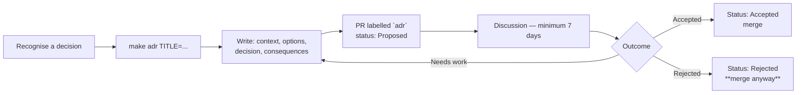

# ADR Process

**Owner:** Principal Architect
**Status:** Active
**Decision record:** [ADR-0000](../../architecture/decisions/ADR-0000-record-architecture-decisions.md)

---

## When to write one

Write an ADR if the decision is **expensive to reverse**:

- Introduces, removes or replaces a technology
- Changes a service or bounded context boundary
- Changes the data model or a core ontology type
- Affects consent, provenance, security or sovereignty
- Establishes a pattern others must follow
- Would make a new contributor ask "why on earth is it done this way?"

**If in doubt, write one.** A rejected ADR costs an hour. An undocumented decision costs a year.

### When *not* to write one

Library choice within an established pattern · naming · file layout · anything reversible in an
afternoon. These go in code review. An ADR for every trivial choice dilutes the directory until
nobody reads it, which defeats the purpose.

## Process

1. `make adr TITLE="use content-addressed media storage"` — creates the file from the template.
2. Write it. Fill in every section, especially **Negative consequences**.
3. Open a PR labelled `adr`, status `Proposed`.
4. **Minimum 7 days** discussion. Longer for anything touching P1–P8.
5. Principal Architect and CTO decide. Governance-affecting ADRs go to the Steering Committee.
6. Update the status, update `decisions/README.md`, merge.

**Rejected ADRs are merged, not deleted.** Knowing what we ruled out, and why, is as valuable as
knowing what we chose — and it prevents the same idea being re-proposed every eighteen months.

## Writing a good one

**Write for a stranger in 2036.** They will not have the conversation, the thread, or the person who
knew. Include the non-technical constraints — budget, staffing, procurement, politics. Those are
usually the real reasons, and omitting them makes the decision look arbitrary later.

**Represent the alternatives fairly.** If every option you rejected looks obviously bad, you have
not done the work, and the ADR will not survive scrutiny by someone who prefers one of them. Include
the option a reasonable person would have chosen, and say honestly why you did not.

**The Negative section must not be empty.** Every real decision has a cost. An ADR without costs is
advocacy wearing the costume of a decision record, and CI checks that the section is not left as the
template placeholder.

**State how it is enforced.** A decision with no enforcement mechanism is a preference. Name the lint
rule, the CI gate, the fitness test — or admit honestly that it relies on goodwill.

## Statuses

| Status | Meaning |
|---|---|
| **Proposed** | Open for discussion |
| **Accepted** | In force, binding |
| **Rejected** | Considered and declined. Kept |
| **Deprecated** | No longer applies; nothing replaced it |
| **Superseded by ADR-NNNN** | Replaced |

**ADRs are immutable once accepted.** Typos and broken links may be fixed. Reasoning may not be
edited — supersede it instead. The record of having been wrong is part of the value.

## Superseding

When a decision changes:

1. Write a new ADR referencing the old one in `Supersedes`.
2. Explain **what changed** — new evidence, changed constraints, scale we did not have before.
   "We changed our minds" is acceptable if you say why.
3. Update the old ADR's status to `Superseded by ADR-NNNN`. That is the only permitted edit.

## Enforcement

- A PR labelled `architecture` without a linked ADR fails the `adr-governance` check.
- The check validates: front-matter table present, status valid, Negative section not the
  placeholder, index entry updated.
- `architecture/decisions/**` requires Principal Architect **and** CTO approval.
- Quarterly review sweeps for ADRs the codebase now contradicts. A contradiction is either a
  superseding ADR waiting to be written, or a defect.

## Related formats

| Format | Use | Lives in |
|---|---|---|
| **ADR** | A decision made | `architecture/decisions/` |
| **RFC** | Exploring a problem before a decision exists | `docs/research/rfc/` |
| **Spike** | Time-boxed experiment to gather evidence | `experiments/*` branch, findings in `docs/research/` |
| **PRD** | What to build and why, from the product side | `docs/product/` |

An RFC often *produces* an ADR. A spike often produces evidence *for* one. They are complementary,
not competing.
