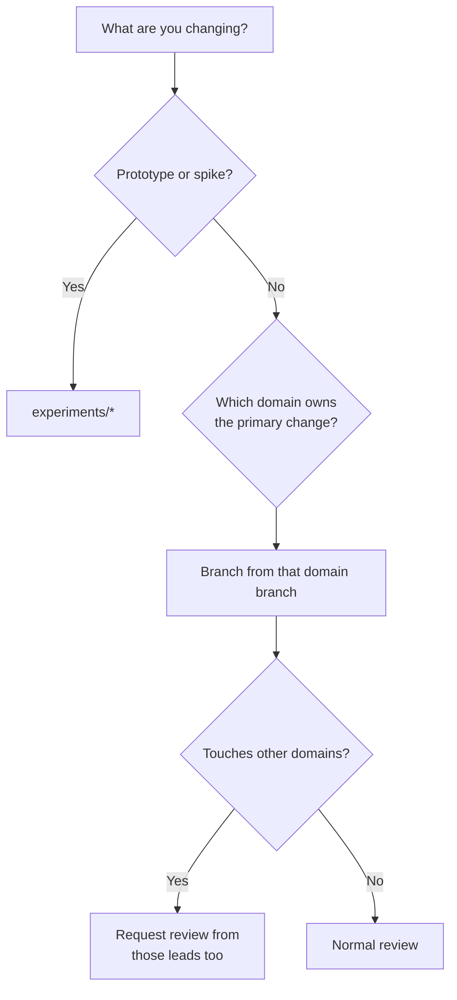

# Branch Strategy

**Owner:** CTO & Release Manager
**Status:** Active
**Decision record:** [ADR-0015](../../architecture/decisions/ADR-0015-branching-and-integration-strategy.md)

---

## Model

Trunk-based development with **long-lived domain integration branches**. Domain branches are owned
integration lanes, **not parallel forks** — they sync from `develop` daily and never diverge.

```
main                         always releasable · protected · tagged for release
 └── develop                 continuous integration of all domains
      └── <domain>           long-lived · one named owner · synced daily
           └── <type>/<domain>/<issue>-<slug>    short-lived · < 5 days
```

**The rule that makes this work:** a domain branch more than **50 commits behind `develop`** raises
an alert; more than **200 behind** fails CI. Without this, the model degrades into GitFlow within
months, and GitFlow is what we are avoiding.

## Naming

```
<type>/<domain>/<issue-number>-<short-slug>
```

`type` ∈ `feat` `fix` `docs` `refactor` `test` `perf` `chore` `spike`

```
feat/knowledge-graph/142-entity-resolution-adjudication
fix/backend/318-outbox-duplicate-delivery
docs/governance/205-indigenous-consent-protocols
spike/ai-platform/401-whisper-benchmark
```

Validated in CI. Working branches: target < 5 days, hard limit 14 with a written explanation.

## Protection rules

| Rule | `main` | `develop` | Domain | Working |
|---|:-:|:-:|:-:|:-:|
| Direct push | ❌ | ❌ | ❌ | ✅ |
| Required approvals | 2 | 1 | 1 | — |
| CODEOWNER approval | ✅ | ✅ | ✅ | — |
| Status checks | All | All | Scoped | Scoped |
| Linear history | ✅ | ✅ | ✅ | — |
| Signed commits | ✅ | ✅ | — | — |
| Force push | ❌ | ❌ | ❌ | ✅ |
| Deletion | ❌ | ❌ | Lead only | ✅ |
| Stale review dismissal | ✅ | ✅ | ✅ | — |
| Conversation resolution | ✅ | ✅ | ✅ | — |

## Merge strategies

| Transition | Strategy | Why |
|---|---|---|
| Working → domain | **Squash** | One coherent commit per unit of work; keeps history readable |
| Domain → `develop` | **Merge commit** | Preserves the domain's integration point and its story |
| `develop` → `main` | **Merge commit** | Release integration point |
| Hotfix → `main` | **Merge commit**, then back-merge to `develop` | Fix must not be lost on the next release |
| `develop` → domain (sync) | **Rebase** (automated) | Keeps domain history linear and readable |

---

## Branch inventory

Thirty long-lived branches. Each has one accountable owner, defined scope, and its own definition of
done.

**Legend:** DoD additions are *in addition to* the standard
[Definition of Done](../../CONTRIBUTING.md#9-definition-of-done).

### Core lines

| Branch | Purpose | Scope | Owner | Reviewers | Merge | Additional DoD |
|---|---|---|---|---|---|---|
| `main` | Releasable trunk | Everything, released | Release Manager | CTO + Principal Architect | Merge commit, 2 approvals, signed | Release checklist passed; artefacts signed; SBOM published |
| `develop` | Continuous integration | Everything, integrated | CTO | Domain leads | Merge commit | Full suite green; no regression vs `main` |

### Discipline branches

| Branch | Purpose | Scope | Owner | Reviewers | Additional DoD |
|---|---|---|---|---|---|
| `architecture` | Architecture docs, ADRs, views, fitness functions | `architecture/**` | Principal Architect | CTO | ADR status resolved; diagrams render; fitness tests added for new constraints |
| `product` | PRDs, personas, journeys, roadmap | `docs/product/**`, `ROADMAP.md` | Product Director | CTO, UX Lead | Acceptance criteria testable; success metric defined; out-of-scope stated |
| `research` | Evaluations, benchmarks, spikes, OSS assessment | `docs/research/**` | Research Lead | Principal Architect | Method reproducible; data published; recommendation explicit including "do nothing" |
| `ux-design` | Design system, flows, accessibility, content design | `docs/product/design/**`, `packages/ui` specs | UX Lead | Frontend Lead, Product Director | WCAG 2.2 AA verified; low-bandwidth reviewed; RTL considered; plain-language checked |
| `documentation` | User, admin, developer and operator documentation | `docs/**` | Documentation Lead | Domain lead of the subject | Tested by someone who did not write it; links valid; screenshots current |
| `governance` | Consent framework, sovereignty, risk, policy | `docs/governance/**` | Governance Lead | CTO, Security Lead | Legal basis stated; community impact assessed; external review where required |

### Platform branches

| Branch | Purpose | Scope | Owner | Reviewers | Additional DoD |
|---|---|---|---|---|---|
| `frontend` | Web app, admin console, design system implementation | `apps/web`, `apps/admin-console`, `packages/ui` | Frontend Lead | UX Lead, Backend Lead | A11y tests pass; bundle budget met; offline path tested; i18n complete |
| `backend` | Services, application and domain layers | `services/**`, `packages/domain` | Backend Lead | Principal Architect | Contract tests pass; layering fitness test passes; events documented |
| `workers` | Async processors | `workers/**` | Backend Lead | Infrastructure Lead | Idempotency tested; retry and dead-letter verified; resumable |
| `authentication` | Identity, OIDC, tokens, session | `services/identity`, auth adapters | Security Lead | Backend Lead | Adversarial auth suite passes; token lifetimes reviewed; no credential in logs |
| `knowledge-graph` | Ontology, projector, entity resolution | `services/knowledge-graph`, `workers/graph-projector` | Knowledge Graph Lead | Principal Architect | Rebuild-from-log test passes; provenance invariant holds; ontology versioned |
| `ai-platform` | Model gateway, prompts, extraction, evaluation | `services/ai-orchestrator`, `workers/extraction` | AI Lead | Security Lead, Principal Architect | Eval delta reported; prompts versioned and hashed; egress policy respected |
| `meeting-capture` | Sessions, media ingestion, consent gate, offline capture | `services/ingestion`, capture UI | Product Director + Backend Lead | Governance Lead | Consent gate tested; offline sync interruption-tested; no data-loss path |
| `search` | Hybrid search, ranking, embeddings | `services/search`, `workers/indexing` | Backend Lead | AI Lead | Permission-filter adversarial test passes; relevance regression run |
| `document-processing` | Parsing, OCR, chunking, document provenance | `workers/extraction` (document path) | AI Lead | Backend Lead | Provenance preserved through parsing; OCR quality measured |
| `integrations` | EDRMS, calendar, SSO, export connectors | `services/**` adapters | Backend Lead | Security Lead | Anti-corruption layer present; graceful degradation verified; optional by construction |
| `security` | Threat model, controls, hardening, policy | Cross-cutting | Security Lead | CTO | Threat model updated; adversarial tests added; no new findings above threshold |
| `database` | Schema, migrations, RLS, performance | `packages/domain` persistence, migrations | Backend Lead | Principal Architect | Migration reversible; RLS enabled; expand/contract respected; timed on realistic volume |
| `storage` | Object storage, media lifecycle, retention | `ObjectStorePort` adapters | Infrastructure Lead | Security Lead | Encryption verified; retention enforced; erasure verified across all stores |

### Operations branches

| Branch | Purpose | Scope | Owner | Reviewers | Additional DoD |
|---|---|---|---|---|---|
| `infrastructure` | Docker, Kubernetes, Helm, Terraform | `infrastructure/**` | Infrastructure Lead | Security Lead | Deploys clean from scratch; idempotent; no secret in config; air-gap compatible |
| `deployment` | Deployment topologies and profiles | `deployments/**` | Infrastructure Lead | CTO | Install tested from zero; upgrade and rollback tested; runbook written |
| `observability` | Instrumentation, dashboards, alerts | `packages/observability`, `infrastructure/observability` | Infrastructure Lead | Backend Lead | Domain metrics emitted; alert has a runbook; no sensitive field in telemetry |
| `testing` | Test infrastructure, fixtures, harnesses | `templates/**` tests, CI test config | QA Lead | Backend Lead, Frontend Lead | Deterministic; fast; fixtures synthetic only; failure messages diagnostic |
| `performance` | Benchmarks, load tests, optimisation | Cross-cutting | QA Lead | Principal Architect | Baseline recorded; regression threshold set; measured not assumed |
| `release` | Release engineering, packaging, signing | `scripts/release/**`, workflows | Release Manager | Infrastructure Lead, Security Lead | Reproducible; signed; SBOM attached; LTS backport assessed |

### Exploration

| Branch | Purpose | Rules |
|---|---|---|
| `experiments/*` | Time-boxed spikes and prototypes | **Never merges to `main`.** Max 30 days, then deleted or promoted via a written proposal. Exempt from the production-ready rule — this is the *only* place prototypes are permitted. Findings recorded in `docs/research/` before deletion |

---

## Choosing a branch



**Cross-cutting changes:** target the domain of the *primary* owner and request review from the
others. If genuinely no single domain owns it, target `develop` and get Principal Architect review.

## Synchronisation

Automated daily: `develop` → every domain branch, by rebase.

| Divergence | Action |
|---|---|
| < 50 commits behind | Normal |
| 50–200 behind | Warning to the owner |
| > 200 behind | **CI fails** on that branch until resynced |
| Sync conflict | Owner resolves within 2 working days |

If a domain branch is chronically stale, **retire it**. Not every domain needs a standing branch,
and keeping one that nobody uses is worse than deleting it — it implies an ownership that is not
being exercised.

## Release and hotfix

**Release:** `develop` → `main` at the six-week checkpoint → tag `vX.Y.Z`. LTS lines are cut from
`main` as `release/X.Y-lts` and receive backported security and critical fixes for 24 months
([ADR-0017](../../architecture/decisions/ADR-0017-versioning-and-release-strategy.md)).

**Hotfix:** `hotfix/<issue>-<slug>` from `main` → merge to `main` → **immediately back-merge to
`develop` and all supported LTS lines**. A hotfix that is not back-merged reappears as a regression
in the next release, which is a mistake we should only make once.

## Retiring a branch

Domain branches are not permanent fixtures. Retire when the domain is complete, has merged into
another, or has been inactive for 90 days. Retirement: announce, merge outstanding work, delete,
update this document and CODEOWNERS. Deleting a branch that is not earning its keep is good
housekeeping, not an admission of failure.
