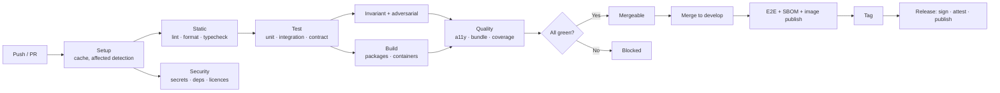

# CI/CD

**Owner:** Infrastructure Lead
**Status:** Active
**Workflows:** [`.github/workflows/`](../../.github/workflows/)

---

## Principles

1. **CI runs what you run.** Every gate is a `make` target invoked identically locally and in CI.
   A failure you cannot reproduce locally is a bug in our CI setup, not something to shrug at.
2. **Fast enough to be used.** Target p95 under 10 minutes for a pull request. Slower than that and
   people batch changes, which makes reviews worse.
3. **No logic in YAML.** Workflows are thin wrappers around `scripts/` and `Makefile`. This keeps us
   portable off GitHub Actions — a public-infrastructure project that can only be built on one
   commercial platform is not credibly sovereign.
4. **Gates are not optional.** We do not disable a gate to go green. If a gate is wrong, we change it
   deliberately, in its own pull request.
5. **Supply chain is part of CI**, not a separate concern.

## Pipeline

## Workflows

| Workflow | Trigger | Purpose |
|---|---|---|
| `ci.yml` | PR, push | Lint, typecheck, test, build — the main gate |
| `security.yml` | PR, push, daily | Secrets, dependencies, licences, container scanning |
| `codeql.yml` | PR, weekly | Static analysis |
| `adr-governance.yml` | PR | Architectural changes carry an ADR; ADR format is valid |
| `docs.yml` | PR | Markdown lint, link check, documentation freshness |
| `e2e.yml` | Merge to `develop`, nightly | End-to-end journeys |
| `evaluation.yml` | Model or prompt change, nightly | Extraction and transcription quality delta |
| `sovereignty.yml` | PR, nightly | **Zero-egress verification in the sovereign profile** |
| `branch-sync.yml` | Daily | Sync `develop` into domain branches; alert on divergence |
| `release.yml` | Tag | Build, sign, attest, SBOM, publish, changelog |
| `stale.yml` | Daily | Flag stale branches, issues and PRs |

## Required checks

Enforced by branch protection. A pull request cannot merge without all of these:

| Check | What fails it |
|---|---|
| `lint` | ESLint or Prettier violation |
| `typecheck` | Any TypeScript error |
| `test:unit` | Any failure; coverage decrease |
| `test:integration` | Any failure |
| `test:contract` | Implementation diverges from the spec |
| `test:invariant` | A consent, provenance, isolation or layering invariant broken |
| `test:adversarial` | A security control breached — **or an adversarial test weakened** |
| `a11y` | WCAG 2.2 AA violation (UI changes) |
| `bundle-size` | Frontend budget exceeded |
| `secrets` | Any credential detected, in the diff or in history |
| `licenses` | Dependency licence incompatible with the consuming package |
| `api-breaking` | Breaking REST change without a major version bump |
| `docs` | Broken link; behaviour change without documentation |
| `adr` | Architectural change without an ADR |

## Performance

| Technique | Effect |
|---|---|
| Turborepo affected detection | Only changed projects build and test |
| Dependency and build caching | Cache hit reduces setup from ~3 min to ~20 s |
| Parallel jobs | Static, security and test run concurrently |
| Testcontainers reuse | Shared infrastructure within a job |
| Fail fast on static analysis | Do not spend 8 minutes to discover a lint error |

Budget: PR p95 < 10 minutes. If we exceed it consistently, it is treated as a defect with an owner —
slow CI degrades review quality across the whole project, silently.

## Supply chain

| Control | When |
|---|---|
| Actions pinned to commit SHA (not tag) | Always |
| Minimal `GITHUB_TOKEN` permissions, per job | Always |
| No secrets exposed to fork PRs | Always |
| Dependency review on PR | Every dependency change |
| SBOM (CycloneDX) | Every release |
| Artefact and image signing (cosign) | Every release |
| SLSA provenance attestation | Every release (Phase 7) |
| Reproducible builds | Phase 7 target |

**Fork pull requests** run a restricted workflow with no secrets and no write access. Full CI runs
only after a maintainer review — this is the standard defence against a well-known exfiltration
pattern, and it costs contributors a small delay we consider worth it.

## Deployment

We publish artefacts; **we do not deploy to anyone's infrastructure.** Operators deploy Witness
themselves. This is a consequence of the sovereignty principle and it means our "CD" ends at a signed,
verifiable artefact.

| Artefact | Published to |
|---|---|
| Container images | GitHub Container Registry + an offline OCI bundle |
| npm packages (SDK, contracts) | npm registry |
| Python package (SDK) | PyPI |
| Helm chart | OCI registry |
| Offline install bundle | Release assets, checksummed and signed |

An **offline bundle** ships with every release so air-gapped operators are never second-class.

## Environments

| Environment | Purpose | Data |
|---|---|---|
| Local | Development | Synthetic fixtures |
| CI ephemeral | Test execution | Synthetic, destroyed after |
| Reference deployment | Validate releases against realistic conditions | **Synthetic only** — we never hold real institutional data |

We do not operate an environment containing real user data, ever. If we did, we would become a target
and a single point of failure, which would contradict the entire architecture.

## When CI breaks on `main`

1. **Stop merging.** A red trunk blocks everyone.
2. Fix forward if the fix is obvious and small; otherwise revert.
3. Reverting is not a failure — it is the correct first response.
4. If a flaky test caused it, quarantine within a day, fix or delete within a week.
5. Repeated breakage from the same area gets a retrospective, not a reminder.
