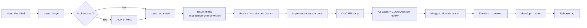

# Engineering Operating Model

**Owner:** CTO
**Status:** Active
**Review:** Quarterly

How engineering at Witness is organised, how work flows, how decisions are made, and what we hold
ourselves to. This is the operating system; the other documents in this directory are its modules.

---

## 1. What we are optimising for

We are building infrastructure intended to outlive everyone currently working on it. That single
fact determines everything below.

| We optimise for | Over |
|---|---|
| **Maintainability** | Delivery speed |
| **Legibility to a stranger** | Cleverness |
| **Replaceability** | Integration convenience |
| **Correctness of the record** | Feature breadth |
| **Operability by an under-resourced team** | Architectural elegance |
| **Written decisions** | Fast decisions |

This is an unusual set of trade-offs and it will feel slow to anyone arriving from a product
startup. That is the intended feeling. A shortcut taken here is paid for by a ministry in 2033 by
people who never met us.

**What we do not trade away:** consent, provenance, accessibility, security and Indigenous data
sovereignty are not negotiable against a date. Dates move.

## 2. Organising principle

**Domain ownership with explicit authority.** Every area of the system has one named owner who
holds merge authority, is accountable for its health, and whose authority is written down in a
charter in [`agents/`](../../agents/).

Ownership means:
- **Authority** to decide within the domain, without asking permission
- **Accountability** for quality, security, documentation and operability of that domain
- **Obligation** to review promptly, to be reachable, and to name a deputy

The corresponding rule: **no unowned code.** If a change lands somewhere with no owner, we either
assign one or the change does not land.

**Conway's Law is exploited, not resisted.** Bounded contexts, services, domain branches, CODEOWNERS
entries and role charters all align deliberately. When they diverge, we treat it as a defect in the
organisation, not a naming inconsistency.

## 3. Roles and authority

Nineteen roles, each with a charter in [`agents/`](../../agents/) defining mission, responsibilities,
authority, deliverables, ownership, success metrics, definition of done, dependencies, review
responsibilities and merge authority.

The charters state explicitly, for each role, **what they may decide alone, what they must consult
on, and what they must escalate**. Ambiguous authority is the most common cause of both stalled
decisions and unilateral ones.

| Decision level | Who | Example |
|---|---|---|
| **Within a domain** | Domain Lead, alone | Choosing a testing utility, refactoring internals |
| **Crossing domains** | Affected leads, consensus | Changing an event contract |
| **Architectural** | Principal Architect + CTO, via ADR | Adding a data store |
| **Principle-affecting** | Steering Committee | Changing P1–P8 |
| **Consent / provenance / Indigenous data** | Governance Lead holds an **absolute veto** | Any weakening |

## 4. How work flows

**"Ready" means acceptance criteria are written before work starts.** An issue without them is not
ready, and starting anyway is the most reliable way to build the wrong thing well.

## 5. Cadence

| Ceremony | Frequency | Duration | Purpose |
|---|---|---|---|
| **Engineering review** | Fortnightly | 60 min | Status, blockers, cross-domain coordination, `STATUS.md` update |
| **Architecture review** | Monthly | 90 min | ADRs in flight, drift, technical debt, fitness function results |
| **Security review** | Monthly | 60 min | Threat model changes, findings, dependency risk, incident follow-up |
| **Governance review** | Quarterly | 90 min | Consent framework, Indigenous data protocols, risk register |
| **Retrospective** | Monthly | 60 min | How we work; one concrete change committed each time |
| **Release readiness** | Per release (6 weeks) | 45 min | Checklist, go/no-go |
| **Roadmap review** | Quarterly | Half day | Sequencing, scope, `ROADMAP.md` update |

Meetings have a written agenda in advance and written outcomes after, in the repository. **A meeting
whose outcome is not written down did not happen** — the same standard we hold our users' meetings
to, which we would be hypocrites to exempt ourselves from.

**Asynchronous by default.** Contributors will be distributed across many time zones, and many will
be part-time or volunteer. Anything requiring synchronous presence excludes someone.

## 6. Quality gates

Enforced mechanically, not by reminder. Full detail in [`CI_CD.md`](CI_CD.md).

| Gate | Blocks merge | Applies to |
|---|---|---|
| Lint, format, typecheck | Yes | All |
| Unit + integration tests | Yes | All |
| Coverage not decreasing | Yes | All |
| Contract tests against specs | Yes | API changes |
| Architecture fitness tests | Yes | All |
| Adversarial security suite | Yes | All |
| Accessibility (WCAG 2.2 AA) | Yes | UI |
| Bundle size budget | Yes | Frontend |
| Secret scanning | Yes | All |
| Dependency and licence scan | Yes | Dependency changes |
| Documentation updated | Yes | Behaviour changes |
| ADR present | Yes | Architectural changes |
| CODEOWNER approval | Yes | All |

**We do not disable a gate to go green.** If a gate is wrong, we change the gate deliberately, in
its own pull request, with reasoning. A disabled gate is a decision to accept a class of defect
forever, and it should look like one.

## 7. Definition of Done

The single list, in [`CONTRIBUTING.md` §9](../../CONTRIBUTING.md#9-definition-of-done). It is
duplicated in the pull request template so nobody has to remember it.

Summary: acceptance criteria met · tested · documented · observable · secure · accessible ·
internationalised · consent and provenance invariants upheld · migration and rollback documented ·
no undeclared technical debt · CODEOWNER approved.

## 8. How we handle disagreement

1. **Write down the disagreement** until both parties agree the statement is fair. A surprising
   share of disputes dissolve here, having actually been about different premises.
2. **Look for the cheap experiment** that would settle it with evidence rather than argument.
3. **Escalate to the decision authority** ([`GOVERNANCE.md`](../../GOVERNANCE.md)).
4. **The authority decides in writing, with reasoning**, recorded in
   [`docs/governance/DECISIONS.md`](../governance/DECISIONS.md).
5. **Disagree and commit.** Reopening requires *new evidence*, not repetition at higher volume.

**Escalation is not failure.** A lead who escalates a genuinely contested decision is doing their
job. A lead who sits on one for three weeks is not.

## 9. Technical debt

Debt is a legitimate tool, used deliberately and recorded. It is not a synonym for mess.

- Any deliberate shortcut is logged in [`TECH_DEBT.md`](TECH_DEBT.md) with an owner, a rationale and
  a review date — **in the same pull request that incurs it**.
- Each release allocates capacity to debt reduction. If that capacity is consistently consumed by
  features, that is a signal reported to the Steering Committee, not a scheduling detail.
- Debt without an owner is not debt; it is rot, and it is a defect.

## 10. Incidents

Severity, response and postmortem process: `docs/operations/INCIDENT_RESPONSE.md`.

**Blameless postmortems** for every SEV-1 and SEV-2, published in redacted form because operators of
other deployments need to know. The question is always "what about the system allowed this?", never
"who did this?"

A consent violation is a SEV-1 regardless of how few records are involved.

## 11. AI in the engineering process

AI assistance is expected, welcome, and governed. Full detail in [`AI_GUIDELINES.md`](AI_GUIDELINES.md).

The short version: **AI can propose, humans dispose** — the same principle we apply to the product
itself (P4). AI-assisted contributions are disclosed, the human contributor owns the output entirely,
and AI cannot approve a pull request or be the sole reviewer of security, consent, cryptography or
Indigenous data governance changes.

## 12. Onboarding

A new contributor should reach a merged pull request within their first week. If they cannot, the
failure is ours.

| Day | Milestone |
|---|---|
| 1 | Read `PROJECT_CONTEXT.md`, `CONTRIBUTING.md`, this document. Local stack running |
| 2 | Read `ARCHITECTURE.md` and the three key ADRs. Run the full test suite |
| 3 | Pick a `good first issue`. Pair with the domain lead |
| 5 | First pull request open |
| 10 | First pull request merged |
| 30 | Owning a small area; reviewing others' work |

Every contributor gets a named buddy for their first month. If onboarding takes longer than this,
that is a defect in our documentation and it gets an issue.

## 13. How we know this is working

| Signal | Healthy | Investigate |
|---|---|---|
| PR time to first review | < 1 working day | > 2 days |
| PR time to merge | < 3 days | > 7 days |
| PR size | < 400 lines | Regularly > 800 |
| CI duration (p95) | < 10 min | > 15 min |
| Failed deployments | < 5% | > 10% |
| Escaped defects per release | Trending down | Trending up |
| Documentation drift found in review | Rare | Common |
| Bus factor per domain | ≥ 2 | 1 |
| Contributor onboarding to first merge | < 10 days | > 20 days |
| Ratio of rejected to accepted ADRs | Non-zero | Zero — we are not really deciding |

That last one is deliberate. If every ADR is accepted, the process has become a formality for
recording decisions already made elsewhere, and it has stopped doing its job.
