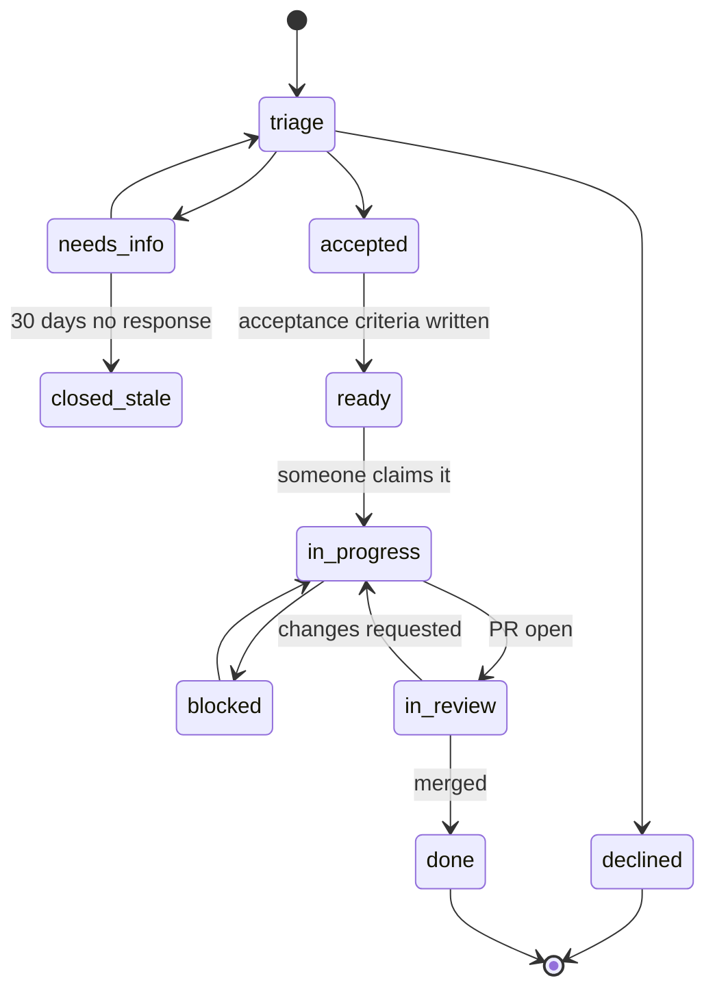

# Issue Workflow

**Owner:** Engineering Manager
**Status:** Active

---

## Lifecycle



| State | Meaning | Exit condition |
|---|---|---|
| `triage` | New, unassessed | Owning lead assesses — **within 2 working days** |
| `needs-info` | Cannot proceed without more from the reporter | Response received, or 30 days → closed |
| `accepted` | Real, in scope, will be done | Acceptance criteria written |
| `ready` | **Anyone could pick this up and know when it is done** | Someone claims it |
| `in-progress` | Actively being worked | PR opened |
| `blocked` | Cannot proceed — dependency, decision, external | Blocker cleared; blocker is named |
| `in-review` | PR open | Merged or changes requested |
| `done` | Merged and deployed to `develop` | — |
| `declined` | Out of scope, or we will not do it | — |

**`ready` is the important state.** An issue is not ready until acceptance criteria are written.
Starting work on an issue without them is the most reliable way to build the wrong thing carefully.

## Triage

Every issue is triaged within **two working days** by the lead who owns the area. Triage answers:

1. Is it real and reproducible?
2. Is it in scope? (Check [`PROJECT_CONTEXT.md` §2](../../PROJECT_CONTEXT.md#2-what-witness-is-not))
3. Does it violate a principle P1–P8? If so, it is declined regardless of merit.
4. Is it a duplicate?
5. Does it need an ADR first?
6. What is the priority?
7. Who owns it?

**Decline openly, with reasoning.** A clear "no, because…" respects the reporter's time far more
than silence or a perpetually-open issue nobody intends to do. Declined issues are closed with an
explanation and remain searchable.

## Labels

| Group | Labels |
|---|---|
| **Type** | `type:bug` `type:feature` `type:chore` `type:docs` `type:research` `type:security` `type:adr` `type:epic` `type:accessibility` `type:sovereignty` |
| **Priority** | `P0` `P1` `P2` `P3` |
| **State** | `triage` `needs-info` `accepted` `ready` `blocked` `in-progress` `in-review` |
| **Domain** | `domain:architecture` `domain:backend` `domain:frontend` `domain:knowledge-graph` `domain:ai-platform` `domain:security` `domain:governance` `domain:infrastructure` `domain:docs` … (one per branch) |
| **Community** | `good first issue` `help wanted` `needs-expertise` |
| **Flags** | `breaking-change` `needs-adr` `needs-external-review` `ai-generated` |

## Priority

| Priority | Definition | Response |
|---|---|---|
| **P0** | Production down, data at risk, active security exposure, **any consent violation** | Drop everything. Incident process |
| **P1** | Blocks a release, blocks contributors, significant user harm | Next sprint |
| **P2** | Planned work | Scheduled |
| **P3** | Backlog, nice to have | When capacity allows |

**Any consent violation is P0 regardless of the number of records affected.** One person's consent
violated is a breach of the promise the system exists to keep. Treating it as minor because it was
"only one record" would be a category error about what this product is.

## Acceptance criteria

Written before work starts. Testable, not aspirational.

**Bad:** "Search should be fast and return good results."

**Good:**
```
- [ ] Hybrid search returns results in < 800 ms p95 over the 10k-meeting fixture set
- [ ] No result is returned that the caller lacks permission to see (adversarial test)
- [ ] No result is returned from a session whose consent has been revoked
- [ ] nDCG@10 ≥ 0.75 on the relevance judgement set
- [ ] Results display confidence and provenance affordances
- [ ] Keyboard navigable; screen reader announces result count (WCAG 2.2 AA)
```

If you cannot write testable acceptance criteria, the issue is not understood well enough to start —
and that is useful information, not a blocker to route around.

## Epics

Large work is an epic with linked child issues. An epic carries: the problem, the user outcome,
success metrics, out-of-scope statement, dependencies, and a link to any ADR or PRD.

An epic with no children in `ready` after two weeks is not being worked and should be closed or
re-planned. Perpetually open epics are how a backlog becomes fiction.

## Curated community labels

`good first issue` and `help wanted` are **curated, not aspirational**. Before applying one:

- The problem is described well enough for a stranger to start
- Acceptance criteria are written
- Relevant files are pointed at
- A named person is available to answer questions
- It is genuinely self-contained

An unmaintained `good first issue` that wastes a newcomer's evening costs us a contributor we will
never hear from again.

## Security issues

**Never in a public issue.** Follow [`SECURITY.md`](../../SECURITY.md) — private disclosure. Public
issues describing a vulnerability are closed and deleted immediately, and the reporter is contacted
privately with thanks.

## Stale handling

| Age | Action |
|---|---|
| `needs-info`, 30 days no response | Closed with a note; reopening is welcome |
| `P3`, 12 months no activity | Reviewed; closed if no longer relevant |
| `blocked`, 90 days | Escalated to the lead — a blocker nobody is clearing is a decision nobody is making |

Closing an issue is not a judgement on the reporter. A backlog that only grows is not a plan; it is
a list of things we are quietly not doing, and it is more honest to say so.
