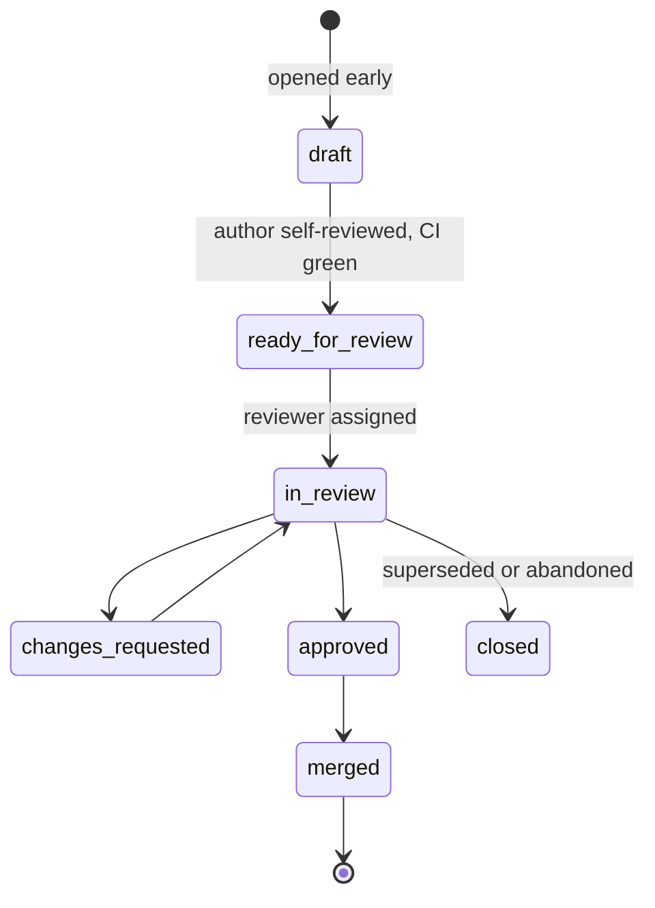

# Pull Request Workflow

**Owner:** Engineering Manager
**Status:** Active
**See also:** [`CODE_REVIEW.md`](CODE_REVIEW.md) · [`CI_CD.md`](CI_CD.md)

---

## Lifecycle

## Before opening

- [ ] Branch from the correct domain branch ([`BRANCH_STRATEGY.md`](BRANCH_STRATEGY.md))
- [ ] Linked issue exists and is `in-progress`
- [ ] `make verify` passes locally — the same gates CI runs
- [ ] You have read your own diff as a stranger would
- [ ] Documentation and tests are in **this** PR, not a follow-up
- [ ] Commits follow Conventional Commits, signed off (`git commit -s`)

## Open as a draft, early

A draft PR from day one is better than a surprise on day five. It gives reviewers context, catches
direction problems while they are cheap, and makes work visible.

Mark ready for review when: CI is green, you have self-reviewed, and you would be comfortable
defending every line.

## Size

| Lines changed | Expectation |
|---|---|
| < 200 | Ideal |
| 200–400 | Normal |
| 400–800 | Justify it in the description |
| > 800 | Split it, or explain in the PR why it genuinely cannot be split |

Generated code, lockfiles and fixtures are excluded from the count. Review quality degrades sharply
with size — this is well evidenced, and everyone knows it while approving 2,000-line PRs anyway.

**Legitimately large PRs exist**: a generated client, a mechanical rename, a vendored dependency.
Say which it is in the description so reviewers know how to read it.

## Description

The template asks for these. They are not ceremony:

| Section | Why |
|---|---|
| **What and why** | The diff shows what changed. Only you know why |
| **Linked issue and ADR** | Traceability from decision to code |
| **How to test** | Lets a reviewer verify rather than trust |
| **Risk and rollback** | Forces you to think about failure before it happens |
| **What I did not do** | Scope boundaries, known gaps, follow-ups. **The most useful section**, and the one most often left blank |
| **AI assistance** | Disclosure ([`AI_GUIDELINES.md`](AI_GUIDELINES.md)) — calibrates review, not a judgement |
| **Definition of Done** | The checklist, so nobody has to remember it |

## Merging

| Requirement | Rule |
|---|---|
| Approvals | ≥ 1 CODEOWNER per path touched; 2 for `main` |
| Specialist review | Per [`CODE_REVIEW.md`](CODE_REVIEW.md) — security, KG, governance, architecture |
| CI | All required checks green. **No overrides** |
| Conversations | All resolved |
| Branch | Up to date with target |
| Strategy | Squash into domain branches; merge commit for domain → `develop` → `main` |
| Self-merge | **Not permitted**, including for the CTO and Founder |

The only exception is an active production security incident, which requires retrospective review
within 48 hours and a public record of what was merged and why.

## Stacked pull requests

**Prohibited by default.** Branch from `main`, target `main` — see
[`docs/engineering/organisation/01-ORGANISATION_CHART.md`](organisation/01-ORGANISATION_CHART.md).

A stacked PR requires all of the following, recorded in the PR description, not assumed:

- **Explicit approval** — a human has agreed the stack is warranted, not just that the author found
  it convenient.
- **Dependency record** — which PR this one cannot exist without.
- **Merge order** — which merges first, and why nothing else can.
- **Retarget plan** — the exact base-branch change required if the PR the stack sits on merges
  before this one is ready, stated before either PR is opened, not improvised afterward.
- **Recovery plan** — what happens if the base merges and this PR is *not* retargeted in time. "It
  gets stranded and someone notices later" is not a recovery plan.
- **Named owner** — one person or agent responsible for the retarget actually happening.

This is not theoretical caution. This exact repository lost 84 files for most of a day because PR #2
was stacked on PR #1's branch and PR #1 merged first, closing the only path PR #2 had to `main` — the
incident [ADR-0021](../../architecture/decisions/ADR-0021-canonical-scope-and-architecture-reconciliation.md)
exists to repair. It then happened *again*, in miniature: PR #11 was deliberately stacked on PR #10
with an explicit retarget plan written into its description, and was still merged into PR #10's
branch directly rather than retargeted — the retarget plan existed but nothing enforced it being
followed. **The retarget plan is not sufficient on its own; the default of not stacking is the
actual mitigation.**

For work that is genuinely sequential and cannot avoid stacking, the pattern above (three branches,
one below another) still applies — but only with all six conditions met and recorded.

## Draft, stale and abandoned

| Situation | Action |
|---|---|
| Draft, no activity 14 days | Author pinged |
| Draft, no activity 30 days | Closed; reopening is trivial |
| Ready for review, no reviewer 2 days | Escalated to the domain lead |
| Changes requested, no response 14 days | Author pinged; may be taken over by another contributor with credit preserved |
| Author unavailable | Anyone may take it over. Original commits and attribution are kept |

Taking over a stalled PR is not a slight. Keep the original author's commits and credit them.

## Reverting

Reverting is a normal, healthy operation — not a punishment and not an admission of incompetence.

**Revert immediately, without discussion, if:** `main` or `develop` is broken; a security issue is
introduced; a consent, provenance or isolation invariant is violated; production impact is
suspected at any operator.

**Discuss first if:** the fix is obvious and under 15 minutes, or reverting would cause more
disruption than the defect.

After a revert: an issue is opened with the root cause, and the re-land PR references it. Nobody is
blamed; if a revert was needed, the interesting question is why our gates did not catch it.

## Fork contributions

External contributors work from forks. CI runs a restricted workflow (no secrets, no write access)
until a maintainer approves the full run — a standard defence against a known exfiltration pattern.

Maintainers: review the diff **before** approving the CI run, not after. That is the point of the
control.
