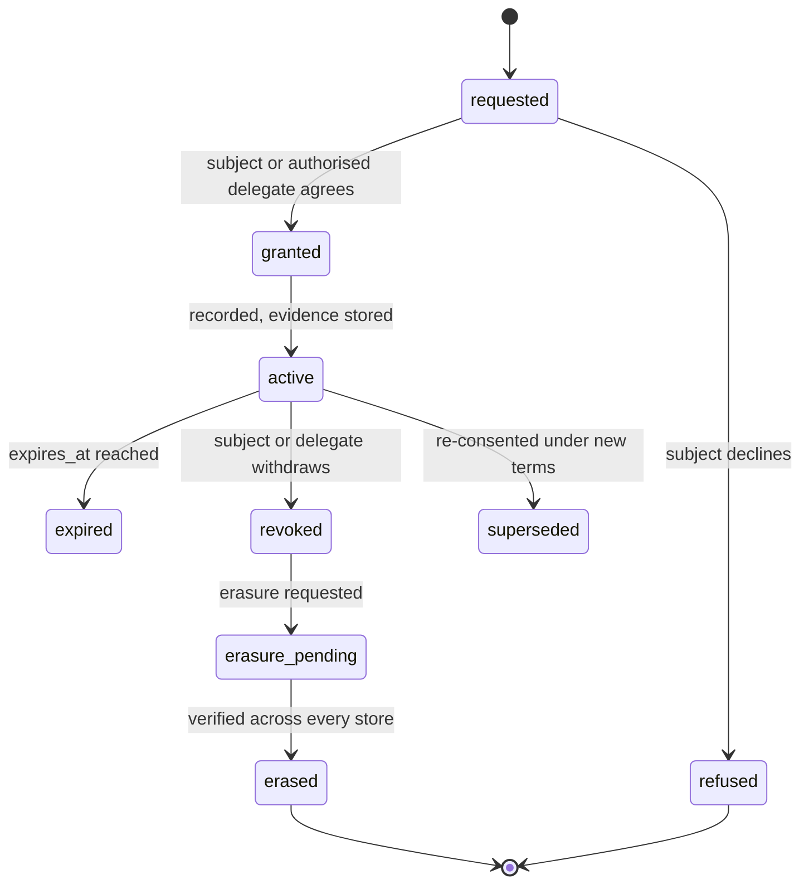

# Consent Framework

**Owner:** Governance Lead
**Status:** Draft v0.1 — **requires external legal and Indigenous governance review before Phase 3**
**Decision record:** [ADR-0008](../../architecture/decisions/ADR-0008-consent-as-a-domain-primitive.md)
**Principle:** P2 — consent is a domain primitive

---

## 1. Why this document is load-bearing

Witness records people speaking. Often about things that matter to them. Sometimes in circumstances
where they have limited power relative to the institution doing the recording.

If the consent model fails, Witness is not an institutional memory platform that had a privacy
incident. It is a surveillance tool that had good intentions. There is no version of this product
that survives getting consent wrong.

So consent here is not a checkbox, a settings page, or a policy document. It is an **aggregate with
a lifecycle, a service, an enforcement point, and a set of guarantees we can be held to**.

## 2. What consent means here

Most software means "the user ticked a box at signup". That definition fails us in five ways:

| Reality | Why a boolean fails |
|---|---|
| **Consent is scoped** | Someone may agree to their words informing internal analysis but not to publication |
| **Consent is revocable, with propagation obligations** | Revocation must reach transcripts, assertions, the graph, three indexes, embeddings, caches and backups |
| **Consent is often collective** | Community knowledge is governed by custodial authority, not individual choice |
| **Consent is given by non-users** | Most people in a consultation will never hold an account |
| **Consent is not always the lawful basis** | A parliamentary record may rest on public task or legal obligation, not consent |

The last point matters and is easy to get wrong. **Not all lawful processing is consent-based.** A
framework that assumes consent is the only basis will either block legitimate statutory recording or
push operators into recording consent that was never really given — which is worse than honestly
recording a different basis.

## 3. The consent record

```
consent_grant
  subject              who the data is about
  granted_by_subject   who gave it (may differ — delegation, guardianship, custodial authority)
  legal_basis          consent | public_task | legal_obligation | vital_interests
                       | legitimate_interests | customary_authority
  capture_method       written | verbal_recorded | digital_signature | witnessed
                       | community_protocol
  capture_evidence_ref pointer to the artefact proving it was given
  language             the language it was given and explained in
  granted_at / expires_at / revoked_at
  version              which version of the consent text applied

consent_scope (many per grant)
  purpose              what the data may be used for
  data_class           what kind of data
  permitted_operations transcribe | extract | index | publish | export | share
  permitted_audiences  who may see the resulting knowledge
  restrictions         free-form conditions recorded verbatim
```

Three fields deserve explanation because they are unusual and each exists for a reason.

**`capture_method` includes `verbal_recorded`.** In field consultation, consent is frequently given
verbally, in the room, in the participant's own language. A system that only accepts a signed form
forces field workers to either exclude people or to fabricate paperwork. We record the audio of the
grant itself as the evidence.

**`language`** is recorded because consent given in a language the person does not read is not
consent. If the consent text was in English and the participant speaks Tok Pisin, that is a fact the
record must carry.

**`capture_evidence_ref`** means every grant points at something a human can inspect years later. "The
system says they consented" is not evidence.

## 4. Lifecycle



**Refusal is a first-class state, not an absence.** A recorded refusal prevents someone re-asking the
same question every time the record is reviewed, and it prevents a gap being read as permission.

## 5. Enforcement — how this is made real

Three mechanisms, deliberately overlapping. Any one alone would eventually fail.

### 5.1 The type system

`ConsentedContext` cannot be constructed without a valid consent decision. Repository methods that
return personal data **require** one as a parameter. Forgetting the check is a compile error, not a
privacy incident.

### 5.2 The topology

The transcription worker subscribes to `capture.session.consent_cleared.v1` — **not** to
`capture.media.ingested.v1`. Media without cleared consent is stored encrypted and never enters the
pipeline. The gate is in the shape of the system, not in a conditional someone might not write.

### 5.3 The policy decision point

The consent gate sits **in front of** authorisation, not beside it:

> Authorisation asks: *is this user permitted?*
> The consent gate asks: *is this processing lawful at all?*

A user holding every role in the system still cannot read data whose grant has been revoked. That
ordering is the architectural expression of P2.

## 6. Revocation — our hardest guarantee

**A subject may withdraw at any time, for any reason, without explanation, without penalty.**

| Property | Commitment |
|---|---|
| Propagation SLO | **5 minutes**, p99, to every store |
| Scope | Postgres, Neo4j, OpenSearch, pgvector, Redis, object storage |
| Verification | An automated pass re-scans every store and **fails loudly** if anything remains |
| Derived works | Assertions, graph nodes and edges depending solely on the revoked grant are removed |
| Backups | Erasure list replayed on restore — a **mandatory, documented step** in the runbook |
| Monitoring | `consent_revocation_propagation_seconds` is a paging alert |
| Incident | Failure is a **SEV-1**, regardless of how few records are affected |

**The residual risk, stated plainly:** revocation cannot be instant in backups. A restore performed
without replaying the erasure list would resurrect erased data. This is documented in the operator
runbook, tested in the quarterly recovery drill, and it is the single most important thing an
operator must not skip.

### What survives revocation

Content is hard-deleted. A **non-reversible tombstone** remains recording that an assertion existed,
was erased, when, and under whose authority — never what it said.

This resolves a genuine tension: auditability requires that the record cannot be silently altered;
privacy law requires genuine erasure. The result is that an auditor's legitimate question ("was this
record tampered with?") is answerable, and an illegitimate one ("what did she say before she
withdrew?") is not.

## 7. Collective and delegated consent

Individual-only consent models fail Indigenous and community data governance outright. Full treatment
in [`INDIGENOUS_DATA_SOVEREIGNTY.md`](INDIGENOUS_DATA_SOVEREIGNTY.md) and
[ADR-0019](../../architecture/decisions/ADR-0019-indigenous-data-sovereignty.md).

- **`subject_type = community`** — a community is a subject in its own right, holding grants
- **`consent_delegation`** — named custodians hold authority to grant or revoke on the community's
  behalf, with the **basis for that authority recorded**
- **Community restriction** is enforced at the PDP **above all roles, including system administrator**
- **Non-exportable** classification for knowledge that may never leave, under any circumstance

## 8. Rights of the data subject

Exercisable by people who **never hold an account** — via a tokenised access link, in person through
an operator, or through a community custodian.

| Right | Implementation |
|---|---|
| **Know** what is recorded | Subject access report, plain language, in their language where possible |
| **See** the consent they gave | Including the original audio if verbal |
| **Correct** what is wrong | Correction request creating a new assertion, retracting the old |
| **Withdraw** consent | Immediate, no explanation required |
| **Erasure** | Verified across every store |
| **Object** to a purpose | Scoped withdrawal, not all-or-nothing |
| **Know who accessed it** | Access log for their own data |

**Withdrawal must be at least as easy as granting.** If consent takes one step and withdrawal takes
five, we have made a choice about which one we want people to make, and it is the wrong one.

## 9. Consent quality

A consent record can be technically valid and ethically worthless. These are commitments about
whether consent is *meaningful*:

1. **Plain language, tested for comprehension** with real participants before v1.0 — not written by
   lawyers for lawyers.
2. **In the participant's language.** Consent-material translation is our highest translation
   priority, because someone who cannot read the explanation has not consented.
3. **Specific.** "For research purposes" is not a purpose.
4. **Genuinely optional.** Where participation in a public process cannot be conditioned on consent
   to recording, the system must support participation without recording.
5. **Power imbalance acknowledged.** People consulted by a government agency often feel unable to
   refuse. We cannot fix that with software, but we can avoid designs that exploit it — and we can
   make refusal visible, easy and non-penalising.

Point 5 is uncomfortable and we state it deliberately. The most likely way Witness causes harm is not
a technical failure; it is a technically perfect consent record obtained from someone who did not feel
free to say no.

## 10. What operators must do

Witness enforces the mechanism. Operators are responsible for the practice.

- Determine the lawful basis in **your** jurisdiction. We do not give legal advice.
- Configure retention to your statutory obligations.
- Train the people who obtain consent — the interface cannot fix a bad conversation.
- Honour withdrawal requests promptly, including those arriving outside the system.
- Never configure Witness to record without a recorded basis. It will refuse, and attempting to work
  around that is a decision to misuse the software.

## 11. Open questions

| # | Question | Owner | Needed by |
|---|---|---|---|
| CF-1 | Handling a participant who consents, then a co-participant revokes, where the utterance involves both | Governance Lead | Phase 3 |
| CF-2 | Consent for people mentioned but not present — the "third-party data" problem | Governance Lead | Phase 3 |
| CF-3 | Minimum viable consent for a public parliamentary proceeding where public task applies | Governance Lead | Phase 3 |
| CF-4 | Whether a community may delegate revocation authority to an individual custodian without ratification | Governance Lead + external | **Phase 4 gate** |
| CF-5 | Re-consent obligations when purpose changes years later | Governance Lead | Phase 4 |

**CF-2 is the hardest.** In any meeting, people are discussed who are not present and gave no consent.
We have no complete answer yet, and it would be dishonest to imply otherwise. Current direction:
minimise, treat mentions of absent third parties as `confidential` by default, and support redaction
on request — but this needs external legal review before Phase 3, and it is tracked as risk R-04.
