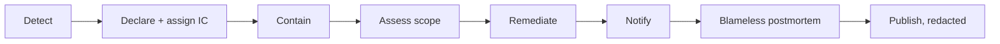

# Incident Response

**Owner:** Security Lead
**Status:** Active

---

## Severity

| Level | Definition | Response |
|---|---|---|
| **SEV-1** | Data breach, **any consent violation**, audit chain compromise, community-restriction failure | Immediate, all hands |
| **SEV-2** | Security control failure without confirmed exposure; data integrity issue | Same day |
| **SEV-3** | Vulnerability with no active exploitation; degraded service | Next working day |
| **SEV-4** | Hygiene, minor misconfiguration | Scheduled |

**A consent violation is SEV-1 regardless of how few records are involved.**

This is not proportionality theatre. One person's consent violated is a breach of the specific promise
the system exists to keep. Treating it as minor because it was "only one record" would be a category
error about what Witness is — and the people affected would be right to see it that way.

## Response

1. **Declare.** Anyone may declare an incident. Over-declaring is cheap; under-declaring is not.
2. **Assign an incident commander.** One person coordinates. They do not also do the fixing.
3. **Contain** before investigating, if containment is possible without destroying evidence.
4. **Assess scope.** Whose data? Which tenants? Which deployments? Be precise, and resist the urge to
   estimate optimistically.
5. **Remediate.**
6. **Notify** — affected operators, affected data subjects where required, regulators where required.
7. **Postmortem** within 5 working days.

## Notification

**Operators** of deployments running affected versions are notified privately **before** public
disclosure where the risk warrants it. Many run air-gapped and cannot pull a patch automatically.

**Data subjects** are notified where their data was affected, in plain language, in their language —
not a legal notice designed to minimise. If someone's testimony was exposed, they need to be able to
understand what happened and what it means for them.

**Publicly**, through a security advisory. We publish even when it is embarrassing. Operators of
public infrastructure need accurate information more than we need to look competent.

## Postmortems

**Blameless, always.** The question is *"what about the system allowed this?"* — never *"who did this?"*

A postmortem that identifies a person as the cause has failed. People make mistakes; that is a
constant. The interesting question is why the system permitted the mistake to have consequences.

Published in redacted form, because operators of other deployments need to learn from it. Template:
[`templates/postmortem/`](../../templates/postmortem/).

## For operators

You are responsible for incident response in **your** deployment. We will support you: analysis,
patches, and honest information about impact.

**Report an incident affecting your Witness deployment to us**, even if you have contained it — the
same vulnerability likely affects others. Follow [`SECURITY.md`](../../SECURITY.md).
