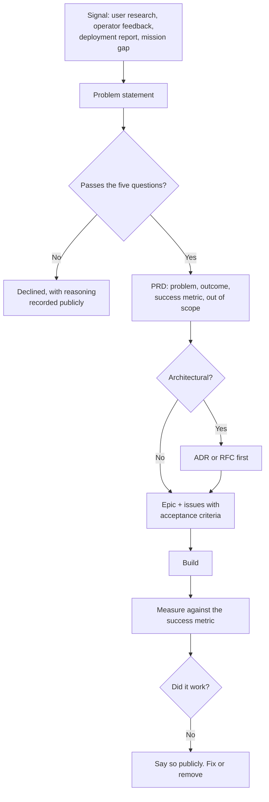

# Product Operating Model

**Owner:** Product Director
**Status:** Active
**Review:** Quarterly

---

## What product means here

Witness is not a market-driven product. It is infrastructure with a mission, and that changes how
product decisions get made.

We do not ask "what will drive adoption?" first. We ask:

1. **Does this serve the mission?** ([`MISSION.md`](../../MISSION.md))
2. **Does it respect the principles?** (P1–P8 — a feature violating one is declined regardless of
   demand)
3. **Does it help answer the one-sentence test?** *"Who committed to what, on whose behalf, on what
   evidence, under what consent — and can I prove it five years later?"*
4. **Can an under-resourced institution actually operate it?**
5. *Then*: is it worth building relative to everything else?

A feature that scores well on demand and badly on 1–4 is declined. This will occasionally cost us
adoption, and we accept that — a product that compromises its principles to grow becomes something
nobody needed.

## Personas

Detail in [`PERSONAS.md`](PERSONAS.md). Summary:

| Persona | Core need | Design weight |
|---|---|---|
| **Policy officer** | "What did we already decide, and why?" | Highest — success or failure rests here |
| **Committee clerk** | Accurate attributable record; redaction; publication | High — has legal obligations |
| **Community engagement lead** | Prove community input shaped outcomes | High — often offline, in the field |
| **Indigenous knowledge custodian** | Control who sees what, forever; withdraw at will | **Highest trust bar** |
| **Programme manager** | Track commitments across years and staff cohorts | High |
| **Auditor / Ombudsman** | Reconstruct decision chains years later | Medium — infrequent, high stakes |
| **Platform operator** | Deploy, run, back up, upgrade, restore | **First-class** — not an afterthought |
| **Data subject** | Understand and control what is recorded about them | **Non-negotiable** — may never be a user |

Two of these are unusual and deliberate. The **platform operator** is a first-class persona because
software that cannot be operated by a two-person government IT team is not public infrastructure. The
**data subject** is a persona despite often never logging in, because rights that only work for
account holders are not rights.

## How work is decided

**Step K is the one most organisations skip.** A feature that shipped and did not achieve its stated
outcome is a finding, not a success. We publish those findings, including in case studies — an honest
account of what did not work is more useful to the next institution than a list of features.

## PRD contents

Every significant piece of work has one, in `docs/product/prd/`:

- **Problem** — whose, how often, what it costs them today
- **Evidence** — how we know this is real, not assumed
- **Outcome** — what changes for the user, stated as behaviour not as a feature
- **Success metric** — how we will know, with a threshold and a measurement date
- **Out of scope** — explicit, so scope creep is visible
- **Principle check** — P1–P8, with any tension named
- **Abuse cases** — how this could be misused ([`SECURITY_REVIEW.md`](../engineering/SECURITY_REVIEW.md))
- **Accessibility and low-bandwidth considerations**
- **Operator impact** — what this adds to running Witness
- **Dependencies and risks**

The **abuse case** and **operator impact** sections are unusual and both are mandatory. Every feature
that touches attribution, identity or search can be turned toward surveillance; and every feature adds
to the operational burden of a team that did not ask for it.

## Prioritisation

Ordered, not scored. Scoring frameworks manufacture false precision.

1. **Correctness and trust** — anything where the system could be wrong in a way users cannot detect
2. **Mission-critical capability** — the pipeline from conversation to provenance-backed knowledge
3. **Operability** — things that make Witness runnable by its actual operators
4. **Accessibility and equity** — low bandwidth, under-served languages, assistive technology
5. **Breadth** — more entity types, more integrations, more formats
6. **Convenience** — genuinely nice, genuinely last

## Research

Owned by the Research Lead, and it is not optional. We are mostly not the users. Engineers building
for policy officers, clerks and Indigenous custodians will get it wrong unless they ask.

| Method | When |
|---|---|
| Contextual inquiry | Before designing a workflow |
| Usability testing | Every significant UI change, with real users |
| Deployment interviews | Every reference deployment, quarterly |
| Operator feedback | Continuous; explicitly asked for at every release |
| Community consultation | For anything touching Indigenous data governance — compensated, never extractive |

**We pay for community and Indigenous expertise.** Asking people whose knowledge has historically
been extracted without compensation to advise us for free would be the same pattern in a new costume.

## Measuring

Reference deployments only, with explicit agreement, and **never** by phoning home. There is no
telemetry from Witness instances to us, and there never will be
([`DIGITAL_SOVEREIGNTY.md`](../governance/DIGITAL_SOVEREIGNTY.md)).

Measured signals, from [`VISION.md`](../../VISION.md): decision retrieval rate · commitment closure
rate · consultation reuse reduction · cross-cohort knowledge survival · correction rate trend · **exit
success** · independent deployments · community-controlled deployments.

**We count a successful migration *away* from Witness as a feature working as designed.** Lock-in is
the failure mode we exist to eliminate; we are not going to quietly reproduce it and call it
retention.

## What we say no to

Recorded so declining is fast and consistent, not a fresh argument each time:

- Anything that scores, ranks, profiles or evaluates individuals
- Automated decision-making or recommendation of decisions (violates P4)
- Features that only work with an external model provider
- Anything requiring us to hold customer data
- Real-time surveillance or monitoring capability
- Engagement-optimising features — this is not that kind of product
- Anything that makes the sovereign default worse to serve the hybrid profile
